# Browser API

[<- Go Back](README.md)

# http-server
* **http-server** is a simple, zero-configuration command-line http server
* It is powerful enough for production usage, but it's simple and hackable enough to be used for testing, local development, and learning
* We're going to install http-server locally
* If you have Node.js installed execute the following command from your terminal

```bash
npm install http-server -g
```

* We create an HTML file like always

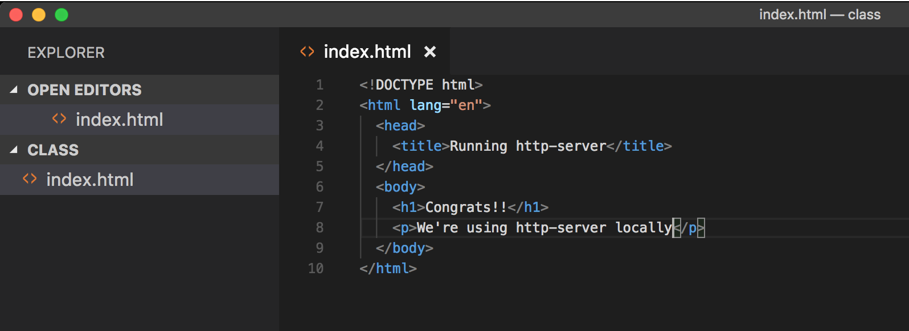

* Usually you just double click the file

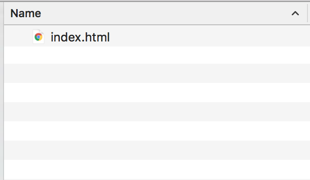

* And open it on a browser

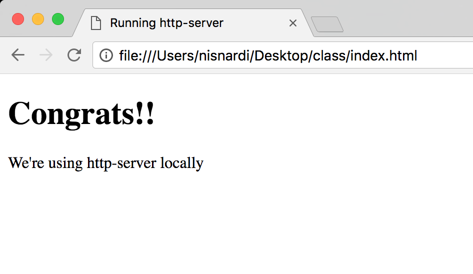

* Now we are going to use the Visual Studio Code terminal
* Go to the main bar and select View > Open View

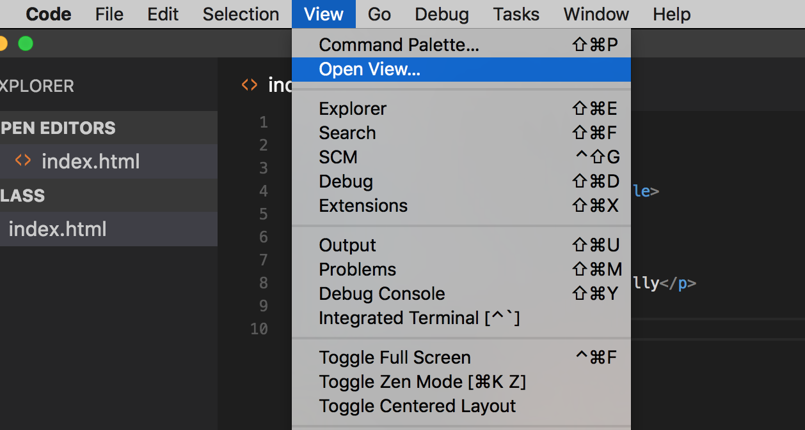

* You will see a couple of options

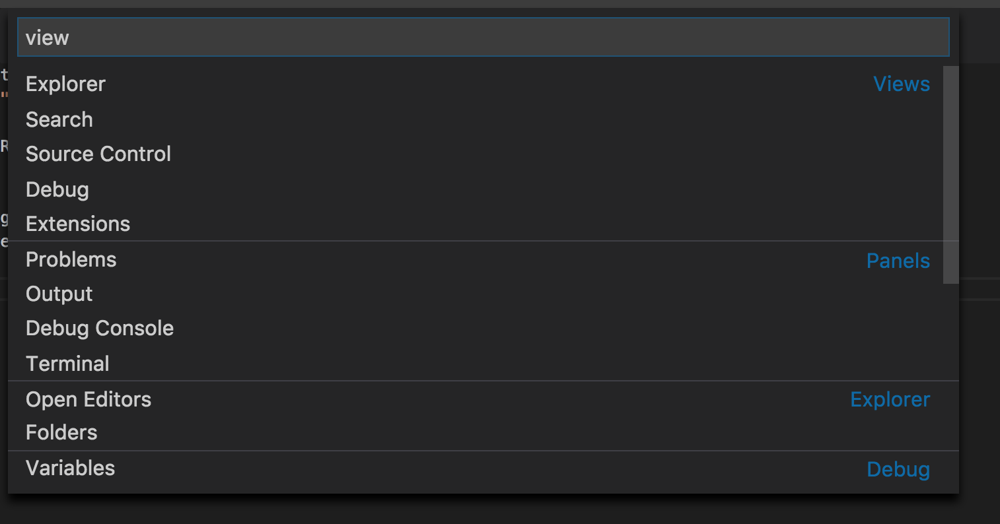

* Select the Terminal

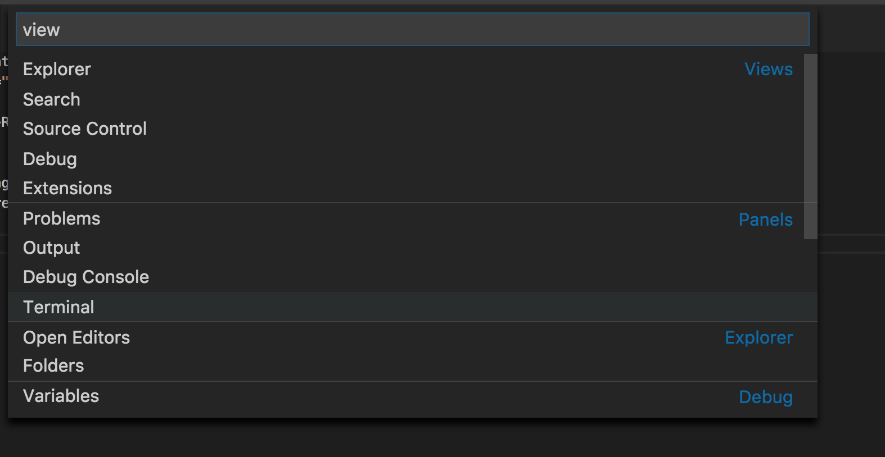

* You will see the terminal view inside VSC
* If you opened the folder VSC already knows that we're using this path
* Type:
```bash
http-server
```
* A new web server will start
* This server will serve the folder files
* So our site root is going to be our folder that we are using
* If everything is ok you see a message
* By default this server will run on port `8080`
* The port might change if you already have that port listening with other app

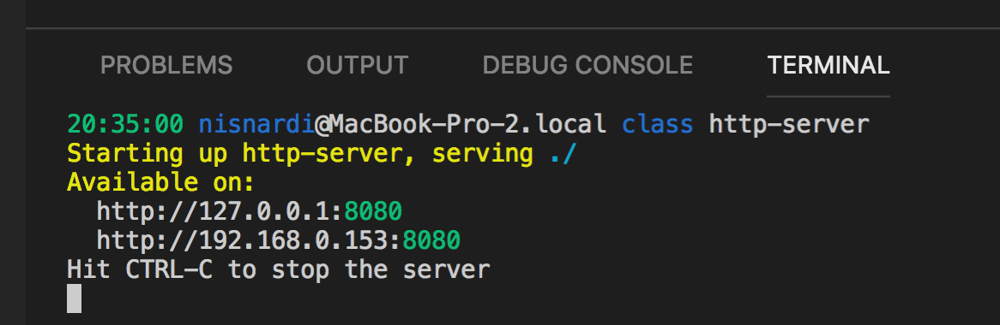

* Now open the browser again
* Navigate to `http://localhost:8080`
* At this moment you must see your index.html document

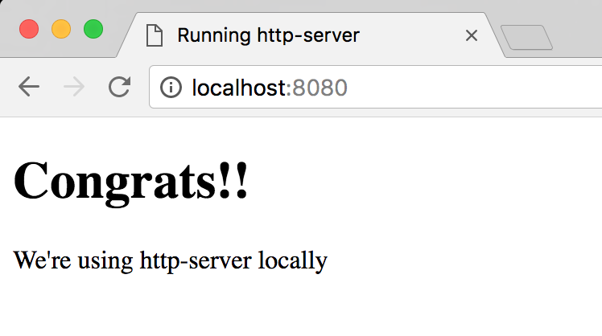

* Using http-server we have a local server running and we are able to simulate a real site
* From now on use http-server or similar to create your sites
* If you need to stop the server just press `CTRL + C`
* You can open the terminal using the following shortcut
```
Ctrl+` 
```

* [http-server site](https://www.npmjs.com/package/http-server)
* [VSC keyboard shortcuts Windows](https://code.visualstudio.com/shortcuts/keyboard-shortcuts-windows.pdf)
* [VSC keyboard shortcuts Mac](https://code.visualstudio.com/shortcuts/keyboard-shortcuts-macos.pdf)

## How to execute JavaScript
* Using the browser we can execute JavaScript in the following ways:
  * Console
  * Inside script tag
  * External file using script tag
  
### Script Tag
* The HTML **script element** is used to embed or reference executable code
* Typically used to embed or refer to JavaScript code
* The script element can also be used with other languages, such as WebGL's GLSL shader programming language
* You can add the script tag inside the head element
* Also, you can add your script tag right before closing the body element
* The script tag and the way we load/execute our JavaScript can have some browser effects
* For now just know that you can place it in both elements (head & body)

**Example:**
```html
<head>
  <script>
    // You can add your JavaScript code here!
    console.log('Welcome to the Browser again!!');
  </script>
</head>
```

* Or

**Example:**
```html
<body>
  <h1>Hi</h1>
  <p>Add the script tag</p>
  
  <script>
    // You can add your JavaScript code here!
    console.log('Welcome to the Browser again!!');
  </script>
</body>
```

#### Practice
[Exercise 1](./exercises/browser/ex_1.md)

### External file using script tag
* Using a **script tag** we can link our HTML file with a JavaScript one
* This is going to work in a similar way as the CSS files and the link tag
* Using the script tag `src` attribute we can set the external file value

**Example:**
* HTML code:

```html
<head>
  <script src="script.js"></script>
</head>
```

* Code inside the `script.js` file
```js
// archivo script.js
console.log('Welcome to the browser');
```

* When the browser finds a **script** tag will request the js file, download it and then execute it
* While this happens the browser is blocked from being able to keep on rendering the document
* This is one of the reasons why we use the script tag before the closing body one
* By doing this we show the HTML content and then execute the script
* Now the browsers supports `async` & `defer` attributes that allows us to tell the browser how it has to handle our script files

**Example:**
```html
<head>
  <script src="script.js" async></script>
</head>
```
* Or

**Example:**
```html
<head>
  <script src="script.js" defer></script>
</head>
```

* These attributes tell the browser it's safe to continue parsing while the scripts are being downloaded
* Scripts with the `async` attribute are executed asynchronously
* This means the script is executed as soon as it's downloaded, without blocking the browser in the meantime
* This implies that it's possible that a second script is downloaded & executed before the first script
* Scripts with the `defer` attribute are executed in order (i.e. first script, then second and so on)
* Also does not block the browser
* Unlike async scripts, defer scripts are only executed after the entire document has been loaded
* You can learn more about async and defer on the following links
  * [Adding interactivity with JavaScript](https://developers.google.com/web/fundamentals/performance/critical-rendering-path/adding-interactivity-with-javascript)
  * [async vs defer](http://www.growingwiththeweb.com/2014/02/async-vs-defer-attributes.html)
  * [async vs defer - Video](https://www.youtube.com/watch?v=cCrfL84DkEk)

#### Practice
[Exercise 2](./exercises/browser/ex_2.md)

## User interaction
* Browsers have a **window** object that represents a window containing a DOM document
* This object has 3 methods that allows us to interact with the user: `alert, prompt & confirm`
* The browsers have already configured a reference so we can call this methods without the window object
* All this methods block the browser flow until they are resolved

**Example:**
```js
// Methods call using windows object:
window.alert();
window.prompt();
window.confirm();

// Using them as functions:
alert();
prompt();
confirm();
```

### Alert
* The **Window.alert()** method displays an alert dialog with the optional specified content and an OK button
* This method accepts a message parameter that will show to the user

**Example:**
```js
window.alert('Hi I\'m using the browser');
alert('How cool is that!!');
```

* [MDN alert doc](https://developer.mozilla.org/en-US/docs/Web/API/Window/alert)

#### Practice
[Exercise 3](./exercises/browser/ex_3.md)

### Prompt
* The **Window.prompt()** displays a dialog with an optional message prompting the user to input some text
* This method accepts 2 parameter
* First parameter is the message that we'll show the user
* Second parameter is optional and is the input default value
* This method returns a `string` value

**Example:**
```js
let name = window.prompt('Please input your name');
let superHero = prompt('Please input your favourite superheroe name');
```

* [MDN prompt doc](https://developer.mozilla.org/en-US/docs/Web/API/Window/prompt)

#### Practice
[Exercise 4](./exercises/browser/ex_4.md)

[Exercise 5](./exercises/browser/ex_5.md)

### Confirm
* The **Window.confirm()** method displays a modal dialog with an optional message and two buttons, OK and Cancel
* This method accepts a string parameter that will show to the user
* This method returns a `boolean` value
* If the user press Ok we get `true` back
* Else we get `false` back

**Example:**
```js
let isAdult = window.confirm('Are you older than 17 years?');
confirm('Are you older than 17 years?');
```

* [MDN confirm doc](https://developer.mozilla.org/en-US/docs/Web/API/Window/confirm)

#### Practice
[Exercise 6](./exercises/browser/ex_6.md)

[Exercise 7](./exercises/browser/ex_7.md)

[Exercise 8](./exercises/browser/ex_8.md)

* [MDN script tag doc](https://developer.mozilla.org/en-US/docs/Web/HTML/Element/script)

## Location
* The **location** interface `represents the location (URL`) of the object it is linked to
* Document and Window interface have a location
* We can access it using `document.location` and `window.location`

**Example:**
```js
// We can use it as a window or document property
window.location
document.location

// Just using location
location
```

* Take a look at a URL structure


* The location interface has properties that represent the different parts of a URL
  * **href**
  * **protocol**
  * **host**
  * **hostname**
  * **port**
  * **pathname**
  * **search**
  * **hash**

**Example:**
```js
location.href;
location.protocol;
location.host;
location.hostname;
location.port;
location.pathname;
location.search;
location.hash;
```

* You can try it too, go to a site page like facebook or a news site and log each property using console.log and see the result
* For example consider the following URL:
```
https://www.winnipegfreepress.com/sports/hockey/jets/white-magic-480439263.html#go-jets-go
```

**Example:**
```js
console.log(location.href);     // https://www.winnipegfreepress.com/sports/hockey/jets/white-magic-480439263.html#go-jets-go
console.log(location.protocol); // https:
console.log(location.host);     // www.winnipegfreepress.com 
console.log(location.hostname); // www.winnipegfreepress.com
console.log(location.port);     // empty string as it doesn't have a port number
console.log(location.pathname); // /sports/hockey/jets/white-magic-480439263.html
console.log(location.search);   // empty string as we don't have a query string params (you can try this submiting a form using GET)
console.log(location.hash);     // #go-jets-go
```

* Host and Hostname look the same as this url is using the default port number
* Host retrieves the full host value (with port)
* Hostname just retrieves the full host name
* As you can see using location we can get all the URL components
* Also, we can set a location value using the href property
* As we change the document/window location the browser will navigate to the new location

**Example:**
```js
location.href = 'http://google.com';

// or

location = 'http://google.com';
```

* [MDN Location doc](https://developer.mozilla.org/en-US/docs/Web/API/Location)

#### Practice
[Exercise 9](./exercises/browser/ex_9.md)

## Timers
* In JavaScript we have `setTimeout` & `setInterval` functions that allow us to execute code based on time

### setTimeout / clearTimeout
* The **setTimeout()** method `sets a timer which executes a function or specified piece of code once after the timer expires`
* This method accepts a function as first parameter that will be executed based on the delay that we configure `(callback)`
* The second parameter is a number that represents the delay in milliseconds and by default is 0

**Example:**
```js
const greet = function() {
  console.log('Hi!!');
}

setTimeout(greet, 5000);
```

* In this example we set a new timeout that will execute the greet function after 5000 milliseconds
* So the greet function will get executed once after 5 seconds
* We can use an anonymous function too

**Example:**
```js
setTimeout(function() {
  console.log('Hi!!');
}, 5000);
```

* The setTimeout returns a numeric value that represents the timeout ID
* Using the **clearTimeout** and the timeout ID we can stop the function from being executed
* The **clearTimeout** accepts a numeric parameter that represents the timeout ID

**Example:**
```js
var idTimeOut = setTimeout(function() {
  console.log('Hi!!');
}, 5000);

// halt the timer execution before the delay happens
clearTimeout(idTimeOut)
```

* In this example we configure the setTimeout function to execute the function that will greet in 5 seconds
* We get an ID back that we store in the **idTimeOut** variable
* Using **clearTimeout** and the timeout ID we stop the setTimeout from being executed (we turn off the timer)
* In some cases we need to pass this timer more values
* We can pass all the parameters that we want to the setTimeout function after we configure the callback and delay ones
* Then in the setTimeout function we get the params in the same order that we send them

**Example:**
```js
const greet = function(name, nickname) {
  console.log(`Hi ${name} ${nickname}`);
}

setTimeout(greet, 5000, 'Marta', 'Martita');
```

* In this example we configure the greet function as callback and a 5 second delay
* Then we pass 2 other values as params (marta and martita)
* This params will be params for the greet callback
* So name will become Marta
* And nickname will be Martita
* Now we know how to pass params to a callback function that will be executed by setTimeout

* [MDN setTimeout doc](https://developer.mozilla.org/en-US/docs/Web/API/WindowOrWorkerGlobalScope/setTimeout)

#### Practice
[Exercise 10](./exercises/browser/ex_10.md)

[Exercise 11](./exercises/browser/ex_11.md)

### setInterval / clearInterval
* The **setInterval()** method `repeatedly` calls a function or executes a code snippet, with a fixed time delay between each call
* It returns an interval ID which uniquely identifies the interval, so you can remove it later by calling **clearInterval()**
* This methods accepts the function to be called as first parameter
* The second parameter is a number that represents time in milliseconds (1 second -> 1000 milliseconds)

**Example:**
```js
const greet = function() {
  console.log('hi');
}

const id = setInterval(greet, 1000);
```

* In this example the greet function is going to be called every 1 second
* This interval is going to be executed until we stop it
* Use the **clearInterval** function to stop the interval execution

**Example:**
```js
const greet = function() {
  console.log('hi');
}

const id = setInterval(greet, 1000);

clearInterval(id);
```

* We can also pass params to this function in the same we did with `setTimeout`

**Example:**
```js
const greet = function(name, nickname) {
  console.log(`hi ${name} ${nickname}`);
}

setInterval(saludar, 1000, 'Marta', 'Martita');
```

* [MDN setInterval doc](https://developer.mozilla.org/en-US/docs/Web/API/WindowOrWorkerGlobalScope/setInterval)

#### Practice
[Exercise 12](./exercises/browser/ex_12.md)

[Exercise 13](./exercises/browser/ex_13.md)

## Working with elements

### HTML element structure
* This is a good time to remember the HTML element tag structure


* Element structure:
  * **Opening tag:** We define the beginning of a new element
    * **name:** we specify the element type, it can be p, a, div or any other valid element name
    * **attributes** the attributes allows us to describe elements and add functionality to them. To set an attribute we use `attribute="atribute value"`. 
      * Some common attributes are `id`, `class`, `href`, `src` and more
  * **content:** the element content is what we add between the opening and close tags. It can be text or other html elements as well
  * **Close tag:** The browser needs to know where the element ends

* Using JavaScript we will be able to create, insert, update and delete elements
* Also, we can update elements attributes and attribute values using the `DOM`

### DOM
* The document object model `DOM` is a programming interface for HTML and XML documents
* It represents the page so that programs can change the document structure, style, and content
* The DOM represents the document as nodes and objects, that way, programming languages can connect to the page
* DOM has the following types:
  * **document:** represents the main document
  * **element:** represents a document element (it can be an HTML element)
  * **attribute:** represents a node/element attributes
  * **nodeList:** It's a node array and we can access the items using indexes

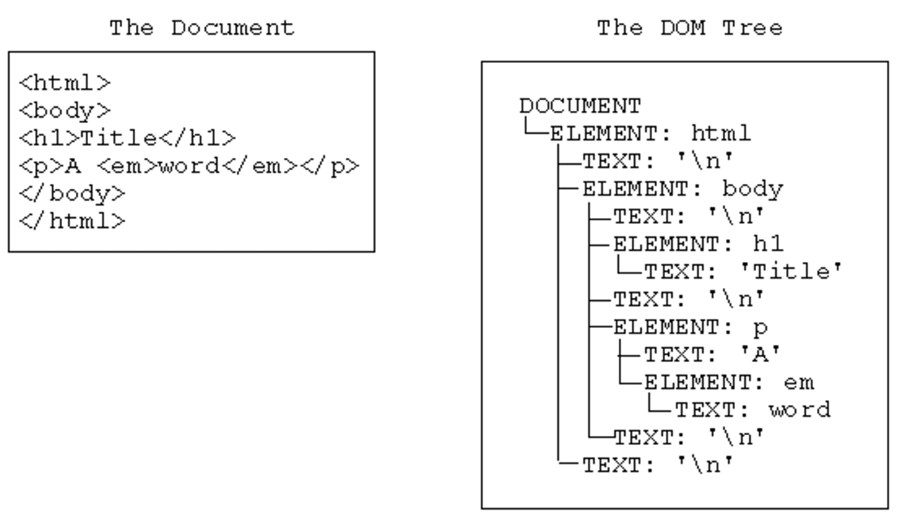

* [MDN Document Object Model doc](https://developer.mozilla.org/en-US/docs/Web/API/Document_Object_Model)
* [MDN DOM Introduction guide](https://developer.mozilla.org/en-US/docs/Web/API/Document_Object_Model/Introduction)

### Document on load
* The window object has a property called **onload**
* The **onload** property is an `event handler` for the `load event of a Window`, XMLHttpRequest, img element, etc
* This event is fired when the resource has loaded
* Subscribing to this event we can make sure that the document or elements are loaded before we reference them from our JavaScript code

**example:**
```js
window.onload = function() { 
	// This code gets executed after loading the document
  console.log('Document loaded');
}
```

#### Practice
[Exercise 14](./exercises/browser/ex_14.md)

* Now we know that the window object has a `onload` property that accepts a function as value that will be executed once the document is loaded
* Every time we assign a function to an event property is called event handler, in this case we're handling the window load event

**FROM NOW ON USE THE LOAD HANDLER ON YOUR BROWSER EXERCISES TO MAKE SURE IT'S LOADED**

### Selectors
* The selectors API provides methods that make it quick and easy to retrieve Element nodes from the DOM by matching against a set of selectors
* Selectors can return one or many elements depending the method that we use
* The most known selector is the document method **getElementById**
* This method accepts a string parameter with the id name value
* [MDN getElementById doc](https://developer.mozilla.org/en-US/docs/Web/API/Document/getElementById)

**Example:**
* HTML
```html
<div id="main">Hi I'm an HTML element</div>
```
* JS
```js
const mainElement = document.getElementById('main');

console.log(mainElement); // we can see the DOM representation of this element
```

* In this example we see how to use the method getElementById
* The HTML has the attribute id with the value main
* Using `document.getElementById('main')` we get the element passing main as the id value
* As this object exists on the DOM we retrieve the element back
* In this case we `assign` the `element reference` to the `mainElement variable`
* **querySelector** & **querySelectorAll** allow us to select elements using CSS selector
* Both of this selector accepts a string as parameter
* This parameter represent a CSS selector
* The document method **querySelector** returns the first Element within the document that matches the specified selector, or group of selectors
* In case it doesn't matches are found, null is returned
* The method **querySelectorAll** returns a static (not live) `NodeList` representing a list of the document's elements that match the specified group of selectors
* So we need to remember that **querySelector** returns one element and **querySelectorAll** a collection

* querySelector

**Example:**
* HTML
```html
<div>Hi I'm div number 1</div>
<div>Hi I'm div number 2</div>
<span>Hi I'm span number 1</span>
<span>Hi I'm span number 2</span>
```
* JS
```js
const div = document.querySelector('div');
const span = document.querySelector('span');

console.log(div); // <div>Hi I'm div number 1</div>
console.log(span); // <span>Hi I'm span number 1</span>
```

* In this example we use querySelector to get one element using the CSS element name selector (div & span)
* The same way we can select elements using other CSS selectors

**Example:**
* HTML
```html
<div class="red">Hi I'm div number 1</div>
<div>Hi I'm div number 2</div>
<span>Hi I'm span number 1</span>
<span class="red">Hi I'm span number 2</span>
```
* JS
```js
const div = document.querySelector('div.red');
const span = document.querySelector('span.red');

console.log(div); // <div class="red">Hi I'm div number 1</div>
console.log(span); // <span class="red">Hi I'm span number 2</span>
```

* [MDN querySelector doc](https://developer.mozilla.org/en-US/docs/Web/API/Document/querySelector)

* querySelectorAll
**Example:**
* HTML
```html
<div>Hi I'm div number 1</div>
<div>Hi I'm div number 2</div>
<span>Hi I'm span number 1</span>
<span>Hi I'm span number 2</span>
```
* JS
```js
const divs = document.querySelectorAll('div');
const spans = document.querySelectorAll('span');

console.log(divs); // NodeList(2) [div, div]
console.log(spans); // NodeList(2) [span, span]
```
* In this example use querySelectorAll to get all div elements and the all span ones
* This method returns a NodeList with 2 elements in each case as we have 2 of each elements type
* Also, we can use other CSS selectors

* querySelectorAll
**Example:**
* HTML
```html
<div class="red">Hi I'm div number 1</div>
<div>Hi I'm div number 2</div>
<span>Hi I'm span number 1</span>
<span class="red">Hi I'm span number 2</span>
```
* JS
```js
const redElements = document.querySelectorAll('.red');
console.log(redElements); // NodeList(2) [div.red, span.red]
```

* In this case we use the class selector (.red) to get all elements that have the class="red" attribute
* Using this method we get a node collection back with 2 elements but in this case we have a div and span as both of them have the class="red" attribute and value
* In this examples we can see that we have different selector methods to select elements with different criteria

* [MDN querySelectorAll doc](https://developer.mozilla.org/en-US/docs/Web/API/Document/querySelectorAll)

#### Practice
[Exercise 15](./exercises/browser/ex_15.md)

### Element Attributes
* Element.attributes property returns a live collection of all attribute nodes registered to the specified node
* attributes is a key/value pair of strings that represents any information regarding that attribute
* Use the name property to get the attribute name
* Use the value property to get the attribute value
* [MDN attributes doc](https://developer.mozilla.org/en-US/docs/Web/API/Element/attributes)

**Example:**
* HTML
```html
<p id="main" class="red">Text in red</p>
```

* JS
```js
const element = document.querySelector('p')

console.log(element.attributes); // NamedNodeMap {0: id, 1: class, id: id, class: class, length: 2}

console.log(element.attributes[0].name);  // id
console.log(element.attributes[0].value); // main

console.log(element.attributes[1].name);  // class
console.log(element.attributes[1].value); // red
```

* An easier way to get an element attribute value is using `getAttribute`
* This method accepts a string parameter with the element attribute name
* It will return the attribute value or null if it doesn't have the attribute
* [MDN getAttribute doc](https://developer.mozilla.org/es/docs/Web/API/Element/getAttribute)

**Example:**
* HTML
```html
<p id="main" class="red">Text in red</p>
```

* JS
```js
const element = document.querySelector('p');
const id = element.getAttribute('id');
const classValue = element.getAttribute('class');

console.log(id);          // main
console.log(classValue);  // red
```

* Also, we can use the attribute name as element property to access the attribute value

**Example:**
* HTML
```html
<p id="main" class="red">Text in red</p>
```

* JS
```js
const element = document.querySelector('p');
const id = element.id; // id is an element property as the html element has the attribute

console.log(id); // main
```

* In the previous example we don't access the class attribute as is a especial property
* As `class` is a JavaScript reserved word we can't use it
* This is why we have the element property `className` instead of class
* So the html attribute is going to be `class` and the JavaScript property is `className`

**Example:**
* HTML
```html
<p id="main" class="red">Text in red</p>
```

* JS
```js
const element = document.querySelector('p');
const className = element.className;

console.log(className); // red
console.log(element.getAttribute('class')); // red
```

#### Practice
[Exercise 16](./exercises/browser/ex_16.md)

### Class List
* The **classList** is a read-only property which returns a live DOMTokenList collection of the class attributes of the element
* Using `classList` is a convenient alternative to accessing an element's list of classes as a space-delimited string via `element.className`

**Example:**
* HTML
```html
<p id="main" class="red bold">Bold text in red</p>
```

* JS
```js
const element = document.querySelector('p');

console.log(element.classList);     // DOMTokenList(2) ["red", "bold", value: "red bold"]

console.log(element.classList[0]);  // red
console.log(element.classList[1]);  // bold
```

* classList has the following methods so we can interact with it
    * **add:** add specified class values. If these classes already exist in attribute of the element, then they are ignored
    * **remove:** remove specified class values
    * **item:** return class value by index in collection
    * **toggle:** if class exists then remove it and return false, if not, then add it and return true
    * **contains:** checks if specified class value exists in class attribute of the element
    * **replace:** replaces an existing class with a new class

**Example:**
* HTML
```html
<p id="main" class="red bold">Bold text in red</p>
```

* JS
```js
const element = document.querySelector('p');
element.classList.add('hide'); // we add the hide class to the p element

element.classList.toggle('hide'); // as the element has the hide class it will remove it, otherwise it will add it

element.classList.remove('bold'); // we remove the bold class

element.classList.item(0); // using 0 based index we can get any class using the class index position

element.classList.contains('red'); // in this case it will return true as the element has the red class

element.classList.replace('red', 'green'); // we change red for green class
```

* classList is great to interact with an element's classes
* [MDN classList doc](https://developer.mozilla.org/en-US/docs/Web/API/Element/classList)

#### Practice
[Exercise 17](./exercises/browser/ex_17.md)

### Has Attributes?
* We can test if an element has an attribute with the `hasAttribute` method
* This method accepts a string parameter with the attribute name
* It returns a boolean value

**Example:**
* HTML
```html
<p id="main" class="red">Text in red</p>
```

* JS
```js
const element = document.querySelector('p');
console.log(element.hasAttribute('class')); // true
```

* In this example we test if the element has the class attribute
* We get a true value as the element has the class attribute

* [MDN hasAttribute doc](https://developer.mozilla.org/en-US/docs/Web/API/Element/hasAttribute)

#### Practice
[Exercise 18](./exercises/browser/ex_18.md)

### Has Attributes?
* The **hasAttributes** method returns a Boolean value, indicating if the current element has any attributes or not

**Example:**
* HTML
```html
<p id="main" class="red">Element with attributes</p>
<h2>Element without attributes</h2>
```

* JS
```js
const element = document.querySelector('p');
const title = document.querySelector('h2');

console.log(element.hasAttributes():); // true

console.log(title.hasAttributes():); // false
```

* [MDN hasAttributes doc](https://developer.mozilla.org/en-US/docs/Web/API/Element/hasAttributes)

### Set Attribute
* The **setAttribute** method sets the value of an attribute on the specified element
* If the attribute already exists, the value is updated; otherwise a new attribute is added with the specified name and value
* This method accepts 2 parameters, the first one is a string with the attribute name, the second one is the value that we want to set to the attribute, `setAttribute(attributeName, attributeValue)`

**Example:**
* HTML
```html
<h2>Element without attributes</h2>
```

* JS
```js
const title = document.querySelector('h2');

console.log(title.hasAttributes()); // false

title.setAttribute('id', 'main');

console.log(title.hasAttributes()); // true

console.log(title.getAttribute('id')); // main
```

* In this example we have an h2 element without attributes
* Then we set an id attribute with the main value (id="main") using `setAttribute` method
* Using `hasAttributes` we know that this element has at least one attribute
* Then we get the id attribute value using `getAttribute`

* [MDN setAttribute doc](https://developer.mozilla.org/en-US/docs/Web/API/Element/setAttribute)

### Remove Attribute
* The **removeAttribute** method removes an attribute from the specified element
* This method accepts a string parameter that names the attribute to be removed from element

**Example:**
* HTML
```html
<h2 id="main">Element with id attribute</h2>
```

* JS
```js
const title = document.querySelector('h2');

console.log(title.hasAttributes()); // true

title.removeAttribute('id');

console.log(title.hasAttributes()); // false
```

* In this example we get an element that has the id attribute and remove it using `removeAttribute('id')`

* [MDN removeAttribute doc](https://developer.mozilla.org/en-US/docs/Web/API/Element/removeAttribute)

#### Practice
[Exercise 19](./exercises/browser/ex_19.md)

### Elements relationship
* The **parentElement** read-only property returns the DOM node's parent Element, or null if the node either has no parent, or its parent isn't a DOM Element
* An element that contains other elements is considered a parent element

**Example:**
* HTML
```html
<div>
  <p>Child element</p>
</div>
```

* JS
```js
const parragraph = document.querySelector('p');
const parent = parragraph.parentElement;

console.log(parent); // <div></div>
```

* Also, we can retrieve the element's child elements using the `children` property
* An element that inside other element is consider a child element
* This method returns an HTMLCollection

**Example:**
* HTML
```html
<div>
  <p>Child Element</p>
  <p>Child Element</p>
  <p>Child Element</p>
  <p>Child Element</p>
</div>
```

* JS
```js
const div = document.querySelector('div');
const children = div.children;

console.log(children); // HTMLCollection(4) [p, p, p, p]
```

* As we get a collection back we can use indexes to access the children in different positions

**Example:**
* HTML
```html
<div>
  <p>Child Element</p>
  <p>Child Element</p>
  <p>Child Element</p>
  <p>Child Element</p>
</div>
```

* JS
```js
const div = document.querySelector('div');
const children = div.children;
const firstChildElement = children[0];

console.log(firstChildElement); // <p>Child Element</p>
console.log(children.item(0));
```

* In this example we use index 0 to get the first element
* Also, HTMLCollection has an `item` method that retrieves an element in a specific position
* We can see 2 different ways of accomplish the same objective (retrieve a child element)
* Also we could do the same using CSS selectors and querySelector method

* [MDN parentElement doc](https://developer.mozilla.org/en-US/docs/Web/API/Node/parentElement)
* [MDN parentElement doc](https://developer.mozilla.org/en-US/docs/Web/API/Node/parentElement)
* [MDN HTMLCollection doc ](https://developer.mozilla.org/en-US/docs/Web/API/HTMLCollection)

#### Practice
[Exercise 20](./exercises/browser/ex_20.md)

* Elements can have **sibling** 
* These elements are at the same element level

**Example:**
* HTML
```html
  <p>Paragraph element</p>
  <p>Paragraph element</p>
  <p>Paragraph element</p>
```

* In this example we can see that all 3 elements are at the same level so they are siblings
* We can access the previous element using **previousElementSibling** property
* Also we can get the next element using **nextElementSibling** property

**Example:**
* HTML
```html
<p>Paragraph element 1</p>
<p>Paragraph element 2</p>
<p>Paragraph element 3</p>
```

* JS
```js
const paragraphs = document.querySelectorAll('p');
const middleElement = paragraphs[1];

console.log(middleElement.previousElementSibling);  // <p>Paragraph element 1</p>
console.log(middleElement.nextElementSibling);      // <p>Paragraph element 3</p>
```

* [MDN previousElementSibling doc](https://developer.mozilla.org/en-US/docs/Web/API/NonDocumentTypeChildNode/previousElementSibling)
* [MDN nextElementSibling doc](https://developer.mozilla.org/en-US/docs/Web/API/NonDocumentTypeChildNode/nextElementSibling)

#### Practice
[Exercise 21](./exercises/browser/ex_21.md)

### Change element content
* **innerText** is a property that represents the "rendered" text content of a node and its descendants
* As a getter, it approximates the text the user would get if they highlighted the contents of the element with the cursor and then copied to the clipboard
* This feature was originally introduced by `Internet Explorer`, and was formally specified in the HTML standard in 2016 after being adopted by all major browser vendors

**Example:**
* HTML
```html
<p>This is a great text to get using JavaScript</p>
```

* JS
```js
const paragraph = document.querySelector('p');

console.log(paragraph.innerText); // This is a great text to get using JavaScript

paragraph.innerText = 'JavaScript in browsers is amazing'; 

console.log(paragraph.innerText); // JavaScript in browsers is amazing
```

* In this example we get the content text from the paragraph using `paragraph.innerText`
* Also, use the property to set a new value `paragraph.innerText = 'JavaScript in browsers is amazing';`
* The **textContent** property represents the text content of a node and its descendants
* [MDN innerText doc](https://developer.mozilla.org/en-US/docs/Web/API/Node/innerText)

**Example:**
* HTML
```html
<p>This is a great text to get using JavaScript</p>
```

* JS
```js
const paragraph = document.querySelector('p');

console.log(paragraph.textContent); // This is a great text to get using JavaScript

paragraph.textContent = 'JavaScript in browsers is amazing'; 

console.log(paragraph.textContent); // JavaScript in browsers is amazing
```

* Both `innerText` & `textContent` allows us to get and set an element content
* They have some differences between them in some special cases and you can read about them on the [MDN textContent doc](https://developer.mozilla.org/en-US/docs/Web/API/Node/textContent)

#### Practice
[Exercise 22](./exercises/browser/ex_22.md)

* The **innerHTML** property gets or sets the HTML or XML markup contained within the element
* This property accepts a DOMString containing the HTML serialization of the element's descendants
* Setting the value of innerHTML removes all of the element's descendants and replaces them with nodes constructed by parsing the HTML given in the string htmlString

**Example:**
* HTML
```html
<p>This is just a paragraph text</p>
```

* JS
```js
const paragraph = document.querySelector('p');

console.log(paragraph.innerHTML); // This is just a paragraph text

paragraph.innerHTML = '<span>Ohhhhhhhhhhhhhhhh what are we doing??</span>';

console.log(paragraph.innerHTML); // <span>Ohhhhhhhhhhhhhhhh what are we doing??</span>
```

* Using innerHTML we can retrieve the element content whether it's text or other HTML content
* We can set the innerHTML property using a string
* If the string has valid HTML content, the browser will parse it and create the proper elements
* It's an easy way of creating new elements

**Example:**
* JS
```js
const paragraph = document.querySelector('p');
paragraph.innerHTML = '';
```

* This is an easy way to remove all the element content
* As this property might have some security issues we can use it on some cases

* [MDN innerHTML doc](https://developer.mozilla.org/en-US/docs/Web/API/Element/innerHTML)

#### Practice
[Exercise 23](./exercises/browser/ex_23.md)

### Using CSS properties
* The **style** property is used to get as well as set the inline style of an element
* While getting, it returns a CSSStyleDeclaration object that contains a list of all styles properties for that element with values assigned for the attributes that are defined in the element's inline style attribute
* The style property has the same (and highest) priority in the CSS cascade as an inline style declaration set via the style attribute
* As we get an object back we can set or get css properties
* The CSS properties name will be in camelCase `cssPropertyName`
* For example: `background-color` becomes: `backgroundColor`

**Example:**
* HTML
```html
  <p>This element doesn't have any styles</p>
```

* JS
```js
let element = document.querySelector('p');

element.style; // we get an empty object ({}) back

element.style.color = 'red'; // As style is an object we can set properties, in this case we set the color to red

element.style.fontWeight = 'bold'; // using font-weight we can set the font to bold, as it's JavaScript the property name is fontWeight
```

* Using the style property and CSS property names written in JavaScript form we can style our components using JS

#### Practice
[Exercise 24](./exercises/browser/ex_24.md)

### Element CRUD
* CRUD means:
  * Create
  * Read
  * Update
  * Delete
* This means that we can create, update & delete elements
* The read action we can say it's when we select an element and get properties from it

#### Creating elements
* The document object has a **createElement** method that allows us to create new elements
* `createElement` accepts a string as parameter with the HTML element name (a, div, span, li, ul, etc)

**Example:**
```js
var paragraph = document.createElement('p');
```

* In this example we call the createElement method and pass 'p' as parameter (tagName)
* Then we assign the element reference to the paragraph variable
* This element it's in memory and it doesn't have any content
* So now we can use the paragraph variable to manipulate the new paragraph element like adding content, adding properties or even insert it into other elements

* [MDN createElement doc](https://developer.mozilla.org/en-US/docs/Web/API/Document/createElement)

#### Insert an element
* The **appendChild** method adds a node to the end of the list of children of a specified parent node
* This method will insert the new element as last child

**Example:**
* JS
```js
const paragraph = document.createElement('p');
const div = document.createElement('div');

paragraph.innerText = 'Adding some text as content';

div.appendChild(paragraph);

document.body.appendChild(div);
```

* In this example we define 2 variables (paragraph & div) and assign one new element to each one (p & div)
* Then we change the paragraph content and assign the text: Adding some text as content
* Now that the paragraph has some content we append it to the div element
* At the end we append the div into the document body
* At the end our DOM looks like this:

```html
<div>
  <p>Adding some text as content</p>
</div>
```

* [MDN appendChild doc](https://developer.mozilla.org/es/docs/Web/API/Node/appendChild)
* For example we can add some attributes and styles!

**Example:**
* JS
```js
const paragraph = document.createElement('p');
const div = document.createElement('div');

paragraph.innerText = 'Adding some text as content';
paragraph.setAttribute('id', 'my-paragraph');

paragraph.style.fontWeight = 'bold';
paragraph.style.color = 'green';

div.style.border = '1px solid gray';

div.appendChild(paragraph);

document.body.appendChild(div);
```

* [MDN appendChild doc](https://developer.mozilla.org/en-US/docs/Web/API/Node/appendChild)

#### Practice
[Exercise 25](./exercises/browser/ex_25.md)

[Exercise 26](./exercises/browser/ex_26.md)

[Exercise 27](./exercises/browser/ex_27.md)

[Exercise 28](./exercises/browser/ex_28.md)

#### Remove elements
* The **removeChild** method removes a child node from the DOM
* This method returns the removed node
* Select the element before removing it

**Example:**
* HTML
```html
<div>
  <p>First paragraph</p>
  <p>Second paragraph</p>
  <p>Third paragraph</p>
</div>
```

* JS
```js
var div = document.querySelector('div');
var firstParagraph = div.children.item(0); 

div.removeChild(firstParagraph);
```

* In this example we select the div element
* Then we get the first children
* Once we have the child reference we remove it from the div using `div.removeChild(firstParagraph)`
* In case we would like to delete all children at once we can set the innerHTML value to ''

**Example:**
* HTML
```html
<div>
  <p>First paragraph</p>
  <p>Second paragraph</p>
  <p>Third paragraph</p>
</div>
```

* JS
```js
var div = document.querySelector('div');

div.innerHTML = '';
```

* [MDN removeChild doc](https://developer.mozilla.org/en-US/docs/Web/API/Node/removeChild)

#### Practice
[Exercise 29](./exercises/browser/ex_29.md)

[Exercise 30](./exercises/browser/ex_30.md)

[Exercise 31](./exercises/browser/ex_31.md)

#### Events
* DOM Events are sent to notify code of interesting things that have taken place
* Each event is represented by an object which is based on the Event interface, and may have additional custom fields and/or functions used to get additional information about what happened
* Events can represent everything from basic user interactions to automated notifications of things happening in the rendering model
* The browser will trigger events whenever something happens with the document or browser itself
* For example we can know when the document is loaded, a button is clicked or a key is pressed
* Events has the following structure:
  * type
  * target
  * event handler
  * event object
* This are the 2 most common ways to handle events
  * Assign a function to the element event property `on and name of the event` for example: element.onclick
  * Using **addEventListener**

**Example:**
* HTML
```html
<button>Click Me!!!</button>
```

* JS
```js
const button = document.querySelector('button');

button.onclick = function() {
  // Code that will be executed once button gets clicked
  console.log('Oh, I been clicked');
}
```

* Also we could do something like:

**Example:**
* JS
```js
const button = document.querySelector('button');
const handleClickEvent = function() {
  console.log('Oh, I been clicked');
}

button.onclick = handleClickEvent;
```

* [MDN Events doc](https://developer.mozilla.org/en-US/docs/Web/Events)
* [MDN onclick doc](https://developer.mozilla.org/en-US/docs/Web/API/GlobalEventHandlers/onclick)

#### Practice
[Exercise 32](./exercises/browser/ex_32.md)

### Add Event Listener
* We can also add event handlers using **addEventListener**
* This method can be used in any object like window, document and other html elements
* **addEventListener** accepts 2 parameters
  * **event type:** it's a string with the event name ('click')
  * **event handler:** it's a function that will work as callback

**Example:**
* HTML
```html
<button>Click Me!!!</button>
```

* JS
```js
const button = document.querySelector('button');

button.addEventListener('click', function() {
  // code that will be executed once the button is clicked
  console.log('Oh, I been clicked');
});
```

* In the event listener function we can use the reserved word **this** to reference the element that emited the event
* In the previous example `this` will reference the button 

**Example:**
```js
function clickHandler() {
	console.log(this)		// this is the button that we clicked
  this.style.backgroundColor = 'green';
}

function dblclickHandler() {
	this.style.backgroundColor = 'red';
}

const button = document.querySelector('button');

button.addEventListener('click', clickHandler);

button.addEventListener('dblclick', dblclickHandler);
```

* In this example we can see how to add a double click event listener using the `dblclick` name
* You can check more events on the [MDN addEventListener doc](https://developer.mozilla.org/en-US/docs/Web/API/EventTarget/addEventListener)

#### Practice
[Exercise 33](./exercises/browser/ex_33.md)

### Remove Event Listener
* To remove an event listener we use the **removeEventListener** method
* This method can also be used on window, document, and HTML elements
* Also, this method accepts two parameters:
  * **event type:** it's a string with the event name ('click')
  * **event handler:** it's a function that will work as callback

**Example:**
```js
function clickHandler() {
	console.log(this);
}

let button = document.querySelector('button');

button.addEventListener('click', clickHandler);     // We add the click event listener 

button.removeEventListener('click', clickHandler);  // We remove the same event listener that we previously added
```

* Remember to always remove the event listener before removing your DOM elements
* Otherwise you might have unexpected results and memory issues (if many elements)

* [MDN removeEventListener doc](https://developer.mozilla.org/en-US/docs/Web/API/EventTarget/removeEventListener)

#### Practice
[Exercise 34](./exercises/browser/ex_34.md)

* As we learn events have different properties that we can use and some of them are:
  * **Event.target:** A reference to the target to which the event was originally dispatched
  * **Event.type:** The name of the event (case-insensitive)
  * **Event.preventDefault()** Prevents default element behaviour

* Using the event object we can know more about it and also prevent the event default action
* For example links element have the default click event behaviour  set to navigate to the href url
* We can prevent this from happening using the `preventDefault` method


**Example:**
* HTML
```html
<a href="contact.html">Go to contact page</a>
```

* JS
```js
let link = document.querySelector('a');
link.addEventListener('click', function(event) {
  event.preventDefault();  // by calling preventDefault the event is not going to trigger the default behaivour
  console.log('look someone clicked me');
});
```

* Using JavaScript we can handle mouse events like `click, dblclick, mouseover, mouseout & mousemove`
* The event object has properties that help us know the mouse position like `clientX & clientY`

**Example:**
```js
let body = document.querySelector('body');

body.addEventListener('click', function(event) {
  console.log(event.clientX);
  console.log(event.clientY);
});
```

#### Practice
[Exercise 35](./exercises/browser/ex_35.md)

[Exercise 36](./exercises/browser/ex_36.md)

* With JavaScript we can handle keyboard events too like `keypress, keydown y keyup`
* The event object that we get as parameter has a `charCode` property with a numeric value that represents the pressed key
* Strings has a static method called fromCharCode (`String.fromCharCode`) that will accept a number value as parameter and returns the key value
* Combining `charCode` and `String.fromCharCode` we can know the key that the user pressed

**Example:**
```js
  const body = document.querySelector('body');

  body.addEventListener('keypress', function(event) {
    const keyCode = event.charCode;
    const key = String.fromCharCode(keyCode);
    
    console.log(key);
  });
```

#### Practice
[Exercise 37](./exercises/browser/ex_37.md)

[Exercise 38](./exercises/browser/ex_38.md)

#### List of Events you can use:
* The browser API allow us to use many events handlers to create interactive UI's:
  * onchange
  * onclick / ondblclick / onmousedown / onmousedown
  * onmouseover / onmouseout
  * onkeydown / onkeypress / onkeyup
  * onload
  * onresize
  * onscroll
  * oninput
  * onfocus / onblur

#### Practice
[Exercise 39](./exercises/browser/ex_39.md)

[Exercise 40](./exercises/browser/ex_40.md)

## Extra practice
[Exercise 41](./exercises/browser/ex_41.md)

[Exercise 42](./exercises/browser/ex_42.md)

#### Forms
* HTML Forms helps us retrieve user data
* Using JavaScript we can handle inputs and forms events and values
* Also, we can check the values that the user inputs
* We need to select the form to be able to interact with
* **Disclaimer: From our HTML material**:
	* The form element has 3 important attributes:
	  * action: the URI of a program that processes the form information
	  * method: the HTTP method that the browser uses to submit the form: get or post 
	    * get: corresponds to the HTTP GET method; form data are appended to the action attribute URI with a '?' as separator, and the resulting URI is sent to the server
	    * post: corresponds to the HTTP POST method ; form data are included in the body of the form and sent to the server
	  * enctype: when the value of the method attribute is post, enctype is the MIME type of content that is used to submit the form to the server. Possible values:
	    * Default: 'application/x-www-form-urlencoded'
	    * To send file content: 'multipart/form-data'
	    * Just text: 'text/plain'
	* [MDN form doc](https://developer.mozilla.org/en-US/docs/Web/HTML/Element/form)

**Example:**
```js
const form = document.querySelector('form');
```

* The `document` object has a `forms` property that returns all the document form elements

**Example:**
```js
  const firstForm = document.forms[0];
  const documentForms = document.forms;
```

* The `form ` element have a `elements` property that returns the selected form elements collection

**Example:**
```js
const form = document.querySelector('form');
const formElements = form.elements;

console.log(formElements)

// As it's a collection we can get the first element using 0 as index
const firstElement = form.elements[0];
```

* The form object has the following properties: `action`, `target`, `encoding` & `method`
* As we know this are all HTML form attributes
* Using JavaScript we can get or set this properties values
* This is a good time to go check the HTML form section!

**Example:**
* HTML
```html
<form action="save_user.html" method="get" enctype="application/x-www-form-urlencoded" name="login"></form>
```

* JS
```js
const form = document.querySelector('form');

console.log(form.action); // save_user.html
console.log(form.encoding); // get
console.log(form.method); // application/x-www-form-urlencoded
console.log(form.name); // login
```

#### Practice
[Exercise 43](./exercises/browser/ex_43.md)

* The form elements have a `value` property that returns the element value
* We can use this property on many form elements like:
  * inputs of text, password, hidden
  * checkbox
  * radio
  * textarea

**Example:**
* HTML
```html
<form action="save_user.html" method="get" enctype="application/x-www-form-urlencoded" name="login">
  <input type="text" id="username" name="username" />
  <input type="password" id="pass" name="pass" />
  <input type="submit" name="submit" value="Send" />
</form>
```

* JS
```js
const form = document.querySelector('form');
const username = form.elements[0].value;

username.value; // we get an empty string as it doesn't have a value
username.value = 'Pepe'; // We can also set an input value
```

#### Practice
[Exercise 44](./exercises/browser/ex_44.md)

* Forms emit a submit event
* We can handle the form submit event using event handlers
* When the form gets submitted it will send the input values to the action document
* We can prevent the default form behaviour using the event preventDefault method
* Other way to do this with forms is returning a false value

**Example:**
* HTML
```html
<form action="save_user.html" method="get" enctype="application/x-www-form-urlencoded" name="login">
  <input type="text" id="username" name="username" />
  <input type="password" id="pass" name="pass" />
  <input type="submit" name="submit" value="Send" />
</form>
```
```js
const form = document.querySelector('form');

form.onsubmit = function() {
	// This code will get executed when the form is submited
  // Returning false we don't execute the form submition
  return false;
}

// also

const form = document.querySelector('form');

form.onsubmit = function(event) {
  event.preventDefault();
}

// or

form.addEventHandler('submit', function(event) {
  event.preventDefault();
});
```

#### Practice
[Exercise 45](./exercises/browser/ex_45.md)

* Select elements have a `selectedIndex` property that returns a number value for the selected option index
* Also, this element has a `options` property that returns the options elements collection
* We can get the selected option if we combine the select `selectedIndex` property and the `options` collection
* Option elements also have a `value` property

**Example:**
* HTML
```html
<form action="save_user.html" method="get" enctype="application/x-www-form-urlencoded" name="login">
  <select name="countries" id="countries">
    <option value="ar">Argentina</option>
    <option value="br">Brazil</option>
    <option value="ca">Canada</option>
    <option value="cl">Chile</option>
  </select>
</form>
```

* JS
```js
const select = document.querySelector('select');
const index = select.selectedIndex;

console.log(index);  // returns the option index
console.log(select.options);  // returns the option collection

Select.options[index]; // 
console.log(select.options[index].value); // returns the selected option value
```

#### Practice
[Exercise 46](./exercises/browser/ex_46.md)

* `checkbox` elements also have a `value` property
* Also, they have a `checked` property that returns a boolean value in case the checkbox is checked or not (true or false)
* Set the `checked` to true if you want to check it and false to uncheck it

**Example:**
* HTML
```html
<form action="save_user.html" method="get" enctype="application/x-www-form-urlencoded" name="login">
  <input type="checkbox" name="sex" value="f" checked> Female
  <input type="checkbox" name="sex" value="m"> Male
</form>
```

* JS
```js
const checkboxes = document.querySelector('checkbox');
const female = checkboxes[0];
const male = checkboxes[1];

console.log(female.checked);  // returns true as the element has the checked attribute
female.checked = false; // Set's the checkbox checked property to false
console.log(female.value); // returns f as it's the element value

male.checked;  // returns false as the element is not checked
male.checked = true; // Set checked to true
console.log(male.value); // returns m as it's the element value
```

* To get the checked elements we can combine JavaScript and CSS selector using `:checked`

**Example:**
* HTML
```html
<form action="save_user.html" method="get" enctype="application/x-www-form-urlencoded" name="login">
  <input type="checkbox" name="sex" value="f" checked> Female
  <input type="checkbox" name="sex" value="m"> Male
</form>
```
```js
const selectedGenderElement = document.querySelector('input:checked');

console.log(selectedGenderElement.checked);  // Returns true as it's the checked element
selectedGenderElement.checked = false; // We uncheck this element
console.log(selectedGenderElement.value); // returns f as it's the element value
```

#### Practice
[Exercise 47](./exercises/browser/ex_47.md)

* Form element can handle events using `onfocus, onblur, onchange & oninput` properties
* Also, you can use this events as event handler using `addEventListener`
  * **focus:** This event is triggered when we set focus on an item (example: clicking on it to write)
  * **blur:** This event is triggered when the element loose focus
  * **change:** This event is triggered when the selected value of an select element changes
  * **input:** This event is triggered when we type in an input

**Example:**
* HTML
```html
<form action="save_user.html" method="get" enctype="application/x-www-form-urlencoded" name="login">
  <input type="text" id="username" name="username" />
  <input type="password" id="pass" name="pass" />
  <input type="submit" name="submit" value="Submit" />
</form>
```

* JS
```js
const form = document.querySelector('form');
const username = form.elements[0];

username.onfocus = function() {
  // this code will get executed when we set focus on the username input
  console.log('Username element focus');
}

username.onblur = function() {
  // this code will get executed when we remove username focus
  console.log('Username element lost focus');
}

username.oninput = function() {
  // this code will get executed when we input some value in the input
  console.log('The user is typing!');
}
```

* Handling the `change` event we can handle a select element change

**Example:**
* HTML
```html
<form action="save_user.html" method="get" enctype="application/x-www-form-urlencoded" name="login">
  <select name="countries" id="countries">
    <option value="ar">Argentina</option>
    <option value="br">Brazil</option>
    <option value="cl">Chile</option>
  </select>
</form>
```

* JS
```js
const select = document.querySelector('select');

select.onchange = function() { 
  // This code gets executed when the user changes the select selected item
  const index = select.selectedIndex;
  const value = select.options[index].value;

  console.log(index);
  console.log(value);
}
```

#### Practice
[Exercise 48](./exercises/browser/ex_48.md)

* To validate if an input is empty we can combine the `length` and `value` properties

**Example:**
* HTML
```html
<form action="save_user.html" method="get" enctype="application/x-www-form-urlencoded" name="login">
  <input type="text" id="username" name="username" />
  <input type="password" id="pass" name="pass" />
  <input type="submit" name="submit" value="Send" />
</form>
```

* JS
```js
const form = document.querySelector('form');

form.onsubmit = function(evento) {
  evento.preventDefault();
  const username = form.elements[0];

  // with the value property we get the input value
  // Then we use the length property to check if the input is empty or not
  // We could add trim before to remove empty spaces too
  if (username.value.length === 0) {
    console.log('Wrong username');
    return false;
  }

  return true;
}
```

#### Practice
[Exercise 49](./exercises/browser/ex_49.md)

# Regex
* JavaScript can use Regex as values too
* Regex allow us to search for a strings pattern
* Also, we can use it to validate our inputs too
* Regexs have a `test()` method that will test if the pattern match the content or not
* For example the regex: `/^[a-z0-9]+$/i` will be true if the text only contains alphanumeric characters

**Example:**
* HTML
```html
<form action="save_user.html" method="get" enctype="application/x-www-form-urlencoded" name="login">
  <input type="text" id="username" name="username" />
  <input type="text" id="mail" name="mail" />
  <input type="password" id="pass" name="pass" />
  <input type="submit" name="submit" value="Send" />
</form>
```
```js
const form = document.querySelector('form');

const validateUser = function(username) {
  // we check if the username value (string) has alphabumeric characters only
  const regex = /^[a-z0-9]+$/i;
  
  return regex.test(username);
}

const validateEmail = function(email) {
  // this is a simple email validation regex
  const emailRegex = /^[a-zA-Z0-9._-]+@[a-zA-Z0-9.-]+\.[a-zA-Z]{2,6}$/;
  
  // this text method will return a true/false value depending if the string matches the regex or not
  return emailRegex.test(email);
}

form.onsubmit = function(event) {
  event.preventDefault();
  
  const username = form.elements[0];
  const email = form.elements[1];

  if (!validateUser(username.value)) {
    console.log('Incorrect username');
    return false;
  }

  if (!validateEmail(mail.value)) {
    console.log('Incorrect Email');
    return false;
  }

  // At this point we can say that the form is valid as the username and email both match the expected regex

  return true;
}
```

* You can learn more about regex and how they work in the following [link (regexone)](https://regexone.com)
* Also, you can look for common regex on the following [site(regexlib)](http://www.regexlib.com)

#### Practice
[Exercise 50](./exercises/browser/ex_50.md)

## JSON
* JSON means **JavaScript Object Notation** and it's a lightweight data-interchange format
* Is easy to read and write
* JSON structure is very similar to JavaScript literal objects but with some minors differences
* The JSON object properties name use double quotes
* Check out the [json.org doc](https://www.json.org) to learn more about JSON

**Example:**
```js
const JSONexample = { 
  "attribute": "valor", 
  "attribute1": 1, 
  "attribute2": [], 
  "attribute3": null, 
  "attribute4": false
};
```

* JavaScript has a JSON object that has two important methods `stringify()` & `parse()` that will help us interact with JSON
  * **stringify:** this method converts a JavaScript value to a JSON string
  * **parse:** this method parses a JSON string
* Using this two methods we can convert from JSON to JavaScript and the other way around

**Example:**
```js
// Stringify example with a JavaScript object to a JSON one

const user = {
  username: 'pepe',
  password: '12345',
  email: 'pepe@gmail.com',
  married: true,
  childrens: ['maria', 'juan']
}

const JSONuser = JSON.stringify(user); // returns a JSON object with the user representation

console.log(JSONuser);
/*
  {
    "username":"pepe",
    "password":"12345",
    "email":"pepe@gmail.com",
    "married":true,
    "childrens":["maria","juan"]
  }
*/

// Parse example

const JSONuser = JSON.parse(JSONuser); // Returns a JavaScript objectretorna un objeto de ECMAScript

console.log(JSONuser);

/*
  {
    username: "pepe", 
    password: "12345", 
    email: "pepe@gmail.com", 
    married: true, 
    childrens: ["maria", "juan"]
  }
*/
```

* In this example we see how easy it's to transform from JSON and JavaScript objects
* We'll use JSON objects to communicate with the server and also when using other API's (twitter, etc)
* [MDN JSON parse doc](https://developer.mozilla.org/en-US/docs/Web/JavaScript/Reference/Global_Objects/JSON/parse)
* [MDN JSON stringify doc](https://developer.mozilla.org/en-US/docs/Web/JavaScript/Reference/Global_Objects/JSON/stringify)
* [Youtube - JSON Crash Course](https://www.youtube.com/watch?v=wI1CWzNtE-M)

#### Practice
[Exercise 51](./exercises/browser/ex_51.md)

## AJAX
* **AJAX** stands for `Asynchronous JavaScript And XML`
* It used to use the XMLHttpRequest object to communicate with servers
* It can send and receive information in various formats, including JSON, XML, HTML, and text files
* AJAX’s most appealing characteristic is its `asynchronous` nature, which means it can communicate with the server, exchange data, and update the page without having to refresh the page
* The two major features of AJAX allow you to do the following:
  * Make requests to the server without reloading the page
  * Receive and work with data from the server
* As XMLHttpRequest is kind of complex to use and given that we no longer use XML that much we can instead use `fetch` and get the same features

* [MDN AJAX doc](https://developer.mozilla.org/en-US/docs/Web/Guide/AJAX)
* [MDN XMLHttpRequest doc](https://developer.mozilla.org/en-US/docs/Web/API/XMLHttpRequest)
* [JSON and AJAX Tutorial: With Real Examples](https://www.youtube.com/watch?v=rJesac0_Ftw)
* [Youtube - AJAX Definition - Intro to AJAX](https://www.youtube.com/watch?v=rJesac0_Ftw)
* [Youtube - REST API concepts and examples](https://www.youtube.com/watch?v=7YcW25PHnAA)

### Fetch
* Open the following link and take a look at the JSON object that we get back from the API
* [https://api.tvmaze.com/search/shows?q=batman](https://api.tvmaze.com/search/shows?q=batman)

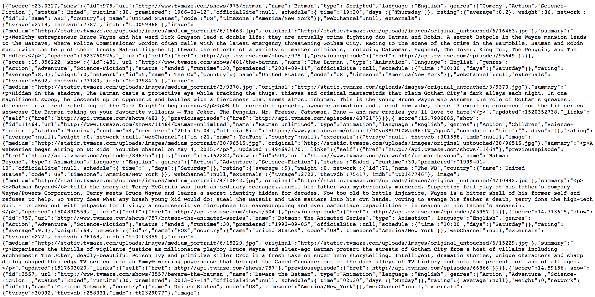

* As you can see we can get JSON back from a server but it might be difficult to read this way
* Open the following url: [https://codebeautify.org/jsonviewer](https://codebeautify.org/jsonviewer)

* Click the load url button and enter the https://api.tvmaze.com/search/shows?q=batman url
* This site will help us see the response that we get from the server on the left side
* We can see the JSON object representation in a way that is more readable

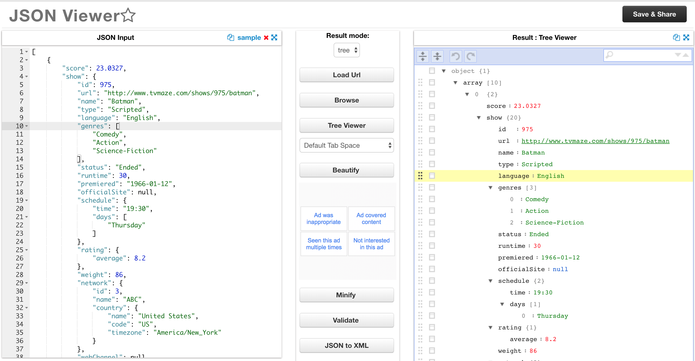

* Now that we know what we want to retrieve from the API call we can learn how to get it using JavaScript
* The **Fetch** API provides an interface for fetching resources (including across the network)
* It will seem familiar to anyone who has used XMLHttpRequest, but the new API provides a more powerful and flexible feature set
* Fetch provides a generic definition of Request and Response objects
* The **fetch** method takes one mandatory argument, the path to the resource you want to fetch

**Example:**
```js
const apiURL = 'https://api.tvmaze.com/search/shows?q=batman';

fetch(apiURL);
```

* In this example we are using TV Maze public api to retrieve some batman tv data
* The `fetch` method returns a `Promise` that resolves to the Response to that request, whether it is successful or not
* As the response it's a promise we can use the `then` method
* The `then` method accepts a callback function as parameter

**Example:**
```js
const apiURL = 'https://api.tvmaze.com/search/shows?q=batman';

fetch(apiURL)
  .then(function(response) {
    console.log(response); // we get a Response object back with the TV data
  });
```

* The Response object looks like this


* The Response object has a `json` method that returns a promise that resolves with the result of parsing the body text as JSON

**Example:**
```js
const apiURL = 'https://api.tvmaze.com/search/shows?q=batman';

fetch(apiURL)
  .then(function(response) {
    return response.json();
  });
```

* Promises can be chained using the `then` method as we return values

**Example:**
```js
const apiURL = 'https://api.tvmaze.com/search/shows?q=batman';

fetch(apiURL)
  .then(function(response) {
    return response.json();
  })
  .then(function(data) {
    console.log(data);
  });
```


* Each episode JSON has the following structure:

```json
{
  "score": 23.0327,
  "show": {
    "id": 975,
    "url": "http://www.tvmaze.com/shows/975/batman",
    "name": "Batman",
    "type": "Scripted",
    "language": "English",
    "genres": [
      "Comedy",
      "Action",
      "Science-Fiction"
    ],
    "status": "Ended",
    "runtime": 30,
    "premiered": "1966-01-12",
    "officialSite": null,
    "schedule": {
      "time": "19:30",
      "days": [
        "Thursday"
      ]
    },
    "rating": {
      "average": 8.2
    },
    "weight": 86,
    "network": {
      "id": 3,
      "name": "ABC",
      "country": {
        "name": "United States",
        "code": "US",
        "timezone": "America/New_York"
      }
    },
    "webChannel": null,
    "externals": {
      "tvrage": 2719,
      "thetvdb": 77871,
      "imdb": "tt0059968"
    },
    "image": {
      "medium": "http://static.tvmaze.com/uploads/images/medium_portrait/6/16463.jpg",
      "original": "http://static.tvmaze.com/uploads/images/original_untouched/6/16463.jpg"
    },
    "summary": "<p>Wealthy entrepreneur Bruce Wayne and his ward Dick Grayson lead a double life: they are actually crime fighting duo Batman and Robin. A secret Batpole in the Wayne mansion leads to the Batcave, where Police Commissioner Gordon often calls with the latest emergency threatening Gotham City. Racing to the scene of the crime in the Batmobile, Batman and Robin must (with the help of their trusty Bat-utility-belt) thwart the efforts of a variety of master criminals, including Catwoman, Egghead, The Joker, King Tut, The Penguin, and The Riddler.</p>",
    "updated": 1523760926,
    "_links": {
      "self": {
        "href": "http://api.tvmaze.com/shows/975"
      },
      "previousepisode": {
        "href": "http://api.tvmaze.com/episodes/95649"
      }
    }
  }
}
```

* Now that we have the data and know the JSON structure we can use it:

**Example:**
```js
const apiURL = 'https://api.tvmaze.com/search/shows?q=batman';

fetch(apiURL)
  .then(function(response) {
    return response.json();
  })
  .then(function(data) {
    const show = data[0];

    console.log(show.show.name); // Batman
    console.log(show.show.premiered); // 1966-01-12
    console.log(show.show.image.original); // http://static.tvmaze.com/uploads/images/original_untouched/6/16463.jpg
  });
```

* Now we can use everything that we learned on [this fetch example](https://github.com/nisnardi/fetch-demo)

#### Practice
[Exercise 52](./exercises/browser/ex_52.md)

## Congrats!!!
* Browser will fight to parse and interpret you JavaScript code


* You Rock! 🤘🏻


* Now you know JavaScript Browser side, we no longer need a droid! Thanks C-3PO 🤖

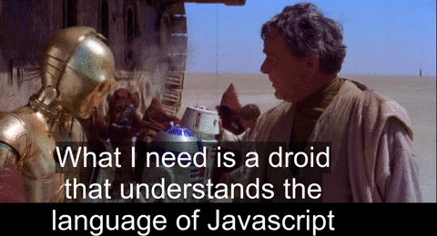

## Assets / Resources
* [Wes Bos - 30 Day Vanilla JS Coding Challenge (Great practice)](https://javascript30.com)
* [Frontendmasters - front-end handbook](https://frontendmasters.com/books/front-end-handbook/2018/)
* [Superhero.js](http://superherojs.com)
