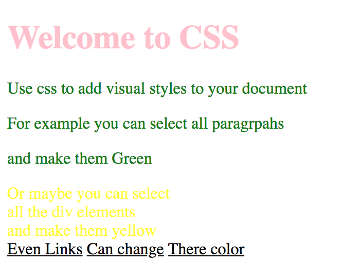

# Exercise 1

* Inside your git project create a index1.html file
* Copy and paste the following HTML code:

```html
<!DOCTYPE html>
<html>
  <head>
    <title>Welcome to CSS</title>
  </head>
  <body>
    <h1>Welcome to CSS</h1>
    <p>Use css to add visual styles to your document</p>
    <p>For example you can select all paragraphs</p>
    <p>and make them Green</p>
    <div>Or maybe you can select</div>
    <div>all the div elements</div>
    <div>and make them yellow</div>
    <a href="#">Even Links</a>
    <a href="#">Can change</a>
    <a href="#">Their color</a>
  </body>
</html>
```

* After applying all styles the document must look like this:




* Add a style element
* All h1 element must be pink
* All paragraphs must be green
* All divs must be yellow
* All links must be black