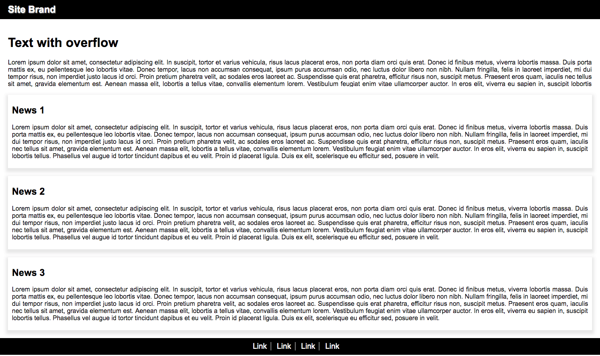

# Exercise 10

* Create a index10.html file
* Copy and paste the following HTML code:

```html
<!DOCTYPE html>
<html>
    <head>
        <title>Document</title>
    </head>
    <body>
        <header>
            <h2>Site Brand</h2>
        </header>
        <div class="main">
            <div class="overflow">
                <h1>Text with overflow</h1>
                <p>Lorem ipsum dolor sit amet, consectetur adipiscing elit. In suscipit, tortor et varius vehicula, risus lacus placerat eros, non porta diam orci quis erat. Donec id finibus metus, viverra lobortis massa. Duis porta mattis ex, eu pellentesque leo lobortis vitae. Donec tempor, lacus non accumsan consequat, ipsum purus accumsan odio, nec luctus dolor libero non nibh. Nullam fringilla, felis in laoreet imperdiet, mi dui tempor risus, non imperdiet justo lacus id orci. Proin pretium pharetra velit, ac sodales eros laoreet ac. Suspendisse quis erat pharetra, efficitur risus non, suscipit metus. Praesent eros quam, iaculis nec tellus sit amet, gravida elementum est. Aenean massa elit, lobortis a tellus vitae, convallis elementum lorem. Vestibulum feugiat enim vitae ullamcorper auctor. In eros elit, viverra eu sapien in, suscipit lobortis tellus. Phasellus vel augue id tortor tincidunt dapibus et eu velit. Proin id placerat ligula. Duis ex elit, scelerisque eu efficitur sed, posuere in velit.</p>
                <p>Duis et tortor et justo euismod porttitor sit amet nec magna. Etiam faucibus ante a sagittis convallis. Sed luctus, ipsum non viverra vestibulum, urna nunc posuere ipsum, ac maximus purus lacus luctus urna. Cras ac ipsum id sem feugiat elementum ac eu est. Suspendisse sed urna quis lacus fringilla bibendum vel lacinia nunc. Vivamus ut libero et leo auctor pretium nec id diam. Suspendisse facilisis nisi et rutrum euismod. Aliquam pharetra vulputate nunc, non aliquet urna scelerisque eu. Integer id tortor lorem. Praesent placerat tincidunt eros, id tristique nisi accumsan ut. Fusce efficitur sapien id convallis posuere. Nam at ultricies nisi. Nullam non justo consequat, gravida urna non, malesuada odio.</p>
                <p>Nullam semper, urna sit amet aliquam viverra, mauris eros fringilla elit, at lacinia ligula est sed ipsum. Nulla elit nunc, tincidunt sit amet nulla eu, tristique sagittis leo. Nam sed risus id eros fringilla mollis. Nulla facilisi. Etiam at orci eleifend, dapibus odio quis, tempus quam. Nunc iaculis euismod urna vel feugiat. Nam pharetra justo non sem sodales, sed pellentesque tortor eleifend. Aliquam a metus quis felis eleifend aliquet. Maecenas et felis libero. Aenean cursus porta magna, vel gravida dui cursus at. Ut vel ipsum ornare, pretium leo sed, pharetra mi. Donec at leo non nulla efficitur ullamcorper. Ut suscipit purus justo, at viverra sem viverra et. Etiam vel consequat mauris. Aliquam vitae ornare nisi. Phasellus facilisis non metus vitae elementum.</p>
                <p>Lorem ipsum dolor sit amet, consectetur adipiscing elit. In suscipit, tortor et varius vehicula, risus lacus placerat eros, non porta diam orci quis erat. Donec id finibus metus, viverra lobortis massa. Duis porta mattis ex, eu pellentesque leo lobortis vitae. Donec tempor, lacus non accumsan consequat, ipsum purus accumsan odio, nec luctus dolor libero non nibh. Nullam fringilla, felis in laoreet imperdiet, mi dui tempor risus, non imperdiet justo lacus id orci. Proin pretium pharetra velit, ac sodales eros laoreet ac. Suspendisse quis erat pharetra, efficitur risus non, suscipit metus. Praesent eros quam, iaculis nec tellus sit amet, gravida elementum est. Aenean massa elit, lobortis a tellus vitae, convallis elementum lorem. Vestibulum feugiat enim vitae ullamcorper auctor. In eros elit, viverra eu sapien in, suscipit lobortis tellus. Phasellus vel augue id tortor tincidunt dapibus et eu velit. Proin id placerat ligula. Duis ex elit, scelerisque eu efficitur sed, posuere in velit.</p>
                <p>Duis et tortor et justo euismod porttitor sit amet nec magna. Etiam faucibus ante a sagittis convallis. Sed luctus, ipsum non viverra vestibulum, urna nunc posuere ipsum, ac maximus purus lacus luctus urna. Cras ac ipsum id sem feugiat elementum ac eu est. Suspendisse sed urna quis lacus fringilla bibendum vel lacinia nunc. Vivamus ut libero et leo auctor pretium nec id diam. Suspendisse facilisis nisi et rutrum euismod. Aliquam pharetra vulputate nunc, non aliquet urna scelerisque eu. Integer id tortor lorem. Praesent placerat tincidunt eros, id tristique nisi accumsan ut. Fusce efficitur sapien id convallis posuere. Nam at ultricies nisi. Nullam non justo consequat, gravida urna non, malesuada odio.</p>
                <p>Nullam semper, urna sit amet aliquam viverra, mauris eros fringilla elit, at lacinia ligula est sed ipsum. Nulla elit nunc, tincidunt sit amet nulla eu, tristique sagittis leo. Nam sed risus id eros fringilla mollis. Nulla facilisi. Etiam at orci eleifend, dapibus odio quis, tempus quam. Nunc iaculis euismod urna vel feugiat. Nam pharetra justo non sem sodales, sed pellentesque tortor eleifend. Aliquam a metus quis felis eleifend aliquet. Maecenas et felis libero. Aenean cursus porta magna, vel gravida dui cursus at. Ut vel ipsum ornare, pretium leo sed, pharetra mi. Donec at leo non nulla efficitur ullamcorper. Ut suscipit purus justo, at viverra sem viverra et. Etiam vel consequat mauris. Aliquam vitae ornare nisi. Phasellus facilisis non metus vitae elementum.</p>
            </div>
            <div class="news">
                <h2>News 1</h2>
                <p>Lorem ipsum dolor sit amet, consectetur adipiscing elit. In suscipit, tortor et varius vehicula, risus lacus placerat eros, non porta diam orci quis erat. Donec id finibus metus, viverra lobortis massa. Duis porta mattis ex, eu pellentesque leo lobortis vitae. Donec tempor, lacus non accumsan consequat, ipsum purus accumsan odio, nec luctus dolor libero non nibh. Nullam fringilla, felis in laoreet imperdiet, mi dui tempor risus, non imperdiet justo lacus id orci. Proin pretium pharetra velit, ac sodales eros laoreet ac. Suspendisse quis erat pharetra, efficitur risus non, suscipit metus. Praesent eros quam, iaculis nec tellus sit amet, gravida elementum est. Aenean massa elit, lobortis a tellus vitae, convallis elementum lorem. Vestibulum feugiat enim vitae ullamcorper auctor. In eros elit, viverra eu sapien in, suscipit lobortis tellus. Phasellus vel augue id tortor tincidunt dapibus et eu velit. Proin id placerat ligula. Duis ex elit, scelerisque eu efficitur sed, posuere in velit.</p>
            </div>
            <div class="news">
                <h2>News 2</h2>
                <p>Lorem ipsum dolor sit amet, consectetur adipiscing elit. In suscipit, tortor et varius vehicula, risus lacus placerat eros, non porta diam orci quis erat. Donec id finibus metus, viverra lobortis massa. Duis porta mattis ex, eu pellentesque leo lobortis vitae. Donec tempor, lacus non accumsan consequat, ipsum purus accumsan odio, nec luctus dolor libero non nibh. Nullam fringilla, felis in laoreet imperdiet, mi dui tempor risus, non imperdiet justo lacus id orci. Proin pretium pharetra velit, ac sodales eros laoreet ac. Suspendisse quis erat pharetra, efficitur risus non, suscipit metus. Praesent eros quam, iaculis nec tellus sit amet, gravida elementum est. Aenean massa elit, lobortis a tellus vitae, convallis elementum lorem. Vestibulum feugiat enim vitae ullamcorper auctor. In eros elit, viverra eu sapien in, suscipit lobortis tellus. Phasellus vel augue id tortor tincidunt dapibus et eu velit. Proin id placerat ligula. Duis ex elit, scelerisque eu efficitur sed, posuere in velit.</p>
            </div>
            <div class="news">
                <h2>News 3</h2>
                <p>Lorem ipsum dolor sit amet, consectetur adipiscing elit. In suscipit, tortor et varius vehicula, risus lacus placerat eros, non porta diam orci quis erat. Donec id finibus metus, viverra lobortis massa. Duis porta mattis ex, eu pellentesque leo lobortis vitae. Donec tempor, lacus non accumsan consequat, ipsum purus accumsan odio, nec luctus dolor libero non nibh. Nullam fringilla, felis in laoreet imperdiet, mi dui tempor risus, non imperdiet justo lacus id orci. Proin pretium pharetra velit, ac sodales eros laoreet ac. Suspendisse quis erat pharetra, efficitur risus non, suscipit metus. Praesent eros quam, iaculis nec tellus sit amet, gravida elementum est. Aenean massa elit, lobortis a tellus vitae, convallis elementum lorem. Vestibulum feugiat enim vitae ullamcorper auctor. In eros elit, viverra eu sapien in, suscipit lobortis tellus. Phasellus vel augue id tortor tincidunt dapibus et eu velit. Proin id placerat ligula. Duis ex elit, scelerisque eu efficitur sed, posuere in velit.</p>
            </div>
        </div>
        <footer>
            <a href="#">Link</a>
            <a href="#">Link</a>
            <a href="#">Link</a>
            <a href="#">Link</a>
        </footer>       
    </body>
</html>
```

* After applying all styles the document must look like this:




* Add a style element
* Select the body element and apply the following styles:
  * All margin sides must be set to 0
  * All padding sides must be set to 0
  * The background color must be white
  * Use Arial or Helvetica or sans-serif as font family
  * Font size must be 16 pixels 
* Select the header element and apply the following styles:
  * The background color must be black
  * Font color must be white
  * Top and bottom padding must be 10 pixels
  * Right and Left padding must be 20px
* Select the h2 element that's inside the header elemetn and apply the following styles:
  * All margin sides must be set to 0
  * Use text shadow with this configuration: 1px 2px 3px #666 
* Select all elements with the main class and apply the following styles:
  * All padding sides must be set to 20 pixels
* Select the parragraphs that are children of the main class elements and apply the following styles:
  * The text must be justify aligned
* Select the elements with the overflow class and apply the following styles:
  * The box must be 150 pixels tall
  * The content of this element must be scrollable only over the y axis
* Select the footer element and apply the following styles:
  * The background color must be black
  * All padding sides must be set to 10 pixels
  * The text must be center aligned
* Select all link elements that are children of the footer element and apply the following styles:
  * Text must be white
  * Remove the undeline decoration
  * Text size must be 1.2em
  * The right border must be 1px solid white
  * Right margin must be 10 pixels
  * Right Padding must be 10 pixels
* Select all links and use the hover pseudo class and apply the following styles:
  * Text color must be gray
  * Text decoration must be underline
  * Also it must be bold
* Select the last link element using the [last-child](https://developer.mozilla.org/en-US/docs/Web/CSS/:last-child) selector and apply the following styles:
  * Remove the right border
* Select the elements with the news class and apply the following styles:
  * Top margin must be 20 pixels tall
  * The box should have the following shadow configuration: 0px 5px 10px 5px rgba(0,0,0,0.1)
  * Top and bottom padding must be 5 pixels
  * Right and left padding must be 10 pixels
