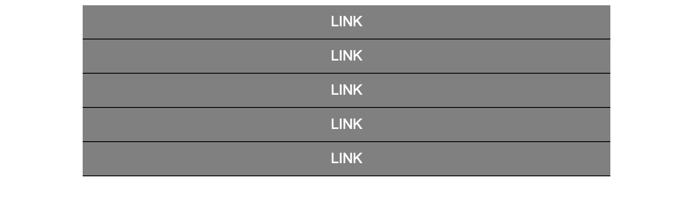
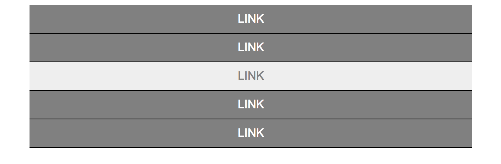

# Exercise 11

* Create a index11.html file
* Copy and paste the following HTML code:

## index11.html
```html
<!DOCTYPE html>
<html>
  <head>
    <title>Learning CSS</title>
  </head>
  <body>
    <div id="container">
      <a href="#">link</a>
      <a href="#">link</a>
      <a href="#">link</a>
      <a href="#">link</a>
      <a href="#">link</a>
    </div>
  </body>
</html>
```

* After applying all styles the document must look like this:




* Add a style element
* Select the body element and apply the following styles:
  * Use Arial, Helvetica, sans-serif as font family
* Select the element with the container id and apply the following styles:
  * Background color must be gray
  * The element must be 600px wide
  * Center this element using margin auto
* Select all the link element that are children of the container id element and apply the following styles:
  * Change the display property to be block
  * Center align the text
  * Use white for font color
  * Remove the link text decoration
  * Add a 1px solid black bottom border
  * Add 10px padding to all sides
  * Transform the text to be uppercase
  * Add the hover pseudoclass and apply the following styles:
    * Background color must be #eee
    * Use gray for font color