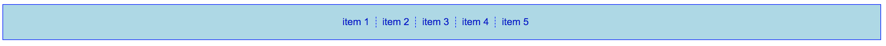

# Exercise 12

* Create a index12.html file
* Copy and paste the following HTML code:

## index12.html
```html
<!DOCTYPE html>
<html>
  <head>
    <title>Learning CSS</title>
  </head>
  <body>
    <ul>
      <li>item 1</li>
      <li>item 2</li>
      <li>item 3</li>
      <li>item 4</li>
      <li>item 5</li>
    </ul>
  </body>
</html>
```

* After applying all styles the document must look like this:



* Add a style element
* Select the body element and apply the following styles:
  * Use Arial, Helvetica, sans-serif as font family
* Select all the unordered list element and apply the following styles:
  * Background color must be lightblue
  * Use 1px solid blue for all sides border
  * Add 20px padding to all sides
  * Center align text
  * Change the font size to 0
* Select all list item elements and apply the following styles:
  * Change the display property to inline-block
  * Use mediumblue for font color
  * Use 1px dashed blue only for the right side
  * Remove all padding
  * Apply 10px padding only to the right side
  * Add 10px to the right margin
  * Change the font size to 16px
* Use the last-child pseudo-class to select only the last list item and apply the following style:
  * Remove all borders