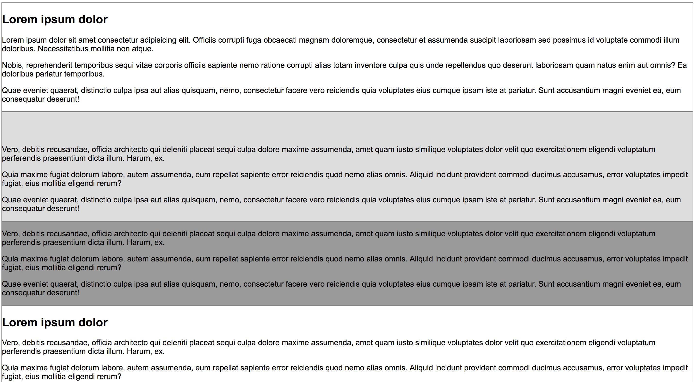

# Exercise 13

* Create a index13.html file
* Copy and paste the following HTML code:

## index13.html
```html
<!DOCTYPE html>
<html>
  <head>
    <title>Learning CSS</title>
  </head>
  <body>
    <article>
      <h1>Lorem ipsum dolor</h1>
      <p>Lorem ipsum dolor sit amet consectetur adipisicing elit. Officiis corrupti fuga obcaecati magnam doloremque, consectetur et assumenda suscipit laboriosam sed possimus id voluptate commodi illum doloribus. Necessitatibus mollitia non atque.</p>
      <p>Nobis, reprehenderit temporibus sequi vitae corporis officiis sapiente nemo ratione corrupti alias totam inventore culpa quis unde repellendus quo deserunt laboriosam quam natus enim aut omnis? Ea doloribus pariatur temporibus.</p>
      <p>Quae eveniet quaerat, distinctio culpa ipsa aut alias quisquam, nemo, consectetur facere vero reiciendis quia voluptates eius cumque ipsam iste at pariatur. Sunt accusantium magni eveniet ea, eum consequatur deserunt!</p>  
    </article>
    <article class="hidden">
      <h1>Lorem ipsum dolor</h1>
      <p>Vero, debitis recusandae, officia architecto qui deleniti placeat sequi culpa dolore maxime assumenda, amet quam iusto similique voluptates dolor velit quo exercitationem eligendi voluptatum perferendis praesentium dicta illum. Harum, ex.</p>
      <p>Quia maxime fugiat dolorum labore, autem assumenda, eum repellat sapiente error reiciendis quod nemo alias omnis. Aliquid incidunt provident commodi ducimus accusamus, error voluptates impedit fugiat, eius mollitia eligendi rerum?</p>
      <p>Quae eveniet quaerat, distinctio culpa ipsa aut alias quisquam, nemo, consectetur facere vero reiciendis quia voluptates eius cumque ipsam iste at pariatur. Sunt accusantium magni eveniet ea, eum consequatur deserunt!</p>
    </article>
    <article class="remove">
      <h1>Lorem ipsum dolor</h1>
      <p>Vero, debitis recusandae, officia architecto qui deleniti placeat sequi culpa dolore maxime assumenda, amet quam iusto similique voluptates dolor velit quo exercitationem eligendi voluptatum perferendis praesentium dicta illum. Harum, ex.</p>
      <p>Quia maxime fugiat dolorum labore, autem assumenda, eum repellat sapiente error reiciendis quod nemo alias omnis. Aliquid incidunt provident commodi ducimus accusamus, error voluptates impedit fugiat, eius mollitia eligendi rerum?</p>
      <p>Quae eveniet quaerat, distinctio culpa ipsa aut alias quisquam, nemo, consectetur facere vero reiciendis quia voluptates eius cumque ipsam iste at pariatur. Sunt accusantium magni eveniet ea, eum consequatur deserunt!</p>
    </article>
    <article>
      <h1>Lorem ipsum dolor</h1>
      <p>Vero, debitis recusandae, officia architecto qui deleniti placeat sequi culpa dolore maxime assumenda, amet quam iusto similique voluptates dolor velit quo exercitationem eligendi voluptatum perferendis praesentium dicta illum. Harum, ex.</p>
      <p>Quia maxime fugiat dolorum labore, autem assumenda, eum repellat sapiente error reiciendis quod nemo alias omnis. Aliquid incidunt provident commodi ducimus accusamus, error voluptates impedit fugiat, eius mollitia eligendi rerum?</p>
      <p>Quae eveniet quaerat, distinctio culpa ipsa aut alias quisquam, nemo, consectetur facere vero reiciendis quia voluptates eius cumque ipsam iste at pariatur. Sunt accusantium magni eveniet ea, eum consequatur deserunt!</p>
    </article>
  </body>
</html>
```

* After applying all styles the document must look like this:



* Add a style element
* Select the body element and apply the following style:
  * Use Arial, Helvetica, sans-serif as font family
* Select the article elements and apply the following style:
  * Use 1px solid gray for all sides border
* Select the article with the hidden class and apply the following style:
  * Background color must be #ddd
* Select the article with the remove class and apply the following style:
  * Background color must be #999
* Select the h1 element inside the article with the class hidden and apply the followinig style:
  * Visibility must be hidden
* Select the h1 element inside the article with the class remove and apply the followinig style:
  * Change the display property to be none
* Check the difference between `display:none` and `visibility:hidden`