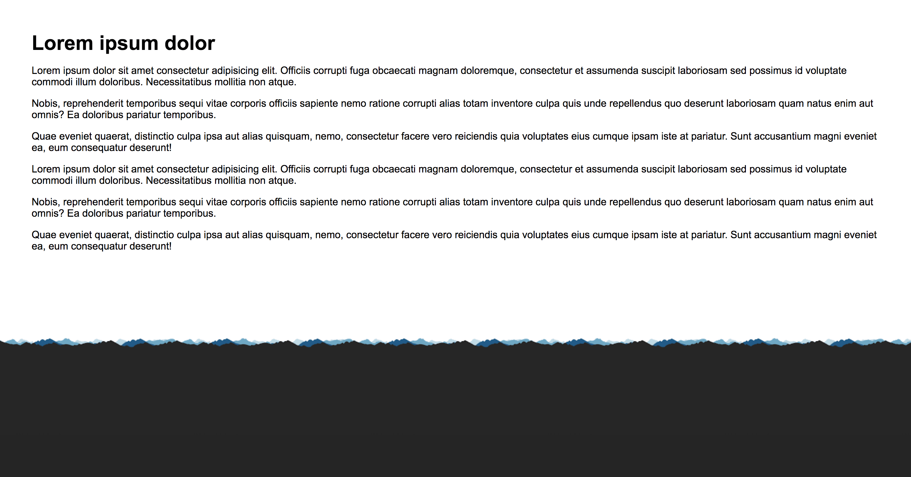

# Exercise 15

* Create a new folder with the name `ex_15`
* Create the following files
* Download the [pattern.png file](./images/pattern.png)

```
/ex_15
|-- index.html
|-- pattern.png
```

## index15.html
```html
<!DOCTYPE html>
<html>
  <head>
    <title>Learning CSS</title>
  </head>
  <body>
      <div class="main">
        <h1>Lorem ipsum dolor</h1>
        <p>Lorem ipsum dolor sit amet consectetur adipisicing elit. Officiis corrupti fuga obcaecati magnam doloremque, consectetur et assumenda suscipit laboriosam sed possimus id voluptate commodi illum doloribus. Necessitatibus mollitia non atque.</p>
        <p>Nobis, reprehenderit temporibus sequi vitae corporis officiis sapiente nemo ratione corrupti alias totam inventore culpa quis unde repellendus quo deserunt laboriosam quam natus enim aut omnis? Ea doloribus pariatur temporibus.</p>
        <p>Quae eveniet quaerat, distinctio culpa ipsa aut alias quisquam, nemo, consectetur facere vero reiciendis quia voluptates eius cumque ipsam iste at pariatur. Sunt accusantium magni eveniet ea, eum consequatur deserunt!</p>  
        <p>Lorem ipsum dolor sit amet consectetur adipisicing elit. Officiis corrupti fuga obcaecati magnam doloremque, consectetur et assumenda suscipit laboriosam sed possimus id voluptate commodi illum doloribus. Necessitatibus mollitia non atque.</p>
        <p>Nobis, reprehenderit temporibus sequi vitae corporis officiis sapiente nemo ratione corrupti alias totam inventore culpa quis unde repellendus quo deserunt laboriosam quam natus enim aut omnis? Ea doloribus pariatur temporibus.</p>
        <p>Quae eveniet quaerat, distinctio culpa ipsa aut alias quisquam, nemo, consectetur facere vero reiciendis quia voluptates eius cumque ipsam iste at pariatur. Sunt accusantium magni eveniet ea, eum consequatur deserunt!</p>  
      </div>
  </body>
</html>
```

* After applying all styles the document must look like this:



* Add a style element
* Select the body element and apply the following style:
  * Use Arial, Helvetica, sans-serif as font family
  * Background color must be #252525
  * Remove all margin sides
  * Remove all padding sides
* Select the h1 element and apply the following style:
  * Remove all margin sides
* Select the element with the main class and apply the following style:
  * Background color must be white
  * Use the pattern.png as background image
  * Repeat the background image only on the x axis
  * The background must be positioned using the left and bottom value
  * Add 50px padding to all sides
  * Override the bottom padding and set the value to 300px
* Take a look at the site

## Extra
* Now instead of using each individual background property use the background shorthand to set all the background properties in one line for the element that has the main class