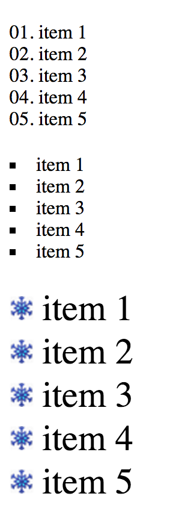

# Exercise 16

* Create a new folder with the name `ex_16`
* Create the following files
* Download the [snow.png file](./images/snow.png)

```
/ex_16
|-- index.html
|-- snow.png
```

## index16.html
```html
<!DOCTYPE html>
<html>
  <head>
    <title>Learning CSS</title>
  </head>
  <body>
    <ol>
      <li>item 1</li>
      <li>item 2</li>
      <li>item 3</li>
      <li>item 4</li>
      <li>item 5</li>
    </ol>
  
    <ul>
      <li>item 1</li>
      <li>item 2</li>
      <li>item 3</li>
      <li>item 4</li>
      <li>item 5</li>
    </ul>

    <ul class="decorated">
      <li>item 1</li>
      <li>item 2</li>
      <li>item 3</li>
      <li>item 4</li>
      <li>item 5</li>
    </ul>
  </body>
</html>
```

* After applying all styles the document must look like this:



* Add a style element
* Select the both ul and ol lists and apply the following style:
  * Remove margin from all sides
  * Remove padding from all sides
  * Add 20px to margin top only
* Select all li elements and apply the following style:
  * The list item style position must be inside
* Select only the ol list and apply the following style:
  * List style must be decimal-leading-zero
* Select only the ul list and apply the following style:
  * List style must be square
* Select the element with the decorated class and apply the following style: 
  * Use the snow.png as list style image
  * Font size must be 30px
