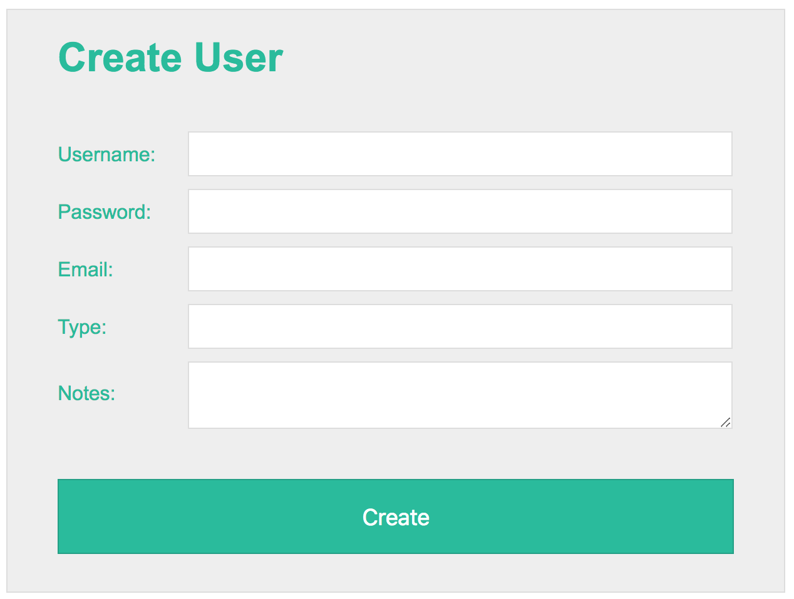

# Exercise 18

* Create a index18.html file
* Copy and paste the following HTML code:

## index18.html
```html
<!DOCTYPE html>
<html lang="en">
<head>
  <title>Learing CSS</title>
</head>
<body>
  <form>
    <h1>Create User</h1>
    <fieldset>
        <label>Username:</label>
        <input type="text" name="username">
    </fieldset>
    <fieldset>
        <label>Password:</label>
        <input type="password" name="password">
    </fieldset>
    <fieldset>
        <label>Email:</label>
        <input type="text" name="email">
    </fieldset>
    <fieldset>
        <label>Type:</label>
        <input type="text" name="type">
    </fieldset>
    <fieldset>
        <label>Notes:</label>
        <textarea name="notes"></textarea>
    </fieldset>
    <fieldset>
      <input type="submit" value="Create">
    </fieldset>
  </form>
</body>
</html>
```
* After applying all styles the document must look like this:



* Add a style element
* Select the form element and apply the following style:
  * Background color must be #eee
  * Use the following configuration for all borders: 1px solid #ddd
  * Use Arial, Helvetica, sans-serif as font family
  * Font size must be 16px
  * Make this element 540px wide
  * Center this element using margin auto for left and right sides
  * Add 20px padding to the top and bottom sides
  * Add 40px padding to the left and right sides
  * Font color must be #1abc9c
* Select the h1 element and apply the following style:
  * Remove margin from all sides
  * Add 40px to the bottom margin only
* Select the fieldset elements and apply the following style:
  * Remove border from all sides
  * Remove padding from all sides
  * Add 10px only for top and bottom margin
  * Remove the left and right margins
* Select the label elements and apply the following style:
  * Display must be inline block
  * Make this element 80px wide
  * Add 20px padding only to the right side
* Select the input type text, input type password and textarea elements and apply the following styles:
  * Display must be inline block
  * Make this elements 417px wide
  * Add 0.5em padding to all sides
  * Font size must be 16px
  * Add a 1px solid #ddd border to all sides
  * Font color must be gray
  * Add the [outline-color](https://developer.mozilla.org/en-US/docs/Web/CSS/outline-color) property with the value #1abc9c
* Select the textarea element and apply the following style: 
  * Vertical align this element to the middle of the text
* Select the input type submit element and apply the following style:
  * Display must be block
  * Add the following padding: 19px 39px 18px 39px
  * Font color must be white
  * Background color must be #1abc9c
  * Font size must be 18px
  * Center align the text
  * Make this element 100% wide
  * Add the following border configuration 1px solid #16a085
* Select the last fieldset element using the last-child pseudoclass and apply the following style:
  * Add 40px only to margin top