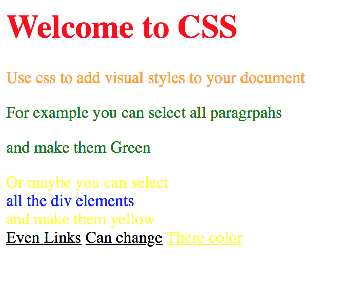

# Exercise 2

* Create a new index2.html file
* Copy and paste the code from the previous exercise (ex_1)

* After applying all styles the document must look like this:

* Use inline styles to override the previous defined document styles
  * All h1 element must be red
  * The first paragraph must be orange
  * The second div must be blue
  * The third link must be yellow

