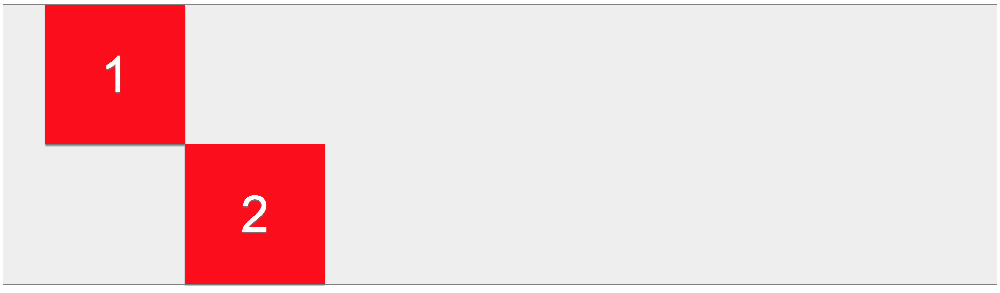
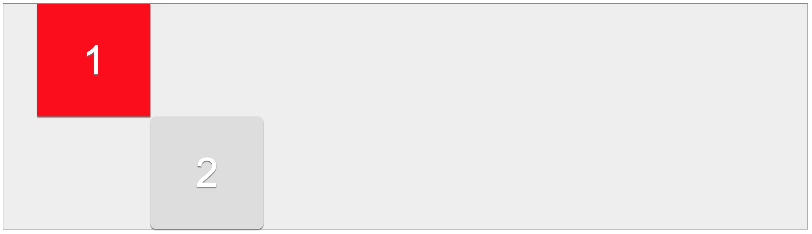

# Exercise 20

* Create a index20.html file
* Copy and paste the following HTML code:

## index20.html
```html
<!DOCTYPE html>
<html>
<head>
  <title>Learing CSS</title>
</head>
<body>
  <div class="container">
    <div>1</div>
    <div>2</div>
  </div>
</body>
</html>
```


* After applying all styles the document must look like this:




* Add a style element
* Select the container class element and apply the following style:
  * Background color must be #eee
  * Use Arial, Helvetica, sans-serif as font family
  * Font color must be white
  * Use 1px solid gray as border for all sides
* Select the div elements that are childrend of the container class element and apply the following style
  * Position must be relative
  * Width and Height must be 200px
  * Background color must be red
  * Font size must be 72px 
  * Center align text
  * Line height must be 200px
  * Use the following 0 2px 1px #777 values as box shadow
  * Use the following 0 2px 1px #777 values as text-shadow
* Select the hover pseudo class for div elements that are children of the container class element and apply the following style:
  * Border radius must be 10px
  * Background color must be #ddd
* Select the first div element that's children of the container class element (use pseudo class)
  * Top must be 0px
  * Left must be 60px
* Select the last div element that's children of the container class element (use pseudo class)
  * Top must be 0px
  * Left must be 260px
* Change the top and left properties values from the divs that are children of the container class and see what happens
* Try 0 and 0 values to see the initial point
* Try negative values