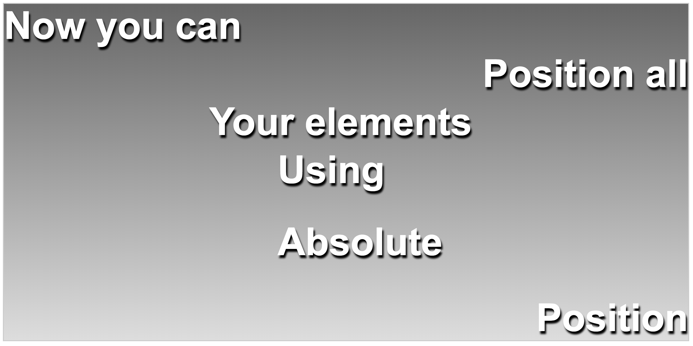

# Exercise 21

* Create a index21.html file
* Copy and paste the following HTML code:

## index21.html
```html
<!DOCTYPE html>
<html>
<head>
  <title>Learing CSS</title>
</head>
<body>
  <div class="container">
    <div class="one">Position</div>
    <div class="two">Absolute</div>
    <div class="three">Using</div>
    <div class="four">Your elements</div>
    <div class="five">Position all</div>
    <div class="six">Now you can</div>
  </div>
</body>
</html>
```

* After applying all styles the document must look like this:



* Add a style element
* Select the container class element and apply the following style:
  * Position must be relative
  * Background must be linear-gradient(180deg, #666, #ddd)
  * Add a 2px solid #ccc border to all sides
  * Make the element 700px tall
* Select the div element that are children of the container class element and apply the following style:
  * Position must be absolute
  * Use Arial, Helvetica, sans-serif as font family
  * Font color must be white
  * Font size must be 80px
  * Make the font bold
  * Add text shadow using the following value 3px 6px 5px #000
* Select the one class elements and apply the following style:
  * Bottom must be 0
  * Right must be 0
* Select the two class elements and apply the following style:
  * Top must be 450px
  * Left must be 40%
* Select the three class elements and apply the following style:
  * Top must be 300px
  * Left must be 40%
* Select the four class elements and apply the following style:
  * Top must be 200px
  * Left must be 30%
* Select the five class elements and apply the following style:
  * Top must be 100px
  * Right must be 0
* Select the six class elements and apply the following style:
  * Top must be 0
  * Left must be 0
* Change the values for each one to six class elements, try left, top, bottom and right

### Extra
* Now try adding some color using the :hover pseudo class and the elements that you have already selected
```css
  .container:hover {
      background: linear-gradient(180deg,  #ddd,#666);
  }
  
  .six:hover {
    color: pink;
  }
```