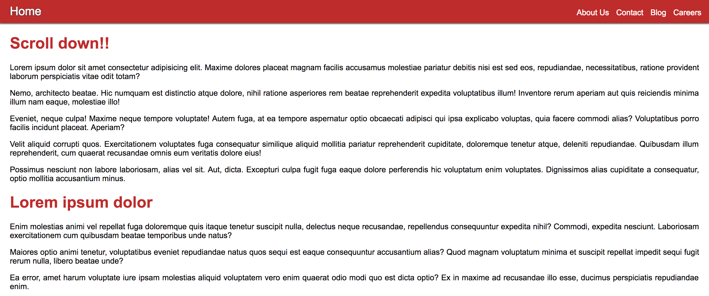
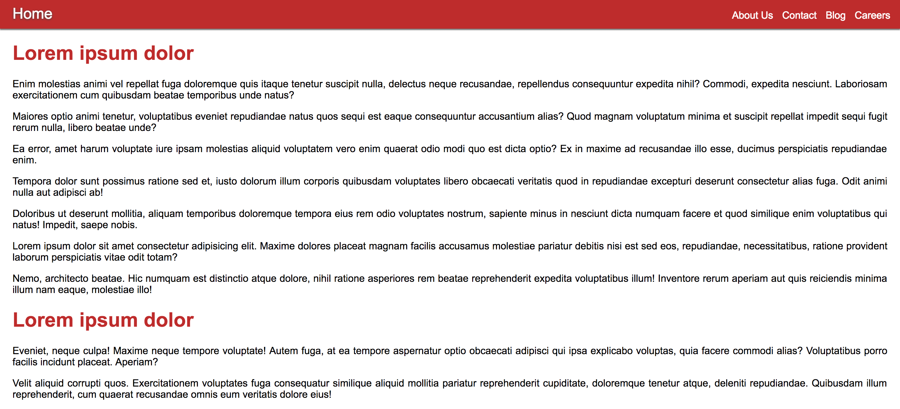

# Exercise 22

* Create a index22.html file
* Copy and paste the following HTML code:

## index22.html
```html
<!DOCTYPE html>
<html>
<head>
  <title>Learing CSS</title>
</head>
<body>
  <nav>
    <div class="home">
      <a href="#">Home</a>
    </div>
    <div class="links">
      <a href="#">About Us</a>
      <a href="#">Contact</a>
      <a href="#">Blog</a>
      <a href="#">Careers</a>
    </div>
  </nav>
  <div class="main">
    <h1>Scroll down!!</h1>
    <p>Lorem ipsum dolor sit amet consectetur adipisicing elit. Maxime dolores placeat magnam facilis accusamus molestiae pariatur debitis nisi est sed eos, repudiandae, necessitatibus, ratione provident laborum perspiciatis vitae odit totam?</p>
    <p>Nemo, architecto beatae. Hic numquam est distinctio atque dolore, nihil ratione asperiores rem beatae reprehenderit expedita voluptatibus illum! Inventore rerum aperiam aut quis reiciendis minima illum nam eaque, molestiae illo!</p>
    <p>Eveniet, neque culpa! Maxime neque tempore voluptate! Autem fuga, at ea tempore aspernatur optio obcaecati adipisci qui ipsa explicabo voluptas, quia facere commodi alias? Voluptatibus porro facilis incidunt placeat. Aperiam?</p>
    <p>Velit aliquid corrupti quos. Exercitationem voluptates fuga consequatur similique aliquid mollitia pariatur reprehenderit cupiditate, doloremque tenetur atque, deleniti repudiandae. Quibusdam illum reprehenderit, cum quaerat recusandae omnis eum veritatis dolore eius!</p>
    <p>Possimus nesciunt non labore laboriosam, alias vel sit. Aut, dicta. Excepturi culpa fugit fuga eaque dolore perferendis hic voluptatum enim voluptates. Dignissimos alias cupiditate a consequatur, optio mollitia accusantium minus.</p>
    <h1>Lorem ipsum dolor</h1>
    <p>Enim molestias animi vel repellat fuga doloremque quis itaque tenetur suscipit nulla, delectus neque recusandae, repellendus consequuntur expedita nihil? Commodi, expedita nesciunt. Laboriosam exercitationem cum quibusdam beatae temporibus unde natus?</p>
    <p>Maiores optio animi tenetur, voluptatibus eveniet repudiandae natus quos sequi est eaque consequuntur accusantium alias? Quod magnam voluptatum minima et suscipit repellat impedit sequi fugit rerum nulla, libero beatae unde?</p>
    <p>Ea error, amet harum voluptate iure ipsam molestias aliquid voluptatem vero enim quaerat odio modi quo est dicta optio? Ex in maxime ad recusandae illo esse, ducimus perspiciatis repudiandae enim.</p>
    <p>Tempora dolor sunt possimus ratione sed et, iusto dolorum illum corporis quibusdam voluptates libero obcaecati veritatis quod in repudiandae excepturi deserunt consectetur alias fuga. Odit animi nulla aut adipisci ab!</p>
    <p>Doloribus ut deserunt mollitia, aliquam temporibus doloremque tempora eius rem odio voluptates nostrum, sapiente minus in nesciunt dicta numquam facere et quod similique enim voluptatibus qui natus! Impedit, saepe nobis.</p>
    <p>Lorem ipsum dolor sit amet consectetur adipisicing elit. Maxime dolores placeat magnam facilis accusamus molestiae pariatur debitis nisi est sed eos, repudiandae, necessitatibus, ratione provident laborum perspiciatis vitae odit totam?</p>
    <p>Nemo, architecto beatae. Hic numquam est distinctio atque dolore, nihil ratione asperiores rem beatae reprehenderit expedita voluptatibus illum! Inventore rerum aperiam aut quis reiciendis minima illum nam eaque, molestiae illo!</p>
    <h1>Lorem ipsum dolor</h1>
    <p>Eveniet, neque culpa! Maxime neque tempore voluptate! Autem fuga, at ea tempore aspernatur optio obcaecati adipisci qui ipsa explicabo voluptas, quia facere commodi alias? Voluptatibus porro facilis incidunt placeat. Aperiam?</p>
    <p>Velit aliquid corrupti quos. Exercitationem voluptates fuga consequatur similique aliquid mollitia pariatur reprehenderit cupiditate, doloremque tenetur atque, deleniti repudiandae. Quibusdam illum reprehenderit, cum quaerat recusandae omnis eum veritatis dolore eius!</p>
    <p>Possimus nesciunt non labore laboriosam, alias vel sit. Aut, dicta. Excepturi culpa fugit fuga eaque dolore perferendis hic voluptatum enim voluptates. Dignissimos alias cupiditate a consequatur, optio mollitia accusantium minus.</p>
    <p>Lorem ipsum dolor sit amet consectetur adipisicing elit. Maxime dolores placeat magnam facilis accusamus molestiae pariatur debitis nisi est sed eos, repudiandae, necessitatibus, ratione provident laborum perspiciatis vitae odit totam?</p>
    <p>Nemo, architecto beatae. Hic numquam est distinctio atque dolore, nihil ratione asperiores rem beatae reprehenderit expedita voluptatibus illum! Inventore rerum aperiam aut quis reiciendis minima illum nam eaque, molestiae illo!</p>
    <p>Eveniet, neque culpa! Maxime neque tempore voluptate! Autem fuga, at ea tempore aspernatur optio obcaecati adipisci qui ipsa explicabo voluptas, quia facere commodi alias? Voluptatibus porro facilis incidunt placeat. Aperiam?</p>
    <h1>Lorem ipsum dolor</h1>
    <p>Velit aliquid corrupti quos. Exercitationem voluptates fuga consequatur similique aliquid mollitia pariatur reprehenderit cupiditate, doloremque tenetur atque, deleniti repudiandae. Quibusdam illum reprehenderit, cum quaerat recusandae omnis eum veritatis dolore eius!</p>
    <p>Possimus nesciunt non labore laboriosam, alias vel sit. Aut, dicta. Excepturi culpa fugit fuga eaque dolore perferendis hic voluptatum enim voluptates. Dignissimos alias cupiditate a consequatur, optio mollitia accusantium minus.</p>
    <p>Lorem ipsum dolor sit amet consectetur adipisicing elit. Maxime dolores placeat magnam facilis accusamus molestiae pariatur debitis nisi est sed eos, repudiandae, necessitatibus, ratione provident laborum perspiciatis vitae odit totam?</p>
    <p>Nemo, architecto beatae. Hic numquam est distinctio atque dolore, nihil ratione asperiores rem beatae reprehenderit expedita voluptatibus illum! Inventore rerum aperiam aut quis reiciendis minima illum nam eaque, molestiae illo!</p>
  </div>
  <footer>Power by ComIT &amp; 	&lt;3</footer>
</body>
</html>
```

* After applying all styles the document must look like this:





* Add a style element
* Select the body element and apply the following style:
  * Remove margin from all sides
  * Add 50px padding to the top side
  * Remove left, right and bottom padding sides
  * Use Arial, Helvetica, sans-serif as font family
  * Add the following property and value: `white-space: nowrap` [MDN white-space doc](https://developer.mozilla.org/en-US/docs/Web/CSS/white-space)
* Select the nav element and apply the following style:
  * Position must be fixed
  * Top must be 0
  * Left must be 0
  * Right must be 0
  * Background color must be #be2c2c
  * Add 10px to top and bottom padding and 20px to left and right sides
  * Remove all margin sides
  * Use the following configuration for box shadow: 0 2px 1px #777
* Select the link elements that are children of the nav element and apply the following style:
  * Font color must be white
  * Remove text decoration
  * Font size must be 16px;
  * Diplay must be inline-block
  * Add 10px margin to the right side only
* Select the hover pseudoclass for link elements that are children of the nav element and apply the following style:
  * Use the following configuration for text shadow: 0px 1px 5px #444;
* Select the last link element that is children of the nav element and apply the following style:
  * Remove margin from all sides
* Select the div elements that are direct children (element > children) of the nav element and apply the following style:
  * Display must be inline-block
* Select the div element that has the links class and that it's children of the nav element and apply the following style:
  * Make the element 90% wide
  * Rigth align text
* Select the div element that has the home class and that it's children of the nav element and apply the following style:
  * Make the element 10% wide
  * Use the following text shadow configuration: 0px 1px 5px #444
* Select the link elements that are children of the div with the class home and that is children of the nav element and apply the following style:
  * Font size must be 24px
* Select the element with the main class and apply the following style:
  * Font size must be 16px
  * Remove top and bottom padding, then add 20px for left and right sides
  * Add the following property and value: `white-space: normal`
  * Justify the text by using the text align property
* Select the h1 element that are children of the element that has the main class and apply the following style:
  * Font color must be #be2c2c
* Select the footer element and apply the following style:
  * Background color must be #be2c2c
  * Font color must be white
  * Add 20px padding to all sides
  * Center align the text using the text align property
  * Use the following configuration for text shadow: 0px 1px 5px black
  * Add 50px margin only to the top side
