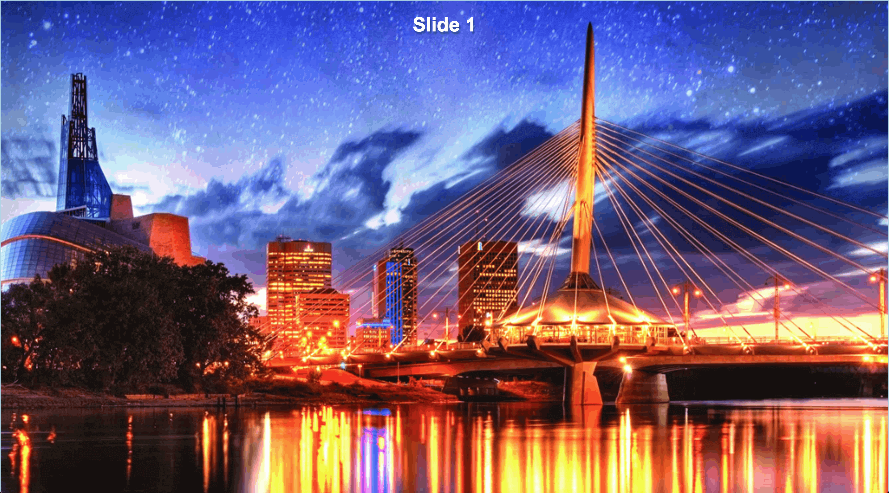
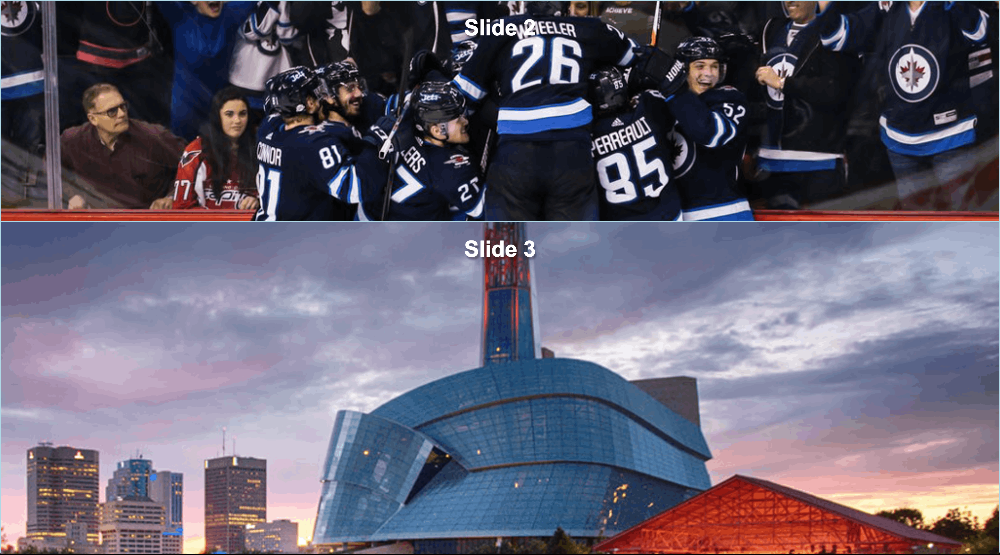

# Exercise 23

* Create a new folder with the name `ex_23`
* Create the following files
* Download the following files:
  * [back1.png](./images/ex_23/back1.png)
  * [back2.png](./images/ex_23/back2.png)
  * [back3.png](./images/ex_23/back3.png)
  * [back4.png](./images/ex_23/back4.png)
  * [back5.png](./images/ex_23/back5.png)
  * [back6.png](./images/ex_23/back6.png)

```
/ex_23
|-- index.html
|-- back1.png
|-- back2.png
|-- back3.png
|-- back4.png
|-- back5.png
|-- back6.png
```
* Copy and paste the following HTML code:

## index.html
```html
<!DOCTYPE html>
<html lang="en">
<head>
  <title>Learning CSS</title>
</head>
<body>
  <div class="one">
    <h1>Slide 1</h1>
  </div>
  <div class="two">
      <h1>Slide 2</h1>
  </div>
  <div class="three">
      <h1>Slide 3</h1>
  </div>
  <div class="four">
      <h1>Slide 4</h1>
  </div>
  <div class="five">
      <h1>Slide 5</h1>
  </div>
  <div class="six">
      <h1>Slide 6</h1>
  </div>
</body>
</html>
```

* After applying all styles the document must look like this:




* Add a style element
* Select the body element and apply the following style:
  * Remove padding and margin from all sides
  * Use Arial, Helvetica, sans-serif as font family
  * Font color must be white
* Select all div elements and apply the following style:
  * Position must be sticky
  * Top must be 0
  * Make the element 100vh tall
  * Use the property `background-size: cover` [Read more about this property in the MDN background-size doc](https://developer.mozilla.org/en-US/docs/Web/CSS/background-size)
  * Background position must be center center
  * Add a 1px solid lightblue border to all sides
* Select the h1 elements and apply the following style:
  * Use 2px 4px 3px rgba(0,0,0,0.3) as text shadow
  * Center text using text align
* Select the elements with the one class and apply the following style:
  * Background image must be back1.png 
* Select the elements with the two class and apply the following style:
  * Background image must be back2.png 
* Select the elements with the three class and apply the following style:
  * Background image must be back3.png 
* Select the elements with the four class and apply the following style:
  * Background image must be back4.png 
* Select the elements with the five class and apply the following style:
  * Background image must be back5.png 
* Select the elements with the six class and apply the following style:
  * Background image must be back6.png
