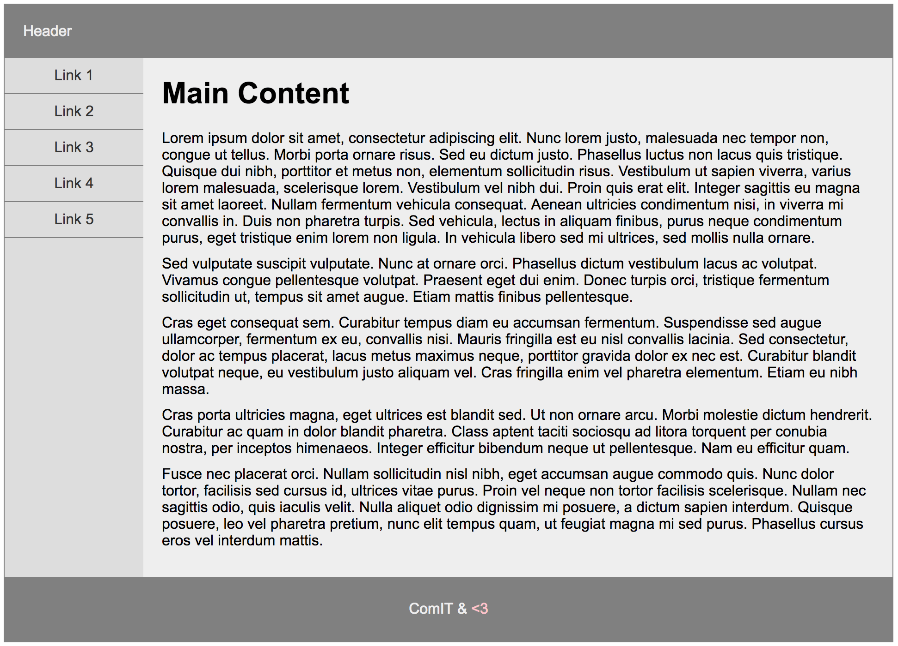
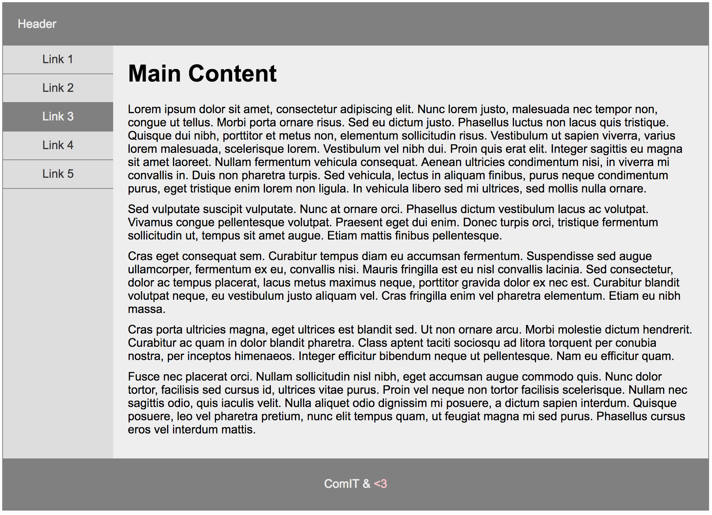

# Exercise 25

* Create a index25.html file
* Copy and paste the following HTML code:

## index25.html
```html
<!DOCTYPE html>
<html lang="en">
<head>
  <title>Learning layout CSS</title>
</head>
<body>
  <div class="container">
    <header>Header</header>
    <div class="side">
      <ul>
        <li><a href="#">Link 1</a></li>
        <li><a href="#">Link 2</a></li>
        <li><a href="#">Link 3</a></li>
        <li><a href="#">Link 4</a></li>
        <li><a href="#">Link 5</a></li>
      </ul>
    </div>
    <div class="main">
      <h1>Main Content</h1>
      <p>Lorem ipsum dolor sit amet, consectetur adipiscing elit. Nunc lorem justo, malesuada nec tempor non, congue ut tellus. Morbi porta ornare risus. Sed eu dictum justo. Phasellus luctus non lacus quis tristique. Quisque dui nibh, porttitor et metus non, elementum sollicitudin risus. Vestibulum ut sapien viverra, varius lorem malesuada, scelerisque lorem. Vestibulum vel nibh dui. Proin quis erat elit. Integer sagittis eu magna sit amet laoreet. Nullam fermentum vehicula consequat. Aenean ultricies condimentum nisi, in viverra mi convallis in. Duis non pharetra turpis. Sed vehicula, lectus in aliquam finibus, purus neque condimentum purus, eget tristique enim lorem non ligula. In vehicula libero sed mi ultrices, sed mollis nulla ornare.</p>
      <p>Sed vulputate suscipit vulputate. Nunc at ornare orci. Phasellus dictum vestibulum lacus ac volutpat. Vivamus congue pellentesque volutpat. Praesent eget dui enim. Donec turpis orci, tristique fermentum sollicitudin ut, tempus sit amet augue. Etiam mattis finibus pellentesque.</p>
      <p>Cras eget consequat sem. Curabitur tempus diam eu accumsan fermentum. Suspendisse sed augue ullamcorper, fermentum ex eu, convallis nisi. Mauris fringilla est eu nisl convallis lacinia. Sed consectetur, dolor ac tempus placerat, lacus metus maximus neque, porttitor gravida dolor ex nec est. Curabitur blandit volutpat neque, eu vestibulum justo aliquam vel. Cras fringilla enim vel pharetra elementum. Etiam eu nibh massa.</p>
      <p>Cras porta ultricies magna, eget ultrices est blandit sed. Ut non ornare arcu. Morbi molestie dictum hendrerit. Curabitur ac quam in dolor blandit pharetra. Class aptent taciti sociosqu ad litora torquent per conubia nostra, per inceptos himenaeos. Integer efficitur bibendum neque ut pellentesque. Nam eu efficitur quam.</p>
      <p>Fusce nec placerat orci. Nullam sollicitudin nisl nibh, eget accumsan augue commodo quis. Nunc dolor tortor, facilisis sed cursus id, ultrices vitae purus. Proin vel neque non tortor facilisis scelerisque. Nullam nec sagittis odio, quis iaculis velit. Nulla aliquet odio dignissim mi posuere, a dictum sapien interdum. Quisque posuere, leo vel pharetra pretium, nunc elit tempus quam, ut feugiat magna mi sed purus. Phasellus cursus eros vel interdum mattis.</p>
    </div>
    <footer>
      <p>ComIT &amp; <span class="love">&lt;3</span></p>
    </footer>
  </div>
</body>
</html>
```


* After applying all styles the document must look like this:





* Add a style element
* Select the html & body elements and apply the following style:
  * Remove margin and padding from all sides
  * Use Arial, Helvetica, sans-serif as font family
  * Font must be 16px tall
* Select the element with the container class and apply the following style:
  * Make the element 960px wide
  * Center the element using margin 0 auo
  * Background color must be #ddd
  * Use 1px solid gray as border for all sides
* Select the header element and apply the following style:
  * Add 20px padding to all sides
  * Text color must be #eee
* Select the header & footer element and apply the following style:
  * Background color must be gray
* Select the element with the side class and apply the following style:
  * Element must float to left side
  * Make the element 150px wide
* Select the ul element inside the side class element and apply the following style:
  * Remove margin and padding from all sides
  * List style must be none
* Select the link element that is children of the li element that are children of the ul element that is children of the side class element and apply the following style:
  * Display must be block
  * Add 10px padding to top and bottom sides and remove the left and right ones
  * Center the text using text align
  * Remove text decoration
  * Text color must be #333
  * Add a 1px solid gray border to the bottom side only
* From the previouse selector add the :hover pseudoclass to change how links look on hover and apply the following style:
  * Text color must be #eee
  * Background color must be gray
* Select the element with the main class and apply the following style:
  * Add a 150px margin left only
  * Background color must be #eee
  * Add 20px padding to all sides
* Select the h1 elements that are children of the element with the main class and apply the following style:
  * Margin top must be 0px
* Select the p elements that are children of the element with the main class and apply the following style:
  * Remove margin from all sides
  * Add 10px margin only to the bottom side
* Select the footer element and apply the following style:
  * Clear floating from both sides
  * Text color must be #eee
  * Center align the text using text align property
  * Add 10px padding to top and bottom sides and remove left and right one
* Select the element with the class love that is children of the footer element and apply the following style:
  * Text color must be pink