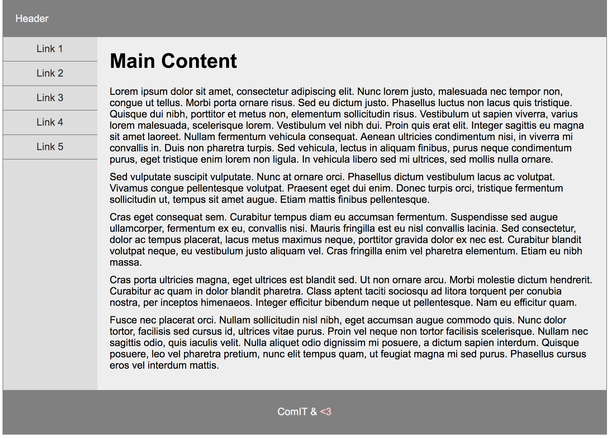
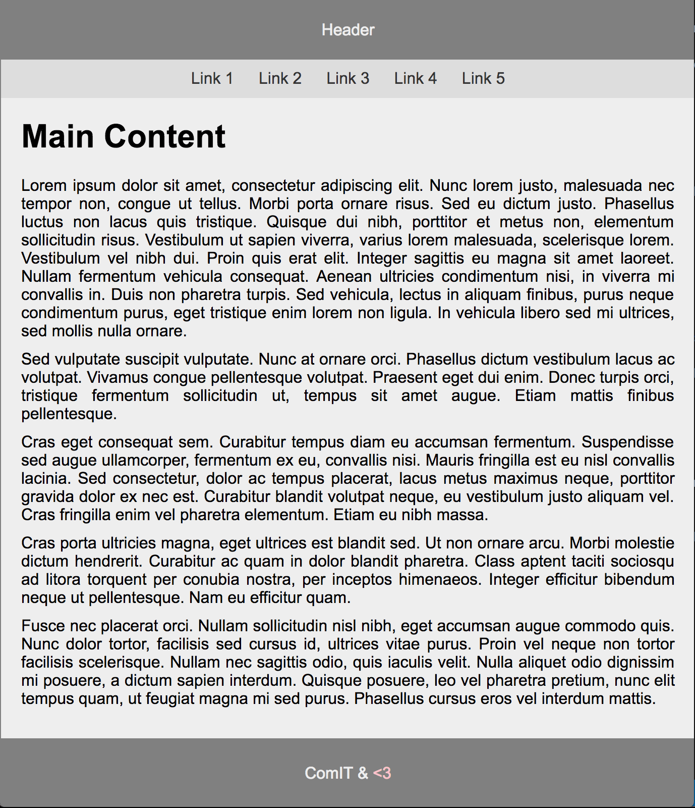

# Exercise 26

* Create a index26.html file
* Copy and paste the final code (with CSS applyed) from exercise 25 in index26.html

* After applying all styles the document must look like this:





* Add the following style:
  * Add the following selector to select the devices that only use screen and that have max-width to 768px
  ```css
      @media only screen and (max-width: 768px) {
        /* Smaller screen code here */
      }
  ```
  * Select the container element and add the following style:
    * Make the element 100% wide
  * Select the header element and apply the following style:
    * Center align the text using text align property
  * Select the element with the side class and apply the following style:
    * Remove flotation with float: none
    * Make the element 100% wide
    * Center align the text using text align property
  * Select the li elements that are children of the ul element that is children of the element with the side class
    * Elements must be display using inline-block
  * Use the previous selector but now select the a elements too and apply the following style:
    * Remove border bottom
    * Add 10px padding to all sides
  * Select the element with the main class and apply the following style:
    * Remove margin left (use 0)
  * Select the paragraph elements that are children of the element with the main class
    * Justify align the text using text align property