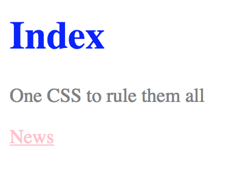
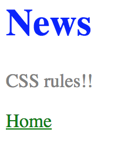
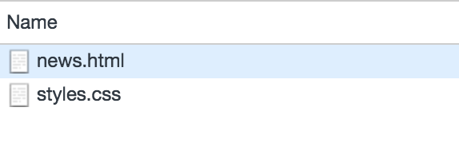
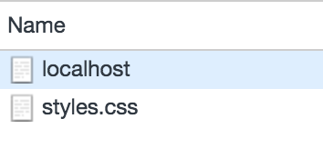

# Exercise 3

* Create a new folder with the name `ex_3`
* Create the following files:

```
/ex_3
|-- index.html
|-- news.html
|-- styles.css
```

* After applying all styles the document must look like this:










## index.html
* Add the html structure
* Add a document title with the text: Same CSS
* Add a link element to link index.html with styles.css
* Add a main title with the text: Index
* Add a paragraph with the text: One CSS to rule them all
* Add a link element to navigate to news.html


## news.html
* Add the html structure
* Add a document title with the text: Same CSS
* Add a link element to link news.html with styles.css
* Add a main title with the text: News
* Add a paragraph with the text: CSS rules!! 
* Add a link element to navigate to index.html

## styles.css
* All main title elements must be red
* All paragraph elements must be gray
* All links must be yellow

* On index.html add a style element and set the following CSS
  * All link elements must be pink
* On news.html the link must be green (use inline style)
* On styles.css change the main title elements color to blue