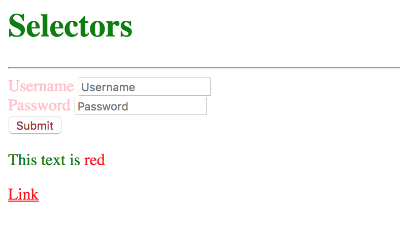

# Exercise 4

* Inside your git repository create a index4.html file
* Copy and paste the following HTML code:

```html
<!DOCTYPE html>
<html>
  <head>
    <title>Selectors</title>
  </head>
  <body>
    <h1>Selectors</h1>
    <hr>
    <form id="login">
      <div>
        <label for="username">Username</label>
        <input name="username" id="username" placeholder="Username">
      </div>
      <div>
          <label for="password">Password</label>
          <input name="password" id="password" placeholder="Password">
      </div>
      <div>
        <input type="submit" value="Submit">
      </div>
    </form>
    <div>
      <p>This text is <span class="red">red</span></p>
      <a href="#" class="red">Link</a>
    </div>
  </body>
</html>
```

* After applying all styles the document must look like this:



* Add a style element
* Use the universal selector to make all the elements text look green
* Select the element with the id login and make the text gray
* Select all the elements with the class red and make the text red
* Select the label and input selector (combined) and make the text pink
* Select the input type submit using the attribute selector and make the text brown