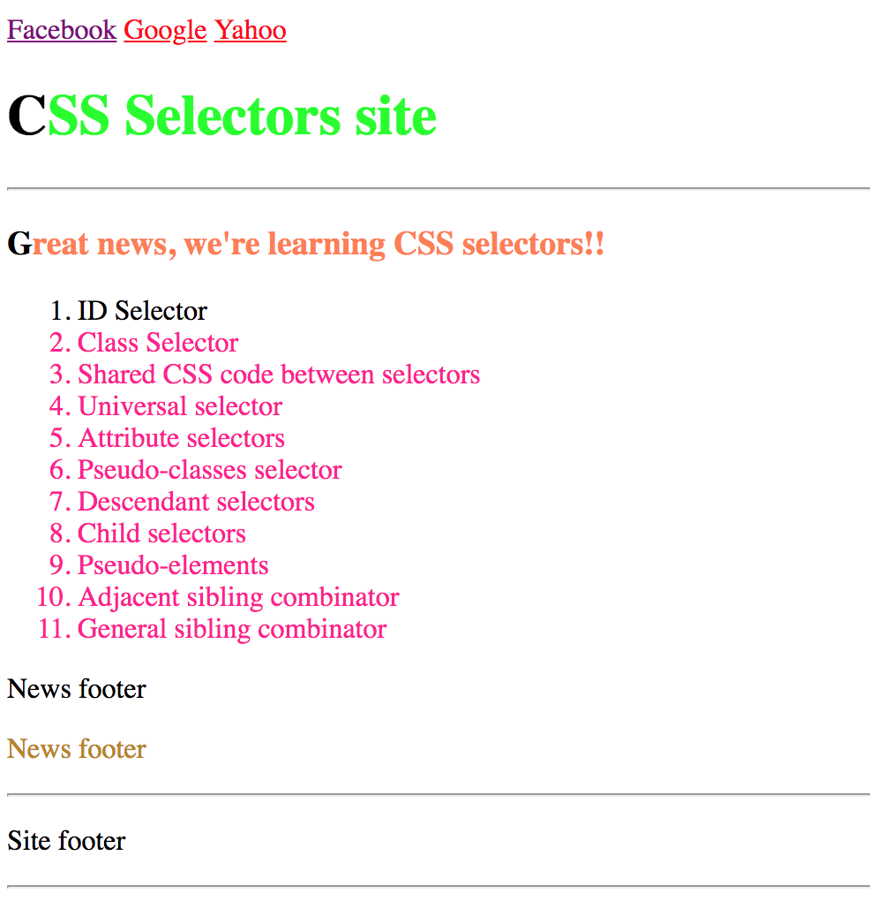
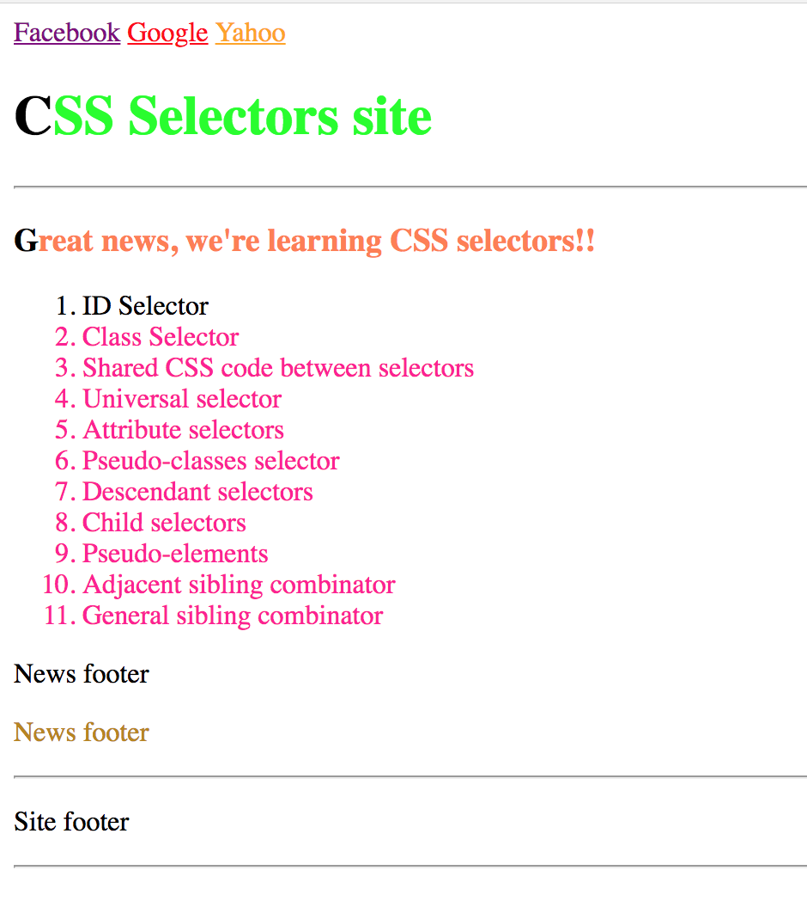

# Exercise 5

* Inside your git repository create a index5.html file
* Copy and paste the following HTML code:

```html
<!DOCTYPE html>
<html>
  <head>
    <title>CSS Selectors</title>
  </head>
  <body>
    <nav>
      <a href="http://facebook.com" target="_blank">Facebook</a>
      <a href="http://google.com" target="_blank">Google</a>
      <a href="http://yahoo.com" target="_blank">Yahoo</a>
    </nav>
    <header>
      <h1>CSS Selectors site</h1>
      <hr>
    </header>
    <article>
      <section>
        <h1>Great news, we're learning CSS selectors!!</h1>
        <ol>
          <li>ID Selector</li>
          <li>Class Selector</li>
          <li>Shared CSS code between selectors</li>
          <li>Universal selector</li>
          <li>Attribute selectors</li>
          <li>Pseudo-classes selector</li>
          <li>Descendant selectors</li>
          <li>Child selectors</li>
          <li>Pseudo-elements</li>
          <li>Adjacent sibling combinator</li>
          <li>General sibling combinator</li>
        </ol>
        <foot>
          <p>News footer</p>
          <p>News footer</p>
        </foot>
      </section>
    </article>
    <foot>
      <hr>
      <p>Site footer</p>
      <hr>
    </foot>
  </body>
</html>
```

* After applying all styles the document must look like this:





* Add a style element
* Use the link pseudo-classes selector to make the links text red
* Use the hover pseudo-classes selector to make the links text orange
* Use the visited pseudo-classes selector to make the links text purple
* Use the descendant selector to select the h1 element inside the header and make the text lime
* Use the child selector to select the h1 that is direct child of the section element and make the text coral
* Use the pseudo element selector to make the first letter of each h1 element black
* Use the adjacent sibling combinator selector to select the paragraph that are siblings and make the second paragraph darkgoldenrod
* Use the general sibling combinator to select all the li elements and make them deeppink. The first li element must remain black
