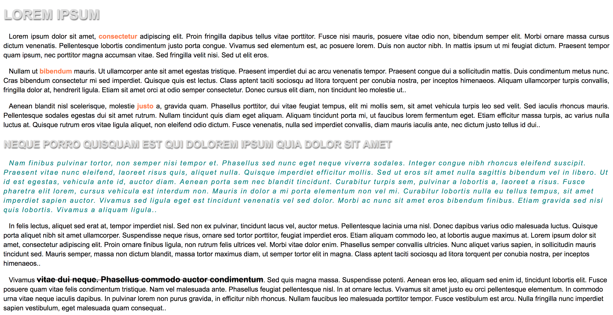
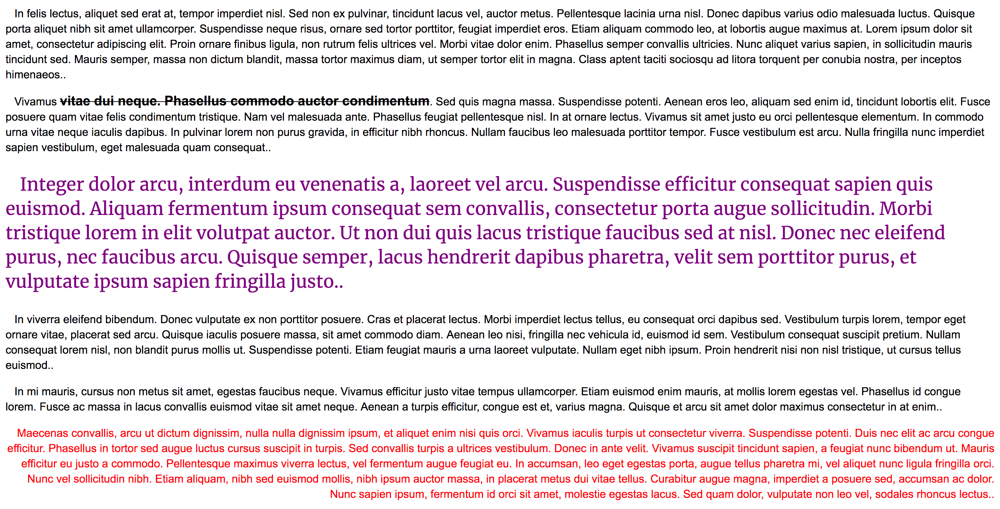

# Exercise 6

* Inside your git repository create a index6.html file
* Copy and paste the following HTML code:

```html
<!DOCTYPE html>
<html>
  <head>
    <title>CSS Fonts and text</title>
    <style>
    </style>
  </head>
  <body>
    <h1>Lorem Ipsum</h1>
    <div class="main">
      <p>Lorem ipsum dolor sit amet, <span class="bold">consectetur</span> adipiscing elit. Proin fringilla dapibus tellus vitae porttitor. Fusce nisi mauris, posuere vitae odio non, bibendum semper elit. Morbi ornare massa cursus dictum venenatis. Pellentesque lobortis condimentum justo porta congue. Vivamus sed elementum est, ac posuere lorem. Duis non auctor nibh. In mattis ipsum ut mi feugiat dictum. Praesent tempor quam ipsum, nec porttitor magna accumsan vitae. Sed fringilla velit nisi. Sed ut elit eros.</p>
      <p>Nullam ut <span class="bold">bibendum</span> mauris. Ut ullamcorper ante sit amet egestas tristique. Praesent imperdiet dui ac arcu venenatis tempor. Praesent congue dui a sollicitudin mattis. Duis condimentum metus nunc. Cras bibendum consectetur mi sed imperdiet. Quisque quis est lectus. Class aptent taciti sociosqu ad litora torquent per conubia nostra, per inceptos himenaeos. Aliquam ullamcorper turpis convallis, fringilla dolor at, hendrerit ligula. Etiam sit amet orci at odio semper consectetur. Donec cursus elit diam, non tincidunt leo molestie ut..</p>
      <p>Aenean blandit nisl scelerisque, molestie <span class="bold">justo</span> a, gravida quam. Phasellus porttitor, dui vitae feugiat tempus, elit mi mollis sem, sit amet vehicula turpis leo sed velit. Sed iaculis rhoncus mauris. Pellentesque sodales egestas dui sit amet rutrum. Nullam tincidunt quis diam eget aliquam. Aliquam tincidunt porta mi, ut faucibus lorem fermentum eget. Etiam efficitur massa turpis, ac varius nulla luctus at. Quisque rutrum eros vitae ligula aliquet, non eleifend odio dictum. Fusce venenatis, nulla sed imperdiet convallis, diam mauris iaculis ante, nec dictum justo tellus id dui..</p>
    </div>
    <h2>Neque porro quisquam est qui dolorem ipsum quia dolor sit amet</h2>
    <div id="quote">
      <p>Nam finibus pulvinar tortor, non semper nisi tempor et. Phasellus sed nunc eget neque viverra sodales. Integer congue nibh rhoncus eleifend suscipit. Praesent vitae nunc eleifend, laoreet risus quis, aliquet nulla. Quisque imperdiet efficitur mollis. Sed ut eros sit amet nulla sagittis bibendum vel in libero. Ut id est egestas, vehicula ante id, auctor diam. Aenean porta sem nec blandit tincidunt. Curabitur turpis sem, pulvinar a lobortis a, laoreet a risus. Fusce pharetra elit lorem, cursus vehicula est interdum non. Mauris in dolor a mi porta elementum non vel mi. Curabitur lobortis nulla eu tellus tempus, sit amet imperdiet sapien auctor. Vivamus sed ligula eget est tincidunt venenatis vel sed dolor. Morbi ac nunc sit amet eros bibendum finibus. Etiam gravida sed nisi quis lobortis. Vivamus a aliquam ligula..</p>
    </div>
    <p>In felis lectus, aliquet sed erat at, tempor imperdiet nisl. Sed non ex pulvinar, tincidunt lacus vel, auctor metus. Pellentesque lacinia urna nisl. Donec dapibus varius odio malesuada luctus. Quisque porta aliquet nibh sit amet ullamcorper. Suspendisse neque risus, ornare sed tortor porttitor, feugiat imperdiet eros. Etiam aliquam commodo leo, at lobortis augue maximus at. Lorem ipsum dolor sit amet, consectetur adipiscing elit. Proin ornare finibus ligula, non rutrum felis ultrices vel. Morbi vitae dolor enim. Phasellus semper convallis ultricies. Nunc aliquet varius sapien, in sollicitudin mauris tincidunt sed. Mauris semper, massa non dictum blandit, massa tortor maximus diam, ut semper tortor elit in magna. Class aptent taciti sociosqu ad litora torquent per conubia nostra, per inceptos himenaeos..</p>
    <p>Vivamus <span class="wrong">vitae dui neque. Phasellus commodo auctor condimentum</span>. Sed quis magna massa. Suspendisse potenti. Aenean eros leo, aliquam sed enim id, tincidunt lobortis elit. Fusce posuere quam vitae felis condimentum tristique. Nam vel malesuada ante. Phasellus feugiat pellentesque nisl. In at ornare lectus. Vivamus sit amet justo eu orci pellentesque elementum. In commodo urna vitae neque iaculis dapibus. In pulvinar lorem non purus gravida, in efficitur nibh rhoncus. Nullam faucibus leo malesuada porttitor tempor. Fusce vestibulum est arcu. Nulla fringilla nunc imperdiet sapien vestibulum, eget malesuada quam consequat..</p>
    <p class="google">Integer dolor arcu, interdum eu venenatis a, laoreet vel arcu. Suspendisse efficitur consequat sapien quis euismod. Aliquam fermentum ipsum consequat sem convallis, consectetur porta augue sollicitudin. Morbi tristique lorem in elit volutpat auctor. Ut non dui quis lacus tristique faucibus sed at nisl. Donec nec eleifend purus, nec faucibus arcu. Quisque semper, lacus hendrerit dapibus pharetra, velit sem porttitor purus, et vulputate ipsum sapien fringilla justo..</p>
    <p>In viverra eleifend bibendum. Donec vulputate ex non porttitor posuere. Cras et placerat lectus. Morbi imperdiet lectus tellus, eu consequat orci dapibus sed. Vestibulum turpis lorem, tempor eget ornare vitae, placerat sed arcu. Quisque iaculis posuere massa, sit amet commodo diam. Aenean leo nisi, fringilla nec vehicula id, euismod id sem. Vestibulum consequat suscipit pretium. Nullam consequat lorem nisl, non blandit purus mollis ut. Suspendisse potenti. Etiam feugiat mauris a urna laoreet vulputate. Nullam eget nibh ipsum. Proin hendrerit nisi non nisl tristique, ut cursus tellus euismod..</p>
    <p>In mi mauris, cursus non metus sit amet, egestas faucibus neque. Vivamus efficitur justo vitae tempus ullamcorper. Etiam euismod enim mauris, at mollis lorem egestas vel. Phasellus id congue lorem. Fusce ac massa in lacus convallis euismod vitae sit amet neque. Aenean a turpis efficitur, congue est et, varius magna. Quisque et arcu sit amet dolor maximus consectetur in at enim..</p>
    <p class="last">Maecenas convallis, arcu ut dictum dignissim, nulla nulla dignissim ipsum, et aliquet enim nisi quis orci. Vivamus iaculis turpis ut consectetur viverra. Suspendisse potenti. Duis nec elit ac arcu congue efficitur. Phasellus in tortor sed augue luctus cursus suscipit in turpis. Sed convallis turpis a ultrices vestibulum. Donec in ante velit. Vivamus suscipit tincidunt sapien, a feugiat nunc bibendum ut. Mauris efficitur eu justo a commodo. Pellentesque maximus viverra lectus, vel fermentum augue feugiat eu. In accumsan, leo eget egestas porta, augue tellus pharetra mi, vel aliquet nunc ligula fringilla orci. Nunc vel sollicitudin nibh. Etiam aliquam, nibh sed euismod mollis, nibh ipsum auctor massa, in placerat metus dui vitae tellus. Curabitur augue magna, imperdiet a posuere sed, accumsan ac dolor. Nunc sapien ipsum, fermentum id orci sit amet, molestie egestas lacus. Sed quam dolor, vulputate non leo vel, sodales rhoncus lectus..</p>
  </body>
</html>
```

* After applying all styles the document must look like this:





* Add a style element
* Add the following CSS properties using the right selector for each case:
  * Select the body element and apply the following styles:
      * Font must be Arial, 16px big and black
  * Select the h1 elements and apply the following styles:
    * Font must be: 2em big, color #ddd, shadow: 1px 2px 3px #666 and text in uppercase
  * Select the h2 elements and apply the following styles:
    * Font must be: 1.5em big, color #ddd, shadow: 1px 2px 3px #666 and text in uppercase
  * Use the same definition to apply h1 & h2 the shared properties
  * Select all paragraphs and apply the following styles:
    * line height must be 1.4em and indent the text using 0.8em
  * Select the class **main** and apply the following style:
    * Text must use justify align
  * Select the class **bold** and apply the following styles:
    * Font must be bold and coral color
  * Select the element with the id **quote** and apply the following styles:
    * Letters must have a 2px spacing, the font style must be italic and darkcyan color
  * Select the elements with the class **last** and apply the following styles:
    * Text must be right aligned and red color
  * Select the elements with the class **wrong** and apply the following styles:
    * The text must be decorated a black line-through, the font must be 1.2em tall and weight 700
  * Select the elements with the class **google** and apply the following styles:
    * Use google fonts to apply the Merriweather family, also font size must be 1.6em and purple color
