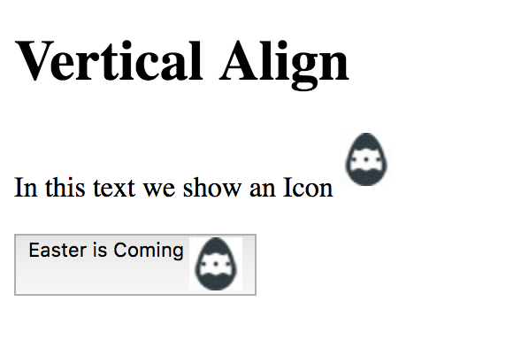
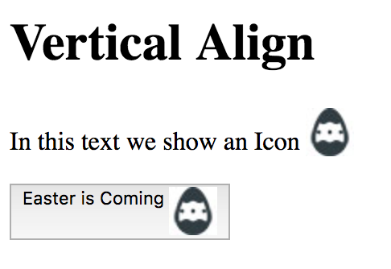
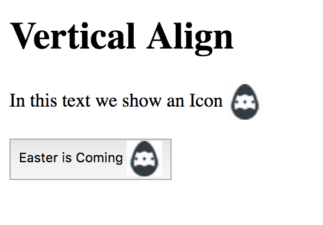

# Exercise 7

* Create a folder with the name ex_7
* Create a index.html file inside the ex_7 folder
* Download the following [icon](../resources/css/easter-egg.jpg) and copy it to the ex_7 folder

```
/ex_7
|
|- index.html
|- image.png

```

* Copy and paste the following HTML code:

## index.html
```html
<!DOCTYPE html>
<html>
<head>
  <title>Vertical Align</title>
</head>
<body>
  <h1>Vertical Align</h1>
  <p>In this text we show an Icon </p>
  <button>Easter is Coming </button>
</body>
</html>
```

* After applying all styles the document must look like this:








* Add a style element
* Select the image element inside the paragraph and set the following style:
  * The image must be vertical align with the value super
* Now select the image element inside the button and set the following style:
  * The image must be vertical align with the value top
* Change the image element vertical align value to bottom, then middle and on each change refresh the page to see how vertical aligment works in CSS
* Happy Coding!
