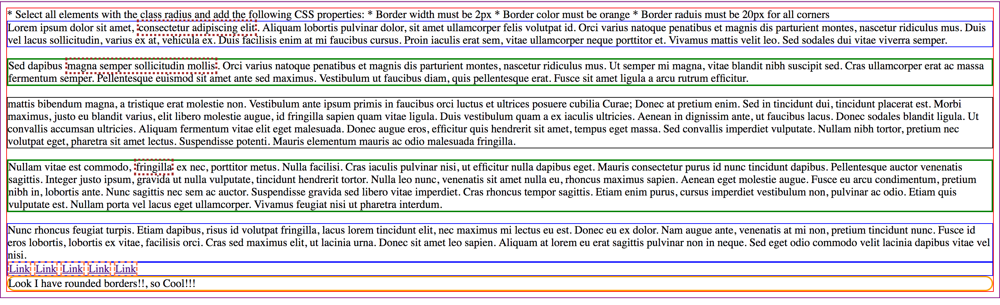

# Exercise 8

* Create a index8.html file
* Copy and paste the following HTML code:

## index8.html
```html
<!DOCTYPE html>
<html>
  <head>
    <title>CSS Box Model Border</title>
  </head>
  <body>
    <div>Lorem ipsum dolor sit amet, <span>consectetur adipiscing elit</span>. Aliquam lobortis pulvinar dolor, sit amet ullamcorper felis volutpat id. Orci varius natoque penatibus et magnis dis parturient montes, nascetur ridiculus mus. Duis vel lacus sollicitudin, varius ex at, vehicula ex. Duis facilisis enim at mi faucibus cursus. Proin iaculis erat sem, vitae ullamcorper neque porttitor et. Vivamus mattis velit leo. Sed sodales dui vitae viverra semper.</div>
    <p>Sed dapibus <span>magna semper sollicitudin mollis</span>. Orci varius natoque penatibus et magnis dis parturient montes, nascetur ridiculus mus. Ut semper mi magna, vitae blandit nibh suscipit sed. Cras ullamcorper erat ac massa fermentum semper. Pellentesque euismod sit amet ante sed maximus. Vestibulum ut faucibus diam, quis pellentesque erat. Fusce sit amet ligula a arcu rutrum efficitur.</p>
    <article>mattis bibendum magna, a tristique erat molestie non. Vestibulum ante ipsum primis in faucibus orci luctus et ultrices posuere cubilia Curae; Donec at pretium enim. Sed in tincidunt dui, tincidunt placerat est. Morbi maximus, justo eu blandit varius, elit libero molestie augue, id fringilla sapien quam vitae ligula. Duis vestibulum quam a ex iaculis ultricies. Aenean in dignissim ante, ut faucibus lacus. Donec sodales blandit ligula. Ut convallis accumsan ultricies. Aliquam fermentum vitae elit eget malesuada. Donec augue eros, efficitur quis hendrerit sit amet, tempus eget massa. Sed convallis imperdiet vulputate. Nullam nibh tortor, pretium nec volutpat eget, pharetra sit amet lectus. Suspendisse potenti. Mauris elementum mauris ac odio malesuada fringilla.</article>
    <p>Nullam vitae est commodo, <span>fringilla</span> ex nec, porttitor metus. Nulla facilisi. Cras iaculis pulvinar nisi, ut efficitur nulla dapibus eget. Mauris consectetur purus id nunc tincidunt dapibus. Pellentesque auctor venenatis sagittis. Integer justo ipsum, gravida ut nulla vulputate, tincidunt hendrerit tortor. Nulla leo nunc, venenatis sit amet nulla eu, rhoncus maximus sapien. Aenean eget molestie augue. Fusce eu arcu condimentum, pretium nibh in, lobortis ante. Nunc sagittis nec sem ac auctor. Suspendisse gravida sed libero vitae imperdiet. Cras rhoncus tempor sagittis. Etiam enim purus, cursus imperdiet vestibulum non, pulvinar ac odio. Etiam quis vulputate est. Nullam porta vel lacus eget ullamcorper. Vivamus feugiat nisi ut pharetra interdum.</p>
    <div>Nunc rhoncus feugiat turpis. Etiam dapibus, risus id volutpat fringilla, lacus lorem tincidunt elit, nec maximus mi lectus eu est. Donec eu ex dolor. Nam augue ante, venenatis at mi non, pretium tincidunt nunc. Fusce id eros lobortis, lobortis ex vitae, facilisis orci. Cras sed maximus elit, ut lacinia urna. Donec sit amet leo sapien. Aliquam at lorem eu erat sagittis pulvinar non in neque. Sed eget odio commodo velit lacinia dapibus vitae vel nisi.</div>
    <div>
      <a href="#">Link</a>
      <a href="#">Link</a>
      <a href="#">Link</a>
      <a href="#">Link</a>
      <a href="#">Link</a>
    </div>
    <div class="radius">Look I have rounded borders!!, so Cool!!!</div>
  </body>
</html>
```

* After applying all styles the document must look like this:



* Add a style element
* Select all elements using the universal selector and add the following CSS properties:
  * Border width must be 1px
  * Border style must be solid
  * We set default values for all elements
* Select the html element and add the following CSS properties:
  * Border color must be purple
* Select the body element and add the following CSS properties:
  * Border color must be red
* Select all div elements and add the following CSS properties:
  * Border color must be blue
* Select all paragraph elements and add the following CSS properties:
  * Border width must be 2px
  * Border color must be green
* Select all span elements and add the following CSS properties:
  * Border width must be 3px
  * Border color must be brown
  * Border style must be dotted
* Select all link elements and add the following CSS properties:
  * Border width must be 2px
  * Border color must be coral
  * Border style must be dashed
* Select all elements with the class radius and add the following CSS properties:
  * Border width must be 2px
  * Border color must be orange
  * Border raduis must be 20px for all corners
  