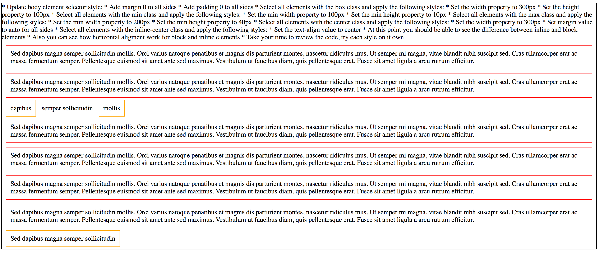
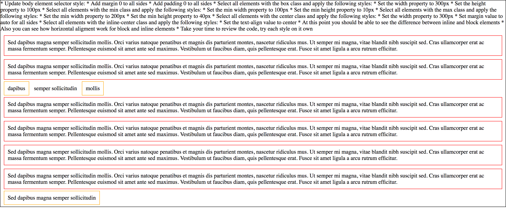
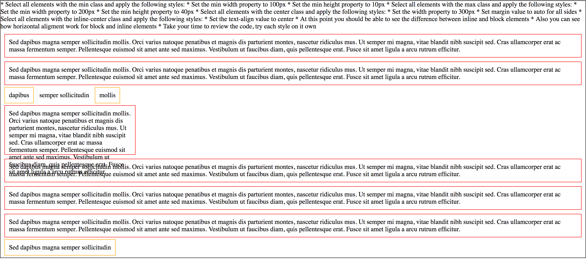
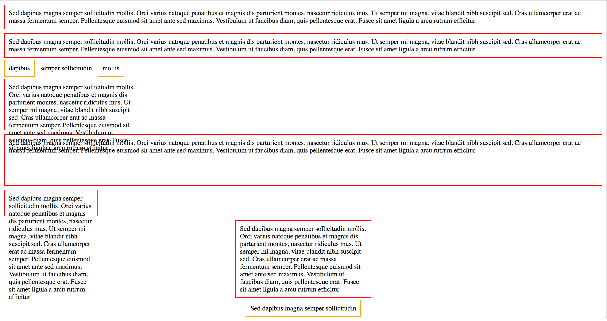

# Exercise 9

* Create a index9.html file
* Copy and paste the following HTML code:

## index9.html
```html
<!DOCTYPE html>
<html lang="en">
  <head>
    <title>CSS Padding, Margin, Width &amp; Height</title>
  </head>
  <body>
    <div>Sed dapibus magna semper sollicitudin mollis. Orci varius natoque penatibus et magnis dis parturient montes, nascetur ridiculus mus. Ut semper mi magna, vitae blandit nibh suscipit sed. Cras ullamcorper erat ac massa fermentum semper. Pellentesque euismod sit amet ante sed maximus. Vestibulum ut faucibus diam, quis pellentesque erat. Fusce sit amet ligula a arcu rutrum efficitur.</div>
    <div>Sed dapibus magna semper sollicitudin mollis. Orci varius natoque penatibus et magnis dis parturient montes, nascetur ridiculus mus. Ut semper mi magna, vitae blandit nibh suscipit sed. Cras ullamcorper erat ac massa fermentum semper. Pellentesque euismod sit amet ante sed maximus. Vestibulum ut faucibus diam, quis pellentesque erat. Fusce sit amet ligula a arcu rutrum efficitur.</div>
    <p><span>dapibus</span> semper sollicitudin <span>mollis</span></p>
    <div class="box">Sed dapibus magna semper sollicitudin mollis. Orci varius natoque penatibus et magnis dis parturient montes, nascetur ridiculus mus. Ut semper mi magna, vitae blandit nibh suscipit sed. Cras ullamcorper erat ac massa fermentum semper. Pellentesque euismod sit amet ante sed maximus. Vestibulum ut faucibus diam, quis pellentesque erat. Fusce sit amet ligula a arcu rutrum efficitur.</div>
    <div class="min">Sed dapibus magna semper sollicitudin mollis. Orci varius natoque penatibus et magnis dis parturient montes, nascetur ridiculus mus. Ut semper mi magna, vitae blandit nibh suscipit sed. Cras ullamcorper erat ac massa fermentum semper. Pellentesque euismod sit amet ante sed maximus. Vestibulum ut faucibus diam, quis pellentesque erat. Fusce sit amet ligula a arcu rutrum efficitur.</div>
    <div class="max">Sed dapibus magna semper sollicitudin mollis. Orci varius natoque penatibus et magnis dis parturient montes, nascetur ridiculus mus. Ut semper mi magna, vitae blandit nibh suscipit sed. Cras ullamcorper erat ac massa fermentum semper. Pellentesque euismod sit amet ante sed maximus. Vestibulum ut faucibus diam, quis pellentesque erat. Fusce sit amet ligula a arcu rutrum efficitur.</div>
    <div class="center">Sed dapibus magna semper sollicitudin mollis. Orci varius natoque penatibus et magnis dis parturient montes, nascetur ridiculus mus. Ut semper mi magna, vitae blandit nibh suscipit sed. Cras ullamcorper erat ac massa fermentum semper. Pellentesque euismod sit amet ante sed maximus. Vestibulum ut faucibus diam, quis pellentesque erat. Fusce sit amet ligula a arcu rutrum efficitur.</div>
    <p class="inline-center"><span>Sed dapibus magna semper sollicitudin</span></p>
  </body>
</html>
```

* After applying all styles the document must look like this:









* Add a style element
* Refresh the browser on each style change to see how it works

* Select the body element and apply the following styles:
  * Add a black 1px solid border
* Select all div elements and apply the following styles:
  * Add a red 1px solid border
  * Padding must be 10px for all sides
  * Margin must be 10px for all sides
* Select all span elements and apply the following styles:
  * Add a orange 1px solid border
  * Padding must be 10px for all sides
  * Margin must be 10px for all sides
* Update body element selector style:
  * Add margin 0 to all sides
  * Add padding 0 to all sides
* Select all elements with the box class and apply the following styles:
  * Set the width property to 300px
  * Set the height property to 100px
* Select all elements with the min class and apply the following styles:
  * Set the min width property to 100px
  * Set the min height property to 10px
* Select all elements with the max class and apply the following styles:
  * Set the max width property to 200px
  * Set the max height property to 40px
* Select all elements with the center class and apply the following styles:
  * Set the width property to 300px
  * Set margin value to auto for all sides
* Select all elements with the inline-center class and apply the following styles:
  * Set the text-align value to center
* At this point you should be able to see the difference between inline and block elements
  * Also you can see how horizontal aligment work for block and inline elements
* Take your time to review the code, try each style on it own
