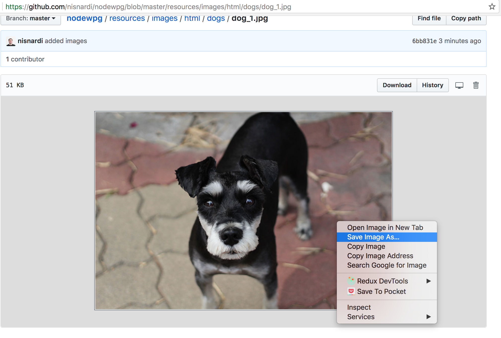

# Exercise 7

* Create a new folder with the name `ex_7`
* Create the following structure and download the following [images](../../resources/html/dogs)
```
/ex_7
|-- imgs
|  |- dogs
|     |- thumbs
|     |  |- dog_1.jpg
|     |  |- dog_2.jpg
|     |  |- dog_3.jpg
|     |  |- dog_4.jpg
|     |  |- dog_5.jpg
|     |
|     |- dog_1.jpg
|     |- dog_2.jpg
|     |- dog_3.jpg
|     |- dog_4.jpg
|     |- dog_5.jpg
|
|-- index.html
|-- dog_1.html
|-- dog_2.html
|-- dog_3.html
|-- dog_4.html
|-- dog_5.html
```

* You can download the images this way:


### dog_1.html
* Add a Document Title: Dog 1
* Create a link to go to home 
* Add a Main Title: So cute..
* Add an Horizontal Rule
* Show the big dog_1.jpg image

### dog_2.html
* Add a Document Title: Dog 2
* Create a link to go to home 
* Add a Main Title: So cute..
* Add an Horizontal Rule
* Show the big dog_2.jpg image

### dog_3.html
* Add a Document Title: Dog 3
* Create a link to go to home 
* Add a Main Title: So cute..
* Add an Horizontal Rule
* Show the big dog_3.jpg image

### dog_4.html
* Add a Document Title: Dog 4
* Create a link to go to home 
* Add a Main Title: So cute..
* Add an Horizontal Rule
* Show the big dog_4.jpg image

### dog_5.html
* Add a Document Title: Dog 5
* Create a link to go to home 
* Add a Main Title: So cute..
* Add an Horizontal Rule
* Show the big dog_5.jpg image

### index.html
* Add a Document Title: I Love Dogs!
* Add a Main Title: I Love Dogs!
* Add an Horizontal Rule
* Create a new section using a div with the id `thumbs`
* Inside the thumbs section add the following elements: 
  * Add a Subtitle with the following text: Thumbs
  * Show the 5 thumbs images
* Create a new section using a div with the id `nav`
  * Add a Subtitle with the following text: Links
  * Create an unordered list
    * Create a list item with a link inside to open the dog_*.html file (example: go to dog 1 points to dog_1.html)
* Create a new section using a div with the id `gallery`
  * Add a Subtitle with the following text: Gallery
  * For each thumb image create a link element with the attribute target _blank and the src should point to the dogs big picture html document
    * Inside each link element add an image element to show the dog thumb picture
    * Example: We'll show the user a dog image and when the user clicks the image it will execute the link to the dogs html
* Create a new section using a div with the id `figures`
  * Add a Subtitle with the following text: Figures & Captions
  * For each thumb picture create a figure element and add a figcaption with the description of the image (type of dog, color, etc)
* All image elements must have an alt and title attibutes
