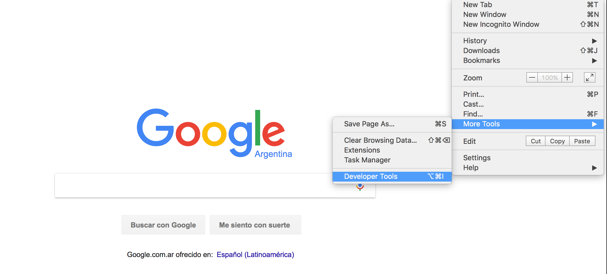
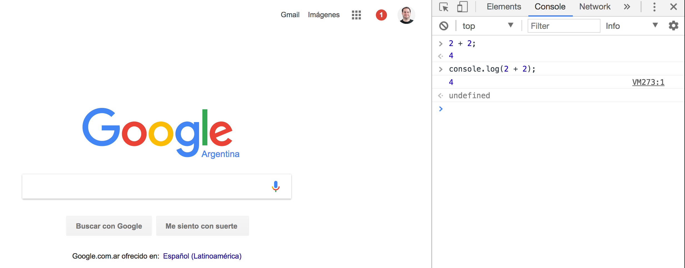
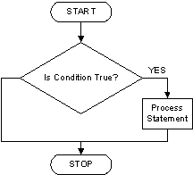
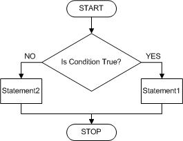
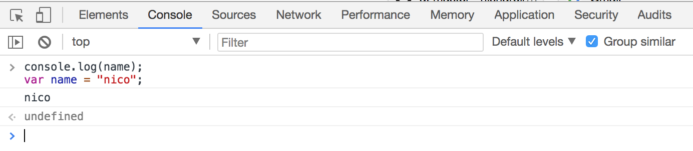
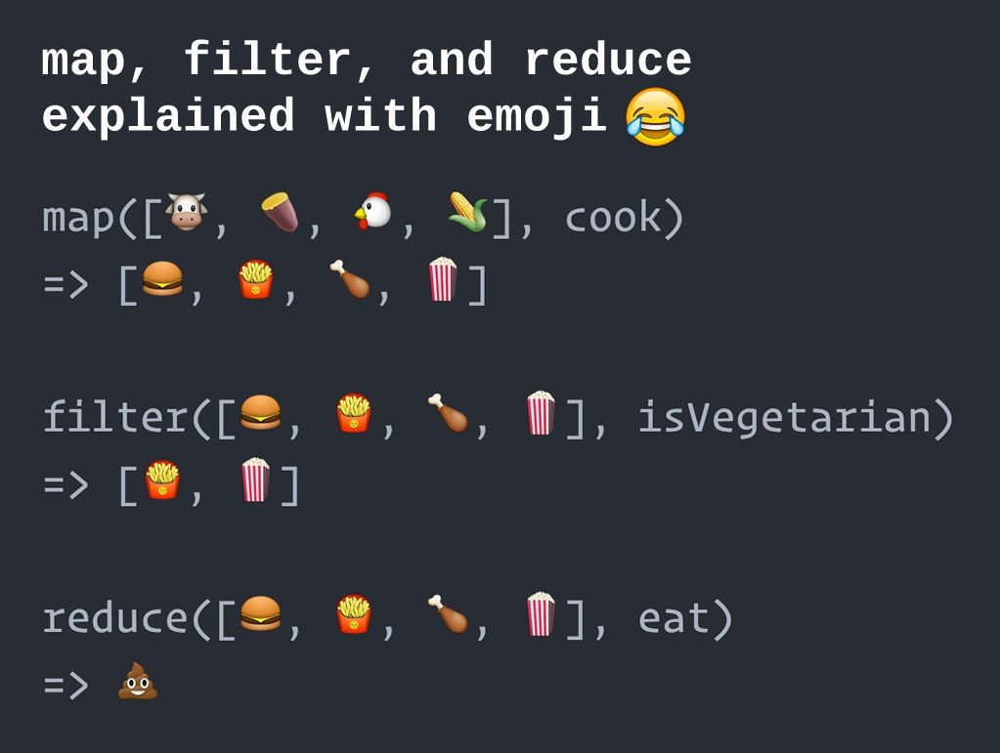
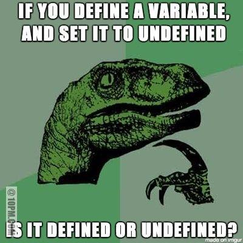

# JavaScript

[<- Go Back](README.md)

## Definition
> JavaScript often abbreviated as JS, is a `high-level`, `interpreted` programming language. It is a language which is also characterized as `dynamic`,  `weakly typed`, `prototype-based` and `multi-paradigm`. 

> As a `multi-paradigm` language, JavaScript supports `event-driven`, `functional`, and `imperative (including object-oriented and prototype-based)` programming styles.

> `Initially only implemented client-side in web browsers`, JavaScript engines `are now embedded in many other types of host software, including server-side in web servers and databases`, and in non-web programs such as word processors and PDF software, and in runtime environments that make JavaScript viable for writing mobile and desktop applications, including desktop widgets.

```js
const person = {
  name: 'Jane',
  age: 31
}

const properties = Object.keys(person);

properties.forEach(function(property) {
  console.log(person[property]);
});
```

* This definition comes from [Wikipedia - JavaScript](https://en.wikipedia.org/wiki/JavaScript) document
* Over this course we'll try to figure out what this means and how it works
* By the end of the programing section we should be able to read this definition again and understand it

## JS History
* It's important to know the language's history to understand where it comes from and where it's going
* Read [auth0 - A brief history of JavaScript](https://auth0.com/blog/a-brief-history-of-javascript)
* Watch & Read [TXJS 2011 A6 – Brendan Eich – Ecma TC39: The Good, The Bad, and The Ugly.](https://brendaneich.com/2011/08/my-txjs-talk-twitter-remix)
* Watch [Tyler McGinnis - Computing Conversations with Brendan Eich](https://www.youtube.com/watch?v=IPxQ9kEaF8c)
* Watch [ECMAScript, TC39, and the History of JavaScript](https://www.youtube.com/watch?v=gytOcNFV1dM)
* Watch [How to fix the web | Brendan Eich | TEDxVienna](https://www.youtube.com/watch?v=zlcnOr81lPc)
* Watch [Brendan Eich on JavaScript at 17 - O'Reilly Fluent 2012](https://www.youtube.com/watch?v=Rj49rmc01Hs)
* Watch [ECMAScript Harmony: Rise of the Compilers - Brendan Eich keynote](https://www.youtube.com/watch?v=PlmsweSNhTw)

## JS Environments
* JavaScript now runs Client and Server side
* Using a Web Browser is one of the easiest way to execute JS Client side
* Using Node.js we can execute JS Server side
* JavaScript is no longer a scripting language to create interactive browser animations

### Client Side - Browser
* Open Chrome
* Open Devtools
* Select the console tab inside Devtools



* Write the following code and press enter to execute it:

```javascript
2 + 2
```

```js
console.log(2 + 2);
```



* Now run the following code:

```javascript
console.log('Congrats!!!, you just ran your first JS code');
```

### Node.js - Server Side

* [Node.js®](https://nodejs.org/) is a JavaScript runtime built on Chrome's V8 JavaScript engine. Node.js uses an event-driven, non-blocking I/O model that makes it lightweight and efficient. Node.js' package ecosystem, npm, is the largest ecosystem of open source libraries in the world.
* It was created by [Ryan Dahl](https://wikipedia.org/wiki/Node.js) in 2009
* We'll use Node.js from now on to learn the language and run our JavaScript exercises
* Once we know the language core concepts we'll learn about the Browsers API's
* [Download & install Node.js](https://nodejs.org/en/download/)
* [Install Node.js & npm Windows](http://blog.teamtreehouse.com/install-node-js-npm-windows)

* After installing Node.js open a terminal window and run the following command:

```bash
node --version
v13.6.0
```

* Also check that you have npm installed too:

```bash
npm --version
6.13.6
```

* Now that we know that we have installed Node.js & npm we can use it
* Execute the following command:

```bash
node
>
```

* It looks like nothing happened but in reality we are executing Node.js JavaScript console
* The **>** symbol means that we opened the Node.js console and it's waiting for us to input JS code
* Now we can write JS code and execute it the same way we did using the browser
* This console is called `REPL("Read-Eval-Print-Loop")`

### Using Node.js REPL
* Open your terminal
* Execute the `node` command
* If you do not see the **>** symbol (and you are using Windows) try `winpty node` instead
* Write the following sentence once you see the **>** symbol:

```javascript
2 + 2
```
* Press the enter key to see the following result:

```javascript
> 2+2
4
>
```

* Press CTRL + C to quit
* You'll see the following message:

```bash
(To exit, press ^C again or type .exit)
```

* So you need to press CTRL + C twice to exit
* In this exercise we added two numbers and Node.js output the result
* It's nice to be able to try code using Node.js console but for longer programs it's better to use a JS files
* To execute a JS program we'll use the node command and the name of the file that we want to execute

```bash
node program.js
```

* Once we execute this command Node.js will read and interpret our JS code
* We use the `.js` extension for our JavaScript code

### Using a Node.js file
* Create a folder with the name `js`
* Create a new file `index.js` inside the js folder
* Write the following code into the index.js file

```javascript
2 + 2
```

* Open the console and change directory to the `js` folder
* Execute the program using the node command:

```bash
node index.js
```

* Check out the output!!
* Don't worry if you don't see an output, Node.js executes our code but it's only adding both values together
* To show the result as output we need to use the `console.log()` object and method
* The `log()` method accepts any value to show as output
* Now add `console.log` and execute the program again

```js
console.log(2 + 2);
```

```bash
node index.js
```

* Now we see the expected output!!!

### Conclusion
* Browser and Node.js internally use the V8 JavaScript engine to run JavaScript code
* We can use the Browser or Node.js console to try out JavaScript code
* V8 is maintained by Google
* We'll use browser to run JavaScript client side and Node.js for Server side

## Variables declaration & assignment operators

## Variables declaration

* Many times when coding we need to store a value to interact with it
* This value is stored in our computer memory
* As this values might change over time we'll call this memory position a `variable` 
* We can assign variables a `name` to identify them
* It's a good practice to use descriptive names to define our variables
* If we use names like a, b, foo they don't add any context about what we're coding
* We can then define that variables are named memory positions where we can assign different values and override them when needed

### ES5
* To define a variable in JavaScript we just need a variable name
* The variable statement **var** declares a variable, optionally initializing it to a value
* Also end each statement with `;`
* [MDN var doc](https://developer.mozilla.org/en-US/docs/Web/JavaScript/Reference/Statements/var)

**Example:**
```js
var variableName;
```

* For example we can define name and age variables to use in our program

**Example:**
```js
var name;
var age;
```

* Not using **var** is a bad coding practice
* To avoid  unexpected errors use var to declare your variables
* Variable names must start with a letter
* Use descriptive variable names to keep your code [smelling nice](https://en.wikipedia.org/wiki/Code_smell)
* In JavaScript it's common to use camel case to define variable names
* In camel case the first word is written in lower case and the rest of the words start with a capitalize letter

**Example:**
```js
var healthInsuranceNumber;
```


#### Practice
* Create a folder called js inside your exercises folder.
- All files of our JS studies will live in here.

[Exercise 1](./exercises/js/ex_1.md)

## Assignment operator
* Once we defined a variable name we can assign a value
* As we have a memory space reserved we can store a value 
* The **=** assigns a value from right to left

**Example:**
```js
var name;
name = 'Jane';
```

* We can define all the variables first and then assign the values:
* Variables in JS can be of different [types](https://www.w3schools.com/js/js_datatypes.asp)

**Example:**
```js
var name;
var age;
name = 'Jane';
age = 20;
```

#### Practice
[Exercise 2](./exercises/js/ex_2.md)

* Also we can declare all variables using a single line:

**Example:**
```js
var name, age;
name = 'Jane';
age = 20;
```

#### Practice
[Exercise 3](./exercises/js/ex_3.md)

* We can declare a variable and assign a value in the same line:
* Multiple assignment doesn't work in JavaScript (only one variable and one value)

**Example:**
```js
var name = 'Jane';
var age = 20;
```

#### Practice
[Exercise 4](./exercises/js/ex_4.md)

* Using `console.log()` we can output the variable value

**Example: index.js (filename)**
```js
var name = 'Jane';
var age = 20;
console.log(name);
console.log(age);
```

**Execute the program using node.js:**
```bash
node index.js
```

#### Practice
[Exercise 5](./exercises/js/ex_5.md)

* After executing the program we should see Jane & 20 as output
* `console.log()` accepts multiple comma separated values 
* We can show a message and the variable value

**Example: index.js (filename)**
```js
var name = 'Jane';
var age = 20;
console.log('name: ', name);
console.log('age: ', age);
```

**Execute the program using node.js:**
```bash
node index.js
```

* Now our output looks like: **name: Jane** and **age: 20**
* This is an easy way to debug our variable values

#### Practice
[Exercise 6](./exercises/js/ex_6.md)

### ES6
* In version 6 of the language we can use **let** to define variables
* This statement declares a **block scope local variable**, optionally initializing it to a value
* Using **let** will help us scope our variables in a better way
* [MDN let doc](https://developer.mozilla.org/en-US/docs/Web/JavaScript/Reference/Statements/let)

**Example:**
```js
let variable = value;
```

#### Practice
[Exercise 7](./exercises/js/ex_7.md)

* When the value of a variable is always the same we can define it as a **constant**
* In ES6 we can declare constants using the reserved word **const** 

**Example:**
```js
const constantVariable = value;
```

#### Practice
[Exercise 8](./exercises/js/ex_8.md)

* We'll get an error if we try to change a constant value

**Example:**
```js
const constantVariable = value;
constantVariable = otherValue;
// TypeError: Assignment to constant variable.
```

#### Practice
[Exercise 9](./exercises/js/ex_9.md)

### var vs let & const
* [Medium - Eric Elliot - JavaScript ES6 var, let or const](https://medium.com/javascript-scene/javascript-es6-var-let-or-const-ba58b8dcde75)
* [StackOverflow - Difference between using let and var](https://stackoverflow.com/questions/762011/whats-the-difference-between-using-let-and-var-to-declare-a-variable-in-jav)
* [JS Tips - Keyword var vs let](http://www.jstips.co/en/javascript/keyword-var-vs-let)

### Memory Management
* If you're wondering how JavaScript memory and variables work you can read the following guide to know more about it and JS Garbage collection
* [MDN Memory management doc](https://developer.mozilla.org/en-US/docs/Web/JavaScript/Memory_Management)

## Data types
* In JavaScript we can use different types of values to represent different things

**Example:**
```js
var name = 'Jane';
var age = 20;

console.log('name: ', name);
console.log('age: ', age);
```

* In this example we use different types of values:
  * For the name variable we use a value between quotes
  * For age we use a number

* JavaScript has the following different base types that we can use:
  * **string:** this type is used to represent textual data
  * **number:** there is only one number type the `double-precision 64-bit binary format IEEE 754 value`. There is no specific type for integers. In addition to being able to represent floating-point numbers, the number type has three symbolic values: +Infinity, -Infinity, and NaN (not-a-number)
  * **boolean:** represents a logical entity and can have two values: `true or false`
  * **undefined:** A variable that has not been assigned a value has the value `undefined`.
  * **null:** this type has exactly one value: `null`. It represents the intentional absence of any object value

* As programmers it's going to be our responsibility to choose the right data type for each variable depending the type of value that we need
* The operations that we'll be able to do are going to be related to the data type we choose
* There exists many more types of values in JavaScript (and we can even create our own) but these are the primitive ones
* A primitive (primitive value, primitive data type) is data that is not an object and has no methods
* [MDN primitive doc](https://developer.mozilla.org/en-US/docs/Glossary/Primitive)
* [MDN data structures doc](https://developer.mozilla.org/en-US/docs/Web/JavaScript/Data_structures)

### String
* String represents a text value, we can use them for names, last name, address, etc
* String values are enclosed between single or double quotes
* By default we use single quotes for strings but there are some special cases
* [MDN string doc](https://developer.mozilla.org/en-US/docs/Web/JavaScript/Reference/Global_Objects/String)

**Example:**
```js
let firstname = 'Juan';
let lastname = "Perez";

console.log(firstname);
console.log(lastname);
```

* In this example we defined two variables (firstname and lastname) and assigned them string values ('Juan', 'Perez')
* We can also use this type of value for messages

**Example:**
```js
let message = 'Welcome to JavaScript!!!';
console.log(message);
```

* We can use primitives without having them assigned to a variable

**Example:**
```js
console.log('Welcome to JavaScript!!!');
```

* In this example we use a literal **string** as `console.log()` parameter

#### Practice
[Exercise 10](./exercises/js/ex_10.md)

[Exercise 11](./exercises/js/ex_11.md)

### String concatenation
* The `+` operator allows us to concat two or more strings together

**Example:**
```js
let name = 'Juan';
let space = ' ';
let lastname = 'Perez';

console.log(name + space + lastname);
```

* In this example we concat all values using the `+` operator
* We might not need to use a variable for the space and we can use a string literal instead

**Example:**
```js
let name = 'Juan';
let lastname = 'Perez';

console.log(name + ' ' + lastname);
```

* In this example we see how to use a literal value without being assigned to a variable

#### Practice
[Exercise 12](./exercises/js/ex_12.md)

[Exercise 13](./exercises/js/ex_13.md)

[Exercise 14](./exercises/js/ex_14.md)

### Template literals
* In ES6 we have `template literals` that will help us write better string templates
* To write a template literal we use **``** (back-tick)
* Then we use the following syntax to add template values `${variable}`
* Once the code gets executed the JavaScript engine will replace the variable value inside the string one
* Take a look at the following example to better understand this concept
* [MDN template literals](https://developer.mozilla.org/en-US/docs/Web/JavaScript/Reference/Template_literals)

**Example:**
```js
var name = 'Peter';
var template = `Welcome ${name} to this great site`

console.log(template);
```

* In this example we defined a name variable and assigned the Peter value
* Then we create a template variable with a message and the name variable
* Once we execute this code we'll get `Welcome Peter to this great site`
* We can add all the variables that we need to a template
* Templates can be multiline

**Example:**
```js
let mom = 'Mary';
let dad = 'Martín';
let template = `My mother\'s name is ${mom} & my dad\'s name is ${dad}`;

console.log(template);
```

* We'll get as result: My mother's name is Mary & my dad's name is Martín
* We will explain the backslash quote thing later ;)
* Using string concatenation we can get the same result

**Example:**
```js
let mom = 'Mary';
let dad = 'Martín';
let message = 'My mother\'s name is ' + mom + ' & my dad\'s name is ' + dad;

console.log(message);
```

* We can get the same result using templates or string concat
* Using templates looks like an easier way to do it!!

#### Practice
[Exercise 15](./exercises/js/ex_15.md)

[Exercise 16](./exercises/js/ex_16.md)

[Exercise 17](./exercises/js/ex_17.md)

### Single or double quotes
* In JavaScript we can choose between single or double quotes
* There're some cases where we need to use one or the other

**Example:**
```js
let text = 'text using "double quotes"';
let otherText = "text using 'simple quotes'";

console.log(text);
console.log(otherText);
```

* In this case single or double quotes are part of the value
* When using quotes as part of the value we have to choose between escaping the quotes or just using the quote type that is not part of the content:
  * Use double quotes if the text has single quote content
  * Use singe quotes if the text has double quote content

#### Practice
[Exercise 18](./exercises/js/ex_18.md)

[Exercise 19](./exercises/js/ex_19.md)

### Numbers
* JavaScript also supports number type
* This type of value doesn't use quotes

**Example:**
```js
let age = 38;
let capacity = 50;

console.log(age);
console.log(capacity);
```

#### Practice
[Exercise 20](./exercises/js/ex_20.md)

[Exercise 21](./exercises/js/ex_21.md)

* A common mistake is to code numbers as strings

**Example:**
```js
let age = 38;
let capacity = "50";
```

> In this example we have two variables that it looks like we are assigning number values. 
> Age has a number type and capacity has a string value with the representation of a number.
> Having different types allows us to do different types of operations, for example we can add or subtract numbers but not strings

* We'll talk later about doing math using number type values

### Boolean
* This type of value only accepts `true or false` as value

**Example:**
```js
let on = true;
let voted = false;
let married = false;

console.log(on);
console.log(voted);
console.log(married);
```

#### Practice
[Exercise 22](./exercises/js/ex_22.md)

### Undefined
* A variable that has not been assigned a value is of type **undefined**
* A method or statement also returns undefined if the variable that is being evaluated does not have an assigned value
* A function returns undefined if a value was not returned
* Also we can assign it as a value to a variable

**Example:**
```js
let variableWithoutDefinition = undefined;

console.log(variableWithoutDefinition);
```

* We might need to assign **undefined** in some special cases

#### Practice
[Exercise 23](./exercises/js/ex_23.md)

### Null
* In JavaScript we also have a **null** value
* We can assign a variable a null value

**Example:**
```js
let nullVariable = null;

console.log(nullVariable);
```

#### Practice
[Exercise 24](./exercises/js/ex_24.md)

* At the beginning **null** & **undefined** look similar but they are different
* We can assign a null value and know that the variable has been defined but it has no value

### typeof
* The **typeof** operator returns a string indicating the type of the unevaluated operand

**Example:**
```js
let name = 'Mary';
let age = 30;
let married = false;
let undefinedVar = undefined;
let nullVar = null;

console.log(typeof name); // string
console.log(typeof age); // number
console.log(typeof married); // boolean
console.log(typeof undefinedVar); // undefined
console.log(typeof nullVar); // object
```

* In this example we can see that typeof will return different values for different data types
* For **null** it will return `object`! Now that was unexpected...
* Object is a different type of JavaScript data value and we'll talk more about it in a different section

#### Practice
[Exercise 25](./exercises/js/ex_25.md)

[Exercise 26](./exercises/js/ex_26.md)

## Arithmetic operators
* Arithmetic operators take numerical values (either literals or variables) as their operands and return a single numerical value
* The standard arithmetic operators are `addition (+), subtraction (-), multiplication (*), & division (/)`

### Addition
* The addition operator **(+)** produces the sum of numeric operands or string concatenation

**Example:**
```js
2 + 2
```

* In this example we add two literal numbers

**Example:**
```js
const myAge = 20;
const myBrotherAge = 15;

console.log(myAge + myBrotherAge);
```

* We can add two or more values using variables

**Example:**
```js
const myAge = 20;
const myBrotherAge = 15;
const result = myAge + myBrotherAge;

console.log(result);
```

* In this example we store the result of adding two values into the result variable

**Example:**
```js
const myAge = 20;
const myBrotherAge = 15;
const result = myAge + myBrotherAge;

console.log(result + 2);
```

* Also we can add variables values and literal numbers too

### Subtraction
* The subtraction operator **(-)** subtracts the two number operands, producing their difference

**Example:**
```js
2 - 2; // We get 0 as result

const myAge = 20;
const myBrotherAge = 15;

// We show the difference between myAge and myBrotherAge
console.log(myAge - myBrotherAge);

// Also we can use a variable to store the subtraction result
const result = myAge - myBrotherAge;

console.log(result);
```

* Also we can combine operations

**Example:**
```js
10 + 2 - 2; 

const myAge = 20;
const myBrotherAge = 15;

// Use variables, literal number and different arithmetic operators
console.log(myAge - myBrotherAge + 10);

const result = myAge - myBrotherAge + 10;

console.log('Result: ' + result);
```

### Multiplication
* The multiplication operator **(*)** produces the product of the operands

**Example:**
```js
2 * 2; // Returns 4 as result

const firstNumber = 10;
const secondNumber = 5;

console.log(firstNumber * secondNumber);

const result = firstNumber * secondNumber;

console.log(result);
```

* In some cases we can use grouping **(operation)** to let the engine know that it need to resolve this operation first
* Read the [MND operator precedence doc](https://developer.mozilla.org/en-US/docs/Web/JavaScript/Reference/Operators/Operator_Precedence) to know more about this subject

**Example:**
```js
2 + 2 * 4; // 10
(2 + 2) * 4; // 16
```

* In the first example it will multiply 2 times 4 and then add 2 to the result
* In the second example as we are grouping 2 plus 2 it will resolve this operation first and then multiply by 4
* This concept works with variables too

**Example:**
```js
const two = 2;
const four = 4;

console.log(two + two * four); // 10
console.log( (two + two) * four ); // 16
```

### Division 
* The division operator **(/)** produces the quotient of its operands where the left operand is the dividend and the right operand is the divisor

**Example:**
```js
20 / 2; // 10

const firstNumber = 20;
const secondNumber = 2;

console.log(firstNumber / secondNumber); // 10

const result = firstNumber / secondNumber;

console.log(result); // 10
```

* With code we can have the same problem that we can have in math when we divide by 0
* JavaScript has a special number type called **Infinity**
* We get **Infinity** if we try to divide by 0
* [MDN Infinity doc](https://developer.mozilla.org/en-US/docs/Web/JavaScript/Reference/Global_Objects/Infinity)

### Remainder
* The remainder operator **(%)** returns the remainder left over when one operand is divided by a second operand

**Example:**
```js
20 % 2; // 0

const firstNumber = 20;
const secondNumber = 2;

console.log(firstNumber % secondNumber); // 0

const result = firstNumber % secondNumber;

console.log(result); // 0
```

* We can use this operator to find out if a number is even or odd
[Freecodecamp - Finding a remainder in JavaScript](https://www.freecodecamp.org/challenges/finding-a-remainder-in-javascript)

#### Practice
[Exercise 27](./exercises/js/ex_27.md)

[Exercise 28](./exercises/js/ex_28.md)

[Exercise 29](./exercises/js/ex_29.md)

[Exercise 30](./exercises/js/ex_30.md)

[Exercise 31](./exercises/js/ex_31.md)

[Exercise 32](./exercises/js/ex_32.md)

### Increment & Decrement
* Using the increment and decrement operators we can do addition and substraction by one really easy

#### Increment
* The increment operator **++** increments (adds one to) its operand and returns a value
* If used [postfix](http://www.cs.man.ac.uk/~pjj/cs212/fix.html), with the operator after the operand (for example, x++), then it returns the value before incrementing
 
**Example:**
```js
let number = 0;

number++;

console.log(number); // 1
```

* If used prefix with the operator before the operand (for example, ++x), then it returns the value after incrementing

**Example:**
```js
let number = 0;

++number;

console.log(number); // 1
```

* In this case we can use the operator before or after but there might be cases when we need to use one or the other depending if we're using the incremented result or not

#### Decrement
* The decrement operator **--** decrements (subtracts one from) its operand and returns a value
* If used postfix (for example, x--), then it returns the value before decrementing
* If used prefix (for example, --x), then it returns the value after decrementing

**Example:**
```js
let number = 10;

--number;

console.log(number); // 9

number--;

console.log(number); // 8
```

#### Assignment operators
* We can assign a number to a variable then use this variable to do any arithmetic operation
* Also we can reuse the variable to assign the result of the arithmetic operation
* Take a look at the following example:

**Example:**
```js
let number = 1;
number = number + 1
```

* In this example we increment the value of the number variable by one
* We already saw that we can use the increment operator **++** to do this

**Example:**
```js
let number = 1;

number++;
```

* We see in this examples that we increment and assign the result to the variable
* The increment and decrement operators are great but we can only add or subtract by one
* We can use different assignment operators to do this task for different operations
* Assignment operators:
  * `+=` Addition assignment
  * `-=` Subtraction assignment
  * `*=` Multiplication assignment
  * `/=` Division assignment
  * `%=` Remainder assignment
* This concept is easier to understand using code:

**Example:**
```js
let number = 1;

number += 1;

console.log(number); // 2
```

**Example:**
```js
let number = 1;

number = number + 10;

console.log(number); // 11
```

* Using the addition assignment we can do the same operation much easier:

**Example:**
```js
let number = 1;

number += 10;

console.log(number); // 11
```

* We can add 10 to the current number variable value using the addition assignment operator `+=`
* Then we can use any of the other assignment operators

**Example:**
```js
let number = 10;

number -= 2;

console.log(number); // 8
```

**Example:**
```js
let number = 10;

number *= 2;

console.log(number); // 20
```

**Example:**
```js
let number = 20;

number /= 2;

console.log(number); // 10
```

**Example:**
```js
let number = 20;

number %= 2;

console.log(number); // 0
```

* The concept is always the same but it only changes the operation that we do over the given variable
* You can learn more about assignment operators on [MDN site](https://developer.mozilla.org/en-US/docs/Web/JavaScript/Reference/Operators/Assignment_Operators)

#### Practice
[Exercise 33](./exercises/js/ex_33.md)

## Comparison operators

### Equality operators
* We can compare two values using the equality operators **==**
* Using the equality operators we get a **boolean** value as result (true or false)
* This type of equality only compares values (or the current values of variables) by value
* For example using this operator we can compare a number value and string value with a number
* If both values are equal we get **true** as result
* In case they are not the same value we'll get **false** as result

**Example:**
```js
let firstNumber = 20;
let secondNumber = 20;
let thirdNumber = 10;

console.log(firstNumber == secondNumber); // true
console.log(firstNumber == thirdNumber); // false
```

* As we only compare by value:

**Example:**
```js
console.log(10 == '10'); // This is true even though the variables have different value type
```

* Also we can know if the values are different using the inequality operator **!=**

**Example:**
```js
let firstNumber = 20;
let secondNumber = 20;
let thirdNumber = 10;

console.log(firstNumber != secondNumber); // false
console.log(firstNumber != thirdNumber); // true
```

* Other way to compare values is to know if a value is greater than the other
* The greater than operator **>** returns true if the left operand is greater than the right operand

**Example:**
```js
let firstNumber = 20;
let secondNumber = 10;

console.log(firstNumber > secondNumber); // true

console.log(secondNumber > firstNumber); // false
```

* Also we can compare values by using the less than operator
* The less than operator **<** returns true if the left operand is less than the right operand

**Example:**
```js
let firstNumber = 20;
let secondNumber = 10;

console.log(secondNumber < firstNumber); // true

console.log(firstNumber < secondNumber); // false
```

* We can use the greater than or equal operator 
* The greater than or equal operator >= returns true if the left operand is greater than or equal to the right operand

**Example:**
```js
let firstNumber = 20;
let secondNumber = 10;
let thirdNumber = 20;

console.log(firstNumber >= secondNumber); // true

console.log(firstNumber >= thirdNumber); // true
```

* We can do the same using less than or equal
* The less than or equal operator **<=** returns true if the left operand is less than or equal to the right operand

**Example:**
```js
let firstNumber = 20;
let secondNumber = 10;
let thirdNumber = 10;

console.log(secondNumber <= firstNumber); // true
console.log(secondNumber <= thirdNumber); // true
```

### Strict Equality Comparison 
* The strict equality operators **===** and **!==** use the Strict Equality Comparison Algorithm and are intended for performing equality comparisons on operands of the **same type**

**Example:**
```js
console.log(10 === '10'); // false

console.log(10 !== '10'); // true
```

* Read more about the [comparison operators on MDN site](https://developer.mozilla.org/en-US/docs/Web/JavaScript/Reference/Operators/Comparison_Operators)

#### Practice
[Exercise 34](./exercises/js/ex_34.md)

[Exercise 35](./exercises/js/ex_35.md)

## Logical Operators
* Logical operators are typically used with Boolean (logical) values
* When they are, they return a **Boolean** value
* We can use the **`&&`** **"Boolean AND" operator** to know if both expressions are true
* We can know if the user age is greater than 18 and the password is equal to another value
* In this case we'll get a true value if both expressions are true
* If one of the expressions is **false**, we get false as the return value too

**Example:**
```js
let age = 20;
let password = 'js1234';
let result = (age >= 18 && password ==='js1234');
console.log('Result: ', result); // We get true as both expressions are true
```

* In this example we get **true** as both expressions are **true**
* We also have the **`||`** **"Boolean OR" operator** to check if at least one of the expressions is true
* Using this operator we only need one of the expressions to be true
* If the first expression is true the following one is not evaluated
* If the first expression is false then the following one is evaluated 
* At least one of the expressions needs to be true to get a true value 
* If not we'll get false as the result

**Example:**
```js
let age = 20;
let password = 'js12345';
let result = age >= 18 || password ==='js1234';
console.log('Result: ', result); // true
```

* In this case the condition is **true** as the user age is greater than 18 (first expression)
* It doesn't matter if the password is the same or not as the first expression is true

**Example:**
```js
let age = 10;
let password = 'js1234';
let result = age >= 18 || password ==='js1234';
console.log('Result: ', result); // true
```

* In this case the condition is **true** as the password is correct
* It doesn't matter if the age is not greater than or equal to 18

**Example:**
```js
let age = 10;
let password = 'js12345';
let result = age >= 18 || password ==='js1234';
console.log('Result: ', result); // false
```

* In this case we get **false** as both expressions are false
* [MDN logical operators doc](https://developer.mozilla.org/en-US/docs/Web/JavaScript/Reference/Operators/Logical_Operators)

## Negation
* Using the not operator **!** we can negate a condition
* If we have a **true** value and we use the not operator we get **false**
* If we have a **false** value and we use the not operator we get **true**

**Example:**
```js
console.log(!true); // false
console.log(!false); // true
```

* We can use the not operator like this: 

**Example:**
```js
let age = 21;
let result = age < 18; 

console.log('User age less than or equal to 18?: ', !result);
```

* The age condition is **false** but as we use the not operator it will be **true**

#### Practice
[Exercise 36](./exercises/js/ex_36.md)

[Exercise 37](./exercises/js/ex_37.md)

## String special characters
* Strings support some special characters that will provide extra functionality
* \n  New Line
* \t  Tab
* \r  Carriage Return

**Example:**
```js
let message = 'Multiline \n text';

console.log(message); // two lines text

message = '\t \t tab text';

console.log(message); // tab text
```

* Special characters need to be "escaped" :
* \'  Single quote
* \"  Double quote
* \\  Backslash

**Example:**
```js
let message = 'Escaping backslash \\ as string content';
console.log(message); // we show \ as string content

message = 'I love to have coffee at Gianu\'s';

console.log(message);

message = "Jets are \"the\" best NHL team";

console.log(message);
```

#### Practice
* Open a browser console and try all the examples to see the output

## String object properties and methods

### Length
* The **length** property of a **String object** indicates the length of a string
* This property returns the **number** of code units in the string

**Example:**
```js
const text = 'Welcome to JavaScript!!';
const characterCount = text.length;

console.log(characterCount); // 24
```

**Example:**
```js
const text = 'Welcome to JavaScript!!';

console.log(text.length);
```

**Example:**
```js
console.log('Welcome to JavaScript!!'.length);
```

* Strings have a length property that allows us to know the string value length (characters)
* We can use it with string literals
* We can also use it on a string stored in a variable
* Finally we can store the length in a variable too in case we need it
* [MDN length doc](https://developer.mozilla.org/en-US/docs/Web/JavaScript/Reference/Global_Objects/String/length)

#### Practice
[Exercise 38](./exercises/js/ex_38.md)

[Exercise 39](./exercises/js/ex_39.md)

### String methods
* Object methods can give us different functionality for different data types
* In this section we'll explore the String object methods
* JavaScript transforms string literals into String objects when calling a method
* [MDN String methods](https://developer.mozilla.org/en-US/docs/Web/JavaScript/Reference/Global_Objects/String)

**Example:**
```js
const stringVariable = 'string value';

// We can call String methods when we have a string value type. 
// To call the method use a dot before the method name
// After the method name we add () to execute it
stringVariable.method();

// Also we can pass values to the method and they are called parameters
stringVariable.method(methodParameter);

// A method might accept more than one parameter and will depend on the method contract
stringVariable.method(methodParameter, otherMethodParameter);
```

* This method returns a new string with the text of the inputs concatenated (put together)

## Concat
* Using the **+** operator we can concatenate string values
* The String object has a **concat** method to do the same using methods instead of operators
* [MDN concat doc](https://developer.mozilla.org/en-US/docs/Web/JavaScript/Reference/Global_Objects/String/concat)

**Example:**
```js
const text = 'My mom name is '; // Note the trailing space!  It's a common mistake to forget whitespace when using concat
const name = 'Mary';

// We get one string back as result with both strings concatenated
const message = text.concat(name);

console.log(message); // My mom name is Mary

console.log(text); // My mom name is

console.log(name); // Mary
```

* Some methods might change the object value
* In this case concat only returns a new string without changing the original values
* The concat method also accepts multiple parameters

**Example:**
```js
let text = 'Java'; // Sometimes we don't want that trailing space ;)

console.log(text.concat('Script', ' is the best', ' Programming language!!'));
```
* The concat method will return the following string: **JavaScript is the best Programming language!!**
* In this example we used concat with many parameters using literal strings
* We can also use variables

#### Practice
[Exercise 40](./exercises/js/ex_40.md)

### Upper and lower case
* Using the **toUpperCase** & **toLowerCase** we can transform our text to upper and lower case

**Example:**
```js
const upperCaseText = 'HELLO';
const lowerCaseText = 'friends';

console.log(upperCaseText.toLowerCase()); // hello
console.log(lowerCaseText.toUpperCase()); // FRIENDS

console.log(upperCaseText); // HELLO
console.log(lowerCaseText); // friends
```

#### Practice
[Exercise 41](./exercises/js/ex_41.md)

[Exercise 42](./exercises/js/ex_42.md)

### String characters position
* The **charAt** method returns the character at the specified index
* This method accepts a number parameter to specify the index position
* Index in JavaScript starts in 0
* The first character will be at the 0 index position

**Example:**
```js
const text = 'JavaScript rocks!! right?';
const firstCharacter = text.charAt(0); 

console.log(firstCharacter); // J

console.log(text.charAt(0)); // J
```

* To know the last string character we can combine charAt and the length property
* As length will return the amount of characters and the index starts at 0 to know the last character we need to substract one from the length value

**Example:**
```js
const text = 'JavaScript rocks!! right?';
const lastCharacterPosition = text.length - 1;
const lastCharacter = text.charAt(lastCharacterPosition);

console.log(lastCharacter); // ?

console.log( text.charAt(text.length - 1) ); // ?
```

#### Practice
[Exercise 43](./exercises/js/ex_43.md)

[Exercise 44](./exercises/js/ex_44.md)


### String slice
* The **slice** method extracts a section of a string and returns it as a new string
* This method accepts two parameters slice(start, end)
* Use 0 index for the beginning of the text
* The end parameter is optional and if we don't pass any value it will return the rest of the text

**Example:**
```js
const text = 'I <3 JavaScript!!';
const result = text.slice(4, 15);

console.log(result); // JavaScript
```

* Counting from the beginning we have 4 index before the **J** letter
* Then we slice the string until the 15 index
* The final result is the JavaScript word
* Also we can avoid passing the second slice parameter and get the rest of the text from a starting point until the end

**Example:**
```js
const text = 'I <3 JavaScript!!';
const result = text.slice(4);

console.log(result); // JavaScript!!
```

* The end parameter can be a negative value
* When using negative values it will position at the end of the string and start counting backwards

**Example:**
```js
const text = 'JavaScript and Java are not the same';
const result = text.slice(0, -25); // JavaScript

console.log(result);
```

#### Practice
[Exercise 45](./exercises/js/ex_45.md)

* The **substr** method returns the part of a string between the start index and a number of characters after it
* We can also use 2 parameters (start and end)
* First parameter is the substring start
* Second parameter is the number of characters

**Example:**
```js
const text = 'I love JavaScript!!';
const result = text.substr(7, 10);

console.log(result); // JavaScript
```

**Example:**
```js
const text = 'I love JavaScript!!';
const jsText = 'JavaScript';
const result = text.substr(7, jsText.length);

console.log(result); // JavaScript
```

#### Practice
[Exercise 46](./exercises/js/ex_46.md)

* You can learn more about [slice](https://developer.mozilla.org/en-US/docs/Web/JavaScript/Reference/Global_Objects/String/slice) and [substr](https://developer.mozilla.org/en-US/docs/Web/JavaScript/Reference/Global_Objects/String/substr) reading the MDN guides

### String split
* The **split** method splits a String object into an array of strings by separating the string into substrings, using a specified separator string to determine where to make each split
* The first method parameter will be the separator value to split the string by (also known as a "delimiter")
* We'll get an **array** object as result
* For now think about an **array** as a list or collection of elements (in this case strings)
* Learn more about the [split](https://developer.mozilla.org/en-US/docs/Web/JavaScript/Reference/Global_Objects/String/split) method on the MDN guide

**Example:**
```js
let friends = 'tute, mati, pepe, raul, juan, Mary, agus, loli';
let friendsArray = friends.split(',');

console.log(friendsArray);
/* 
[ 
  'tute',
  ' mati',
  ' pepe',
  ' raul',
  ' juan',
  ' Mary',
  ' agus',
  ' loli' 
]
*/
```

#### Practice
[Exercise 47](./exercises/js/ex_47.md)

* The String object has a lot of methods that we can use
* Read about them on the [MDN string guide -  methods section](https://developer.mozilla.org/en-US/docs/Web/JavaScript/Reference/Global_Objects/String)
* Read about:
  * String.prototype.includes()
  * String.prototype.indexOf()
  * String.prototype.repeat()
  * String.prototype.replace()
  * String.prototype.trim()
  * And more
* Try using these methods on your own code!! `it will be 'fun'.toUpperCase()`
* We don't need to memorize all the methods, just know that they exist and what they can do for us :)

## Number methods
* The Number JavaScript object is a wrapper object allowing you to work with numerical values
* Great learning project: Find out about wrappers and why Strings are different than "primitives" in most computer languages

### parseInt
* The **parseInt** method parses a string argument and returns an integer of the specified radix or base
* This method returns an integer number parsed from the given string
* If the first character cannot be converted to a number, **NaN** (not a number) is returned
* [MDN parseInt doc](https://developer.mozilla.org/en-US/docs/Web/JavaScript/Reference/Global_Objects/Number/parseInt)

**Example:**
```js
const numberAsAString = '3';

console.log(typeof numberAsAString) // string

const number = parseInt(numberAsAString);

console.log(number); // 3

console.log(typeof number) // number
```

**Example:**
```js
const numberAsAString = '3.20';
const number = parseInt(numberAsAString);

console.log(number); // 3
```

* We can get a **number** from a **string**
* parseInt will return an integer number

### parseFloat
* The **parseFloat** function parses an argument and returns a floating point number
* This method returns a floating point number parsed from the given value
* If the value cannot be converted to a number, NaN is returned
* [MDN parseFloat doc](https://developer.mozilla.org/en-US/docs/Web/JavaScript/Reference/Global_Objects/parseFloat)
* What happens if you pass in a String representation of an Integer (3) instead of a Float (3.14)? 

**Example:**
```js
const piAsText = '3.14';

console.log(typeof piAsText); // string

const pi = parseFloat(piAsText);

console.log(pi);

console.log(typeof pi); // number
```

### Number toString
* The **toString** method returns a string representing the specified Number object
* [MDN number toString doc](https://developer.mozilla.org/en-US/docs/Web/JavaScript/Reference/Global_Objects/Number/toString)

**Example:**
```js
let number = 4;

console.log(typeof number); // number

let message = number.toString() + '2';

console.log(message); // 42

console.log(typeof message); // string
```

* In this example we transfer the number value into a string one
* We use the + operator and instead of adding both values together it will concatenate them as they are both strings
* This is why we need to be careful of which type of value we operate with

#### Practice
[Exercise 48](./exercises/js/ex_48.md)

## Conditionals / Making decisions in your code
* In any programming language, code needs to make decisions and carry out actions accordingly depending on different inputs
* For example, in a game, if the player's number of lives is 0, then it's game over
* In a weather app, if it is being looked at in the morning, show a sunrise graphic; show stars and a moon if it is nighttime
* Conditional statements allow us to represent this kind of decision making in JavaScript from the choice that must be made, to the resulting outcome of those choices
* [MDN conditionals doc](https://developer.mozilla.org/en-US/docs/Learn/JavaScript/Building_blocks/conditionals)

## If statement
* The **if** statement executes a statement if a specified condition is **true**
* If the condition is **false**, another statement can be executed
* [if else](https://developer.mozilla.org/en-US/docs/Web/JavaScript/Reference/Statements/if...else)



**Example:**
```js
// Basic if statement structure
if (condition) {
  // If statement body
  // We'll add the code that we want to execute if the condition is true
}
```

* When coding we need to make decisions based on the conditions that we need
* The if statements will execute this conditions and check whether they are true or false (boolean / true & false values, more about this soon)
* If the statement is true then it will execute the if statement body
* If not, in case the condition is false it will ignore the if statement body and won't execute the code
* Whether the condition it's true or false the code after the if statement it's going to be executed anyway following the natural code flow

**Example:**
```js
if (true) {
  console.log('Using a if statement with a true condition');
}
```

* In this example we use a **true** boolean value as condition so it's true all the time (its a literal value, no condition here!)
* So we can read this like: `If condition is true then execute the following console.log()`

**Example:**
```js
const playerLife = 0;

if (playerLife == 0) {
  console.log('Game Over!!!!');
}
```

* We can read this statement like: `if the players life is 0 then show a Game Over message`
* It's easy to use **if condition then** phrase to detect that we need a if statement
* Once the if statement has been executed the code flow continues

**Example:**
```js
const number = 1;

if (number >= 2) {
  console.log('We won\'t see this message as the condition it\'s always false');
}

console.log('We will see this massege all the time as it doesn\'t depend on the if statement and the code flows keeps on going');
```

#### Practice
[Exercise 49](./exercises/js/ex_49.md)

[Exercise 50](./exercises/js/ex_50.md)

[Exercise 51](./exercises/js/ex_51.md)

## If / else statement
* Now we know how to use a if statement to check for a given condition but we only care about when it's a true value
* In some cases we need to control also what happens in case the condition is false



**Example:**
```js
if (condition) {
  // if true then it will execute this code
} else {
  // if not, then it will execute this code
}
```

```js
const number = 5;

if (number === 2) {
  console.log('The number is 2');
} else {
  console.log('The number is not 2');
}
```

* We can read this code like: `IF number equals 2 THEN show the number is 2 message ELSE show the number is not 2 message` 

#### Practice
[Exercise 52](./exercises/js/ex_52.md)

[Exercise 53](./exercises/js/ex_53.md)

[Exercise 54](./exercises/js/ex_54.md)

### Conditional ternary operator
* The conditional **ternary operator** is the only JavaScript operator that takes three operands
* This operator is frequently used as a shortcut for the if statement
* To use this operator we do it the following way: `(condition) ? true : false`
* If the condition is true then it will execute the code that follows the question character
* In case it's false then it will execute the code that follows the double colon character

**Example:**
```js
let number = 2;
let message = (number === 2) ? 'The number is 2' : 'The number is not 2';

console.log(message);
```

#### Practice
[Exercise 55](./exercises/js/ex_55.md)

[Exercise 56](./exercises/js/ex_56.md)

[Exercise 57](./exercises/js/ex_57.md)

### If else if
* We can also use if else if to check for more conditions

**Example:**
```js
if (condition) {
  // This code gets executed if the condition it's true
} else if (otherCondition) {
  // This code gets executed if the otherCondition it's true
} else {
  // This code gets executed if none of the other conditions where true
}
```

```js
const name = 'Mary';

if (name === 'Miriam') {
  console.log('The name is Miriam');
} else if (name === 'Felipa') {
  console.log('The name is Felipa');
} else {
  console.log('The name is not Miriam or Felipa');
}
```

* In this example we ask for different conditions
* We can keep on adding if else if statements to check for more conditions
* Our code might not as easy to read and follow if we use too many if else if statements
* Try to avoid nesting too many if else if statements

#### Practice
[Exercise 58](./exercises/js/ex_58.md)

[Exercise 59](./exercises/js/ex_59.md)

[Exercise 60](./exercises/js/ex_60.md)

### Switch
* The switch statement evaluates an expression
* Matching the expression's value to a case clause
* Then executes statements associated with that case
* If we don't break it will execute the follow the matching case

```js
const name = 'Mary';

if (name === 'Miriam') {
  console.log('The name is Miriam');
} else if (name === 'Felipa') {
  console.log('The name is Felipa');
} else {
  console.log('The name is not Miriam or Felipa');
}
```

* If we keep nesting statements it's going to be difficult to follow this code

```js
const name = 'Mary';

if (name === 'Miriam') {
  console.log('The name is Miriam');
} else if (name === 'Felipa') {
  console.log('The name is Felipa');
} else if (name === 'Xime') {
  console.log('The name is Xime');
} else if (name === 'Belu') {
  console.log('The name is Belu');
} else {
  console.log('The name is not Mary, Felipa, Xime or Belu');
}
```

* We can acomplish the same result using a **switch** statement

**Example:**
```js
const name = 'Mary';
let message = null;

switch (name) {
  case 'Miriam':
    message = 'The name is Miriam';
    break;
  case 'Felipa':
    message = 'The name is Felipa';
    break;
  case 'Xime':
    message = 'The name is Xime';
    break;
  case 'Belu':
    message = 'The name is Belu';
    break;
  default:
     message = 'The name is not Mary, Felipa, Xime or Belu';
}

console.log(message);
```
* The optional **break** statement associated with each case label ensures that the program breaks out of switch once the matched statement is executed and continues execution at the statement following switch
* If break is omitted, the program continues execution at the next statement in the switch statement
* [MDN switch doc](https://developer.mozilla.org/en-US/docs/Web/JavaScript/Reference/Statements/switch)

#### Practice
[Exercise 61](./exercises/js/ex_61.md)

[Exercise 62](./exercises/js/ex_62.md)

[Exercise 63](./exercises/js/ex_63.md)


## true and false (true and false values)
* In JavaScript we have values that are true and false
* This means that some values might be true and some values might be false
* For true and false values we use boolean
* When using some values as condition they will be evaluated as true (true) or false (false) values depending the value data type
* So, a **true** value is a value that is considered true when evaluated in a Boolean context
* All values are true unless they are defined as false
* A false value is a value that translates to false when evaluated in a Boolean context
* The following values are considered false values:
  * false
  * null
  * undefined
  * 0
  * NaN
  * ''

**Example:**
```js
if ('') {
  // This code won't get executed as an empty string is a false value
} else {
  // This code gets executed
}
```

**Example:**
```js
const name = '';

if (name === '') {
  console.log('Please input your name');
} else {
  console.log('Welcome: ' + name);
}
```

* We can also try the following condition

**Example:**
```js
const name = '';

if (name) {
  console.log('Welcome: ' + name);
} else {
  console.log('Please input your name');  
}
```

* If name is empty then it will be evaluated as a false value so in this case we don't need to compare it to an empty string
* true and false values are an easy way to use some conditions
* One special case is using null:

**Example:**
```js
const name = null;

if (name) {
  console.log('welcome: ' + name);
} else {
  console.log('Please input your name');  
}

console.log(typeof name) // object
```

* Using a null value it's going to be evaluated as an object and it will become true
* When using null we'll have to add an extra validation

**Example:**
```js
const name = null;

if (name && name !== null) {
  console.log('welcome: ' + name);
} else {
  console.log('Please input your name');  
}
```

* [MDN false doc](https://developer.mozilla.org/en-US/docs/Glossary/false)
* [MDN true doc](https://developer.mozilla.org/en-US/docs/Glossary/true)
* [MDN Type Conversion doc](https://developer.mozilla.org/en-US/docs/Glossary/Type_Conversion)

#### Practice
[Exercise 64](./exercises/js/ex_64.md)

[Exercise 65](./exercises/js/ex_65.md)

#### Iterators
* It's common that when coding we need to keep repeating the same code execution until a given condition it's true
* For example I might want to show numbers from 0 to 10 to create a list

**Example:**
```js
console.log(0);
console.log(1);
console.log(2);
console.log(3);
console.log(4);
console.log(5);
console.log(6);
console.log(7);
console.log(8);
console.log(9);
console.log(10);
```

* This code works
* But what about if you need to add more functionality or you need to show more numbers like to a 100 or to a 1000
* We'll go crazy, right?

**Example:**
```js
console.log('number: ', 0);
console.log('number: ', 1);
console.log('number: ', 2);
console.log('number: ', 3);
console.log('number: ', 4);
console.log('number: ', 5);
console.log('number: ', 6);
console.log('number: ', 7);
console.log('number: ', 8);
console.log('number: ', 9);
console.log('number: ', 10);
```

* Thanks we can use iteration to solve this problem

### While
* The **while statement** creates a loop that executes a specified statement as long as the test condition evaluates to true
* The condition is evaluated before executing the statement

**Example:**
```js
while (condition) {
  console.log('This code it\'s goin to be executed until the condition is false');
}
```

* Let refactor the numbers code so it works for 10, 100 or 1000 numbers!

**Example:**
```js
let number = 0;

while (number < 11) {
  console.log(number);
  number++;
}
```

* With only a couple of lines of code we can solve the previous feature
* Now we only need one change to show up to 1000 numbers

**Example:**
```js
let number = 0;

while (number < 1001) {
  console.log(number);
  number++;
}
```

* Also, if we need to change the code to add more functionality we can do it in a really simple and easy way:

**Example:**
```js
let number = 0;

while (number < 1001) {
  console.log('number: ', number);
  number++;
}
```

* Using while we can repeat the block code until the condition is false
* In each iteration we use number++ to increase the number value
* Once we reach 1001 number will no longer be lower than 1001 so the condition will be false
* The code will continue the normal code flow
* We need to be careful as the condition might be always true and this script will continue to execute for ever
* At some point the engine will throw a recursivity exception and we'll get an error
* Always be sure to change the condition so it becomes false at some point

**Example:**
```js
while (true) {
  console.log('Server will run out after executing this code many times!');
}

let number = 0;

while (number < 10000) {
  console.log('number: ', number);
  // We never changed number value so it's always going to be 0 and then less than 10000 so the condition will always be true :(
}

```
* The while statement will not be executed if the condition is false from the beginning

**Example:**
```js
while (false) {
  console.log('This code doesn\'t get executed');
}

let number = 1000;

while (number < 10) {
  console.log('number: ', number);
  number++;
  // All this code won't get executed as the initial condition is false
}
```

* If the condition is false the engine will ignore it
* [MDN while doc](https://developer.mozilla.org/en-US/docs/Web/JavaScript/Reference/Statements/while)

#### Practice
[Exercise 66](./exercises/js/ex_66.md)

[Exercise 67](./exercises/js/ex_67.md)

[Exercise 68](./exercises/js/ex_68.md)

[Exercise 69](./exercises/js/ex_69.md)

[Exercise 70](./exercises/js/ex_70.md)

[Exercise 71](./exercises/js/ex_71.md)

[Exercise 72](./exercises/js/ex_72.md)

[Exercise 73](./exercises/js/ex_73.md)

[Exercise 74](./exercises/js/ex_74.md)

[Exercise 75](./exercises/js/ex_75.md)  (advance)

### do/while
* The **do/while** statement creates a loop that executes a specified statement until the test condition evaluates to false
* The condition is evaluated after executing the statement, resulting in the specified statement executing **at least once**
* In this case the code will be executed once and then ask for a condition
* It's similar to while but the difference it's where we use the condition to evaluate whether it will iterate or not

**Example:**
```js
do {
  // This code will execute at least once
} while (condition)
```

* It will keep iterating until the condition is false
* If the condition is always true we have the same while true problem

**Example:**
```js
do {
  // we'll get a exeption or error
} while (true)
```

* We can refactor one of the previous examples using do while:

**Example:**
```js
let number = 0;

do {
  console.log('number: ', number);
  number++;
} while (number < 10000) {
```

* In this case we show the message
* Increment the number value
* Then evaluate the condition
* We'll iterate until the condition is false

**Example:**
```js
let number = 1000;

do {
  console.log('number: ', number);
  number++;
} while (number < 10) {
```

* In this example we'll only show number 1000 once and then it won't iterate
* Here we can see that even having a false condition do/while gets executed at least once
* [MDN do...while doc](https://developer.mozilla.org/en-US/docs/Web/JavaScript/Reference/Statements/do...while)

#### Practice
[Exercise 76](./exercises/js/ex_76.md)

[Exercise 77](./exercises/js/ex_77.md)

[Exercise 78](./exercises/js/ex_78.md)

[Exercise 79](./exercises/js/ex_79.md)

[Exercise 80](./exercises/js/ex_80.md)

[Exercise 81](./exercises/js/ex_81.md)

[Exercise 82](./exercises/js/ex_82.md)

[Exercise 83](./exercises/js/ex_83.md)

[Exercise 84](./exercises/js/ex_84.md)

[Exercise 85](./exercises/js/ex_85.md)

## For
* The **for** statement creates a loop that consists of three optional expressions
* Enclosed in parentheses and separated by semicolons
* Followed by a statement (usually a block statement) to be executed in the loop

**Example:**
```js
for (initialization; condition; finalExpression) {
  // statement
}
```

* Initialization: An expression (including assignment expressions) or variable declaration
* Condition: An expression to be evaluated before each loop iteration
* finalExpression: An expression to be evaluated at the end of each loop iteration
* For example to iterate over numbers between 0 and 10 we write the following code:

**Example:**
```js
for (let number = 0; number <= 10; number++) {
  console.log(number);
}
```

* Initialization: `let number = 0;`
* Condition: `number <= 10;`
* finalExpression: `number++`

* We initialize a number variable with the value 0
* Then the condition it's going to be evaluated
* If the condition is true it will execute the block statements
* After iterating it will execute the final expression, in this case it's to increment one more number value
* It's still pretty easy to refactor code:

**Example:**
```js
for (let number = 0; number <= 1000; number++) {
  console.log('number: ', number);
}
```

* [MDN for doc](https://developer.mozilla.org/en-US/docs/Web/JavaScript/Reference/Statements/for)

#### Practice
[Exercise 86](./exercises/js/ex_86.md)

[Exercise 87](./exercises/js/ex_87.md)

[Exercise 88](./exercises/js/ex_88.md)

[Exercise 89](./exercises/js/ex_89.md)

[Exercise 90](./exercises/js/ex_90.md)

[Exercise 91](./exercises/js/ex_91.md)

[Exercise 92](./exercises/js/ex_92.md)

[Exercise 93](./exercises/js/ex_93.md)

[Exercise 94](./exercises/js/ex_94.md)

[Exercise 95](./exercises/js/ex_95.md)

[Exercise 96](./exercises/js/ex_96.md)

[Exercise 97](./exercises/js/ex_97.md)

### Break
* The **break** statement terminates the current loop or switch statement and transfers program control to the statement following the terminated statement

**Example:**
```js
for (let i = 0; i < 1000; i++){
  break;
}
```

* In this example we will iterate until index is 10 and then cut the iteration execution
* So we only show numbers from 0 to 9

**Example:**
```js
for (let index = 0; index < 1000; index++){
  if (index < 10) {
    console.log(index);
  } else {
    break;
  }
}
```

* [MDN break doc](https://developer.mozilla.org/en-US/docs/Web/JavaScript/Reference/Statements/break)

#### Practice
[Exercise 98](./exercises/js/ex_98.md)

[Exercise 99](./exercises/js/ex_99.md)

## Functions
* In JavaScript **function** is a value
* We use functions to group functionality
* Using functions allows us to avoid repeating code
* Use the **function** reserved word to define a function
* We need to define the function before executing it
* Use the function name and () to call the given function

**Example:**
```js
function greeting() {
  console.log('Hello');
}

greeting(); // Shows Hello as output
greeting(); // Shows Hello as output
```

* In this example we define a greeting function
* Then we call the greeting function using ()
* Each time we call the greeting function it will execute the function block code
* That's why we output 2 times hello as the greeting function only has a console.log('Hello'); 
* Now we can use this function many times without having to repeat the code
* We can also use functions to test our code too

#### Practice
[Exercise 100](./exercises/js/ex_100.md)

[Exercise 101](./exercises/js/ex_101.md)

* In JavaScript functions are a type of value so we can assign
* We can assign a function to a variable
* When we assign a function to a variable we don't need to name our function as we have the variable for
* Functions without a name are considered anonymous

**Example:**
```js
// Look how we don't name our function, we just assign it
const greeting = function() {
  console.log('Hello');
}

greeting(); // Shows Hello as output
greeting(); // Shows Hello as output
```

* In this example we define a **greeting** and then assign a **function** value
* Assigning the variable works the same way that any other data type (string, number, boolean)
* This is because a function is a JavaScript data type!! :)

#### Practice
[Exercise 102](./exercises/js/ex_102.md)

[Exercise 103](./exercises/js/ex_103.md)

[Exercise 104](./exercises/js/ex_104.md)

* A function might return a value
* When a function doesn't explicit return a value it will return a **undefined** value
* To explicit return a value from a function we use the **return** reserved keyword

**Example:**
```js
function getGreetingMessage() {
  return 'Hello';
}

getGreetingMessage();
```

* The first time we call the getGreetingMessage() the function gets executed, returns a string value with the word Hello
* We are not doing anything with the returned value

**Example:**
```js
function getGreetingMessage() {
  return 'Hello';
}

console.log(getGreetingMessage());
```

* In this example we call the function getGreetingMessage() we get a string back
* Then we get that returned string value and print it using console.log()
* We can use the returned value for anything for example we can assign it to a variable

**Example:**
```js
function getGreetingMessage() {
  return 'Hello';
}

const greeting = getGreetingMessage(); 
console.log(greeting);
```

* This example shows how to call the getGreetingMessage() function, get the string back and then assign it to a variable
* Once we have the value in a variable we can do anything like console.log(greeting)
* A function can also return any data type

**Example:**
```js
function getUserAge() {
  return 30;
}

function isUserLoggedIn() {
  return true;
}
```

* In this example both functions return a different data type
* The getUserAge function returns a number
* The isUserLoggedIn function returns a boolean
* We can also use the returned value as conditionals

**Example:**
```js
function getUserAge() {
  return 30;
}

function isUserLoggedIn() {
  return true;
}

if (getUserAge() >= 18) {
  console.log('The user is older than 18');
}

if (isUserLoggedIn()) {
  console.log('welcome to the site');
}
```

* In the first if statement we call the getUserAge function and get a number back (30)
* Then we compare that to know if the returned value is bigger or equal to 18
* In the second if statement we call the isUserLoggedIn, get a boolean value back
* If the returned value is true then we show the message to the user
* If it's false then the if statement block won't be executed

#### Practice
[Exercise 105](./exercises/js/ex_105.md)

[Exercise 106](./exercises/js/ex_106.md)

* Functions can accept none, one or many parameters
* We can have more flexible functions using parameters
* Also we can reuse the function functionality for different parameters values
* Define the amount of functions parameters while defining the function
* Also we can name each parameter so it has more context inside the function
* We can use the functions parameters inside the function block content

**Example:**
```js
function(firstParameter, secondParameter, thirdParameter) {
  console.log(firstParameter, secondParameter, thirdParameter);
}
```

* We can use parameter the following way:

**Example:**
```js
function greeting(username) {
  console.log('Hi ' + username + '!!!');
}

greeting('Mary'); // Hi Mary!!!
greeting('Xime'); // Hi Xime!!!
greeting('Raul'); // Hi Raul!!!
```

* There's a lot going on in this example:
  * Define the **greeting** named function
  * The greeting function accepts a **username** parameter
  * **username** works as an function internal variable
  * The **username** param will get the value that we pass calling the function 
  * The first time we call the greeting function we pass 'Mary' as parameter and it will become the username in the greeting block content
  * We can pass a function different parameters values (example: Mary, Xime, Raul)

**Example:**
```js
const greeting = function(username) {
  console.log('Hi ' + username + '!!!');
}

greeting('Mary'); // Hi Mary!!!
greeting('Xime'); // Hi Xime!!!
greeting('Raul'); // Hi Raul!!!
```

* We can also use parameters using anonymous functions and using them as variables values
* Refactor the code so the function returns a value instead of showing it as output

**Example:**
```js
const getGreetingMessage = function(username) {
  return 'Hi ' + username + '!!!';
}

console.log( getGreetingMessage('Mary') ); // Hi Mary!!!
console.log( getGreetingMessage('Xime') ); // Hi Xime!!!
console.log( getGreetingMessage('Raúl') ); // Hi Raul!!!
```

* In this case we define a **getGreetingMessage** variable and assing a function as value
* The assigned function accepts a **username** parameter 
* Now we can call the function the same way as before **getGreetingMessage()**
* To pass the parameter we just add the value this way: **getGreetingMessage('Mary')**
* The **getGreetingMessage** returns a string with the message hi and concatenates the username value
* Then we call the **getGreetingMessage('Mary')** and get the following string in return: Hi Mary!!!
* Changing the function parameters changes the returned value
* Also, a function can accept more parameters
* It's important to pass the parameters in the same order when we define and call the function

**Example:**
```js
const greeting = function(username, age) {
  console.log('The user: ' + username + ' has ' + age + ' years!!!';
}

greeting('John', 39); // The user: John has 39 years!!!
greeting(18, 'Mary'); // The user: 18 has Mary years!!!
```

* The first call has the right parameters order, so we get the expected result
* In the second call we get we pass the parameters order in the wrong way so we get an unexpected result back

#### Practice
[Exercise 107](./exercises/js/ex_107.md)

[Exercise 108](./exercises/js/ex_108.md)

[Exercise 109](./exercises/js/ex_109.md)

[Exercise 110](./exercises/js/ex_110.md)

[Exercise 111](./exercises/js/ex_111.md)

[Exercise 112](./exercises/js/ex_112.md)

[Exercise 113](./exercises/js/ex_113.md)

[Exercise 114](./exercises/js/ex_114.md)

[Exercise 115](./exercises/js/ex_115.md)

[Exercise 116](./exercises/js/ex_116.md)

#### Array
* An **array** literal is a list of zero or more expressions
* Each value represents an array element
* The values are closed in square brackets **[]**
* Creating an array using an array literal, it's initialized with the specified values as its elements, and its length is set to the number of arguments specified
* This type of value allows us to store more than one value into a variable
* We create an array literal in the following way:

**Example:**
```js
['John', 'Peter', 'juan', 'Mary', 'Betty', 'Emily', 'xime'];
```

* In this example we have an array literal of names
* We have an array of string values
* The values look like people names
* This array has 7 items

**Example:**
```js
const people = ['John', 'Peter', 'juan', 'Mary', 'Betty', 'Emily', 'xime'];

// We can also write it in his way:
const people = [
  'John', 
  'Peter', 
  'juan', 
  'Mary', 
  'Betty', 
  'Emily', 
  'xime'
];
```

* To assign an empty array we just assign the **[]** to a variable like this:

**Example:**
```js
const people = [];
```

* In JavaScript arrays can have mixed types of values

**Example:**
```js
const data = [
  'hello', 
  42, 
  false, 
  null, 
  function() { console.log('hi') }
];
```

* We can retrieve any array item using the item index
* In JavaScript array index starts in 0
* So the first array item index is 0

**Example:**
```js
const people = ['John', 'Peter', 'juan', 'Mary', 'Betty', 'Emily', 'xime'];

people[0]; // this will return the value 'John'

console.log(people[0]); // This will output John that's the value we get from the array

const name = people[0];

console.log(name);
```

* Also, we can get any array item increasing the index value

**Example:**
```js
const data = [
  'hi', 
  42, 
  false, 
  null, 
  function() { console.log('hi') }
];

const message     = data[0];
const lifeMeaning = data[1];
const single      = data[2];
const nullValue   = data[3];
const greeting    = data[4];

console.log(message);
console.log(lifeMeaning);
console.log('single?:', single);
console.log(greeting);

// Ready to have your mind blown?
greeting(); // This will show hi on the console
```

* In this example we see how to get different array items using different item index
* We can store many different items in an array
* The last example is kind of difficult so we'll see it again:

**Example:**
```js
// The data array has only one item and it's an anonymus function
const data = [ function() { console.log('hi') } ];

// We ge the first element from the data index
const greeting = data[0]; 

// this would be the same, is it easier to see it this way?
const greeting = function() { console.log('hi') };

// In both cases we can call the greeting function
greeting(); // hi
```

#### Practice
[Exercise 117](./exercises/js/ex_117.md)

[Exercise 118](./exercises/js/ex_118.md)

[Exercise 119](./exercises/js/ex_119.md)

* Using index we can also assign new values to the array

**Example:**
```js
const students = ['John', 'Peter', 'juan', 'Mary', 'Betty', 'Emily', 'xime'];

students[0] = 'Pana'; // We replace John by Pana

students[3] = 'Jorge'; // We replace Mary by Jorge

console.log(students);
// ['Pana', 'Peter', 'juan', 'Jorge', 'Betty', 'Emily', 'xime']
```

* We have to be careful using indexes
* If the array doesn't have assigned values in the given index it will create empty items

**Example:**
```js
const students = ['John', 'Peter',  'Mary', 'Betty', 'Emily'];

// We assign Paola as value in the 9th place (remember arrays start in 0 index)
students[8] = 'Paola';

// As the original array only has 5 items it will create empty array items
console.log(students);
// [ 'John', 'Peter', 'Mary', 'Betty', 'Emily', , , , 'Paola' ]
```

* JavaScript has dynamic memory so it's already reserving the spaces

**Example:**
```js
const students = ['John', 'Peter',  'Mary', 'Betty', 'Emily'];

// We assing a value to an index that it doesn't exists
students[8] = 'Paola';

// We add more values to the empty items
students[5] = 'Lucas';
students[6] = 'Lucy';
students[7] = 'Andy';

// We see that all items have a student name
console.log(students);
/*
[ 
  'John',
  'Peter',
  'Mary',
  'Betty',
  'Emily',
      'Lucas',
      'Lucy',
      'Andy',
  'Paola' 
]
*/
```
* In this example we don't leave any empty array items

#### Practice
[Exercise 120](./exercises/js/ex_120.md)

[Exercise 121](./exercises/js/ex_121.md)

[Exercise 122](./exercises/js/ex_122.md)


## Array methods 

### Length
* The **length** property of an object which `is an instance of type Array` sets or returns the number of elements in that array
* This property works in the same way as the string length property

**Example:**
```js
const students = ['John', 'Peter',  'Mary', 'Betty', 'Emily'];

console.log(students.length); // 5
```

* We can use this property to get the last item from an array
* Array index in JavaScript starts in 0
* The length property will return the number of elements
* To get the last element index we can subtract one from the array lenght

**Example:**
```js
const students = ['John', 'Peter',  'Mary', 'Betty', 'Emily'];
const studentCount = students.length;
const studentsLastIndex = studentCount - 1;

console.log(students[studentsLastIndex]); // Emily
```

* We can do in a different way:

**Example:**
```js
const students = ['John', 'Peter',  'Mary', 'Betty', 'Emily'];

console.log(students[ students.length - 1 ]); // Emily
```

* In this example we use the students array to get the length
* Then we subtract one from the students array length
* Then we get a number as result and use it as students index
* [MDN array length doc](https://developer.mozilla.org/en-US/docs/Web/JavaScript/Reference/Global_Objects/Array/length)

#### Practice
[Exercise 123](./exercises/js/ex_123.md)

[Exercise 124](./exercises/js/ex_124.md)

### Push, unshift, shift & pop methods
* We can change an array element using the following methods  **push, unshift, shift & pop**

#### Push
* The **push** method adds one or more elements to the `end of an array`
* This method returns the new length of the array
* [MDN array push doc](https://developer.mozilla.org/en-US/docs/Web/JavaScript/Reference/Global_Objects/Array/push)

**Example:**
```js
const animals = ['dog', 'duck', 'cow'];
let animalCount = animals.push('cat');

console.log(animals);
// [ 'dog', 'duck', 'cow', 'cat' ]

console.log(animalCount); // 4

animalCount = animals.push('elephant', 'dolphin');

console.log(animals);
// [ 'dog', 'duck', 'cow', 'cat', 'elephant', 'dolphin' ];

console.log(animalCount); // 6
```

* In this example we see how the **push** insert element at the array
* Also, we get the length number as return value
* We can pass one ('cat') or many items ('elephant', 'dolphin') to be added to the array
* The animals array gets updated on each **push** call
* Using const with array allows us to change the array items but we can't assign a new value to the variable
* More about [const and updating values in JavaScript](https://mathiasbynens.be/notes/es6-const)

#### Unshift
* The **unshift** method adds one or more elements to the `beginning of an array`
* This method returns the new length of the array
* [MDN array unshift](https://developer.mozilla.org/en-US/docs/Web/JavaScript/Reference/Global_Objects/Array/unshift)

**Example:**
```js
const animals = ['dog', 'duck', 'cow'];
let animalCount = animals.unshift('cat');

console.log(animals); 
// [ 'cat', 'dog', 'duck', 'cow' ]

console.log(animalCount); // 4

animalCount = animals.unshift('elephant', 'dolphin');

console.log(animals);
// [ 'elephant', 'dolphin', 'dog', 'duck', 'cow', 'cat' ];

console.log(animalCount); // 6
```

#### Shift
* The **shift** method `removes the first element` from an array and `returns that removed element`
* This method **changes the length** of the array
* [MDN array shift doc](https://developer.mozilla.org/en-US/docs/Web/JavaScript/Reference/Global_Objects/Array/shift)

**Example:**
```js
const animals = ['dog', 'duck', 'cow'];
const dog = animals.shift();

console.log(animals);
// ['duck', 'cow']

console.log(animals.length); // 2

const duck = animals.shift();

console.log(animals);
// ['cow']

console.log(animals.length);
// 1

const cow = animals.shift();

console.log(animals);
// []

console.log(animals.length);
// 0

console.log(dog); // dog
console.log(duck); // duck
console.log(cow); // cow
```

* Using the **shift** we can remove the first array element and get it as returned value
* The length array property changes as it has less elements

#### Pop
* The **pop** method `removes the last element from an array`returns that element
* This method changes the length of the array
* [MDN array pop doc](https://developer.mozilla.org/en-US/docs/Web/JavaScript/Reference/Global_Objects/Array/pop)

**Example:**
```js
const animals = ['dog', 'duck', 'cow'];
const cow = animals.pop();

console.log(animals);
// ['dog', 'duck']

console.log(animals.length);
// 2

const duck = animals.pop();

console.log(animals);
// ['dog']

console.log(animals.length);
// 1

const dog = animals.pop();

console.log(animals);
// []

console.log(animals.length);
// 0

console.log(cow); // cow
console.log(duck); // duck
console.log(dog); // dog
```

* We can see that some of the array methods works in the same way
* They might change the length property
* Some return the element from the begining or the end and return the element
* Some adds a new element to the begining or end and return the new array length

### Sort and reverse

#### Sort
* The **sort** method sorts the elements of an array in place and `returns the array`
* The sort is not necessarily stable
* The default sort order is according to string UJohnde code points
* The time and space complexity of the sort cannot be guaranteed as it is implementation dependent
* [MDN array sort doc](https://developer.mozilla.org/en-US/docs/Web/JavaScript/Reference/Global_Objects/Array/sort)

**Example:**
```js
const numbers = [1, 4, 2, 5, 3, 8, 9];
const sortedNumbers = numbers.sort();

console.log(sortedNumbers);
// [ 1, 2, 3, 4, 5, 8, 9 ]
```

* This method accepts a function as parameter to be executed to change the way it will sort the elements

#### Reverse
* The **reverse** method reverses an array in place
* The first array element becomes the last, and the last array element becomes the first
* [MDN array reverse doc](https://developer.mozilla.org/en-US/docs/Web/JavaScript/Reference/Global_Objects/Array/reverse)

**Example:**
```js
let numbers = [1, 4, 2, 5, 3, 8, 9];
const reversedNumbers = numbers.reverse();

console.log(reversedNumbers);
// [ 9, 8, 3, 5, 2, 4, 1 ]
```

### Concat & join

#### Join
* The **join** method joins all elements of an array into a string and returns this string
* This method accepts a string value to join by
* [MDN array join doc](https://developer.mozilla.org/en-US/docs/Web/JavaScript/Reference/Global_Objects/Array/join)

**Example:**
```js
const numbers = [1, 4, 2, 5, 3, 8, 9];

const joinedNumbersByDash = numbers.join(' - ');

console.log(joinedNumbersByDash);
// 1 - 4 - 2 - 5 - 3 - 8 - 9

const joinedNumbersByComma = numbers.join(', ');

console.log(joinedNumbersByComma);
// 1, 4, 2, 5, 3, 8, 9
```

* We can choose any string to join array items

#### Concat
* The **concat** method is used to merge two or more arrays
* This method does not change the existing arrays, but instead returns a new array
* [MDN array concat doc](https://developer.mozilla.org/en-US/docs/Web/JavaScript/Reference/Global_Objects/Array/concat)

**Example:**
```js
const animals = ['dog', 'cow', 'cat'];
const mutants = ['Professor X', 'Cyclops', 'Beast', 'Jean Grey'];
const animalsAndMutants = animals.concat(mutantes);

console.log(animalsAndMutants);
/*
[ 
  'dog',
  'cow',
  'cat',
  'Professor X',
  'Cyclops',
  'Beast',
  'Jean Grey'
]
*/
```

### IndexOf
* The **indexOf** method `returns the first index at which a given element can be found` in the array
* This method returns -1 if the element is not present
* [MDN array indexOf doc](https://developer.mozilla.org/en-US/docs/Web/JavaScript/Reference/Global_Objects/Array/indexOf)

**Example:**
```js
const mutants = ['Professor X', 'Cyclops', 'Beast', 'Jean Grey'];

mutants.indexOf('Beast'); // 2

if (mutants.indexOf('Beast') > -1) {
  console.log('Beast is X-Men team member');
}

mutants.indexOf('Logan'); // -1

if (mutants.indexOf('Logan') > -1) {
  console.log('Logan is X-Men team member');
} else {
  console.log('Logan is on his own');
}
```

* In the first example we get 2 as return value when asking to know if the value Beast is in the mutants array
* Then the if condition is true and we show the message
* In the second example we ask if the value Logan is in the mutants array
* We get -1 as is not a mutants item (We <3 Logan anyway!)

### toString
* The **toString** method returns a string representing the specified array and its elements
* [MDN array toString doc](https://developer.mozilla.org/en-US/docs/Web/JavaScript/Reference/Global_Objects/Array/toString)

**Example:**
```js
const mutants = ['Professor X', 'Cyclops', 'Beast', 'Jean Grey'];

console.log(mutants.toString());
// 'Professor X', 'Cyclops', 'Beast', 'Jean Grey'
```
* It's like calling `mutants.join(',');`

#### Practice
[Exercise 125](./exercises/js/ex_125.md)

[Exercise 126](./exercises/js/ex_126.md)

[Exercise 127](./exercises/js/ex_127.md)

[Exercise 128](./exercises/js/ex_128.md)

[Exercise 129](./exercises/js/ex_129.md)

[Exercise 130](./exercises/js/ex_130.md)

[Exercise 131](./exercises/js/ex_131.md)

[Exercise 132](./exercises/js/ex_132.md)

[Exercise 133](./exercises/js/ex_133.md)

[Exercise 134](./exercises/js/ex_134.md)

### ForEach
* The **forEach** method executes a provided function once for each array element

**Example:**
```js
const students = ['John', 'Peter',  'Mary', 'Betty', 'Emily'];

students.forEach(function(student) {
  console.log(student);
});
```

* In this example we use the forEach array method to iterate over each element of the students array
* We pass a function as parameter
* This anonymus function that we pass gets a parameter
* We can use any parameter name
* Only remember that this parameter is each array item

**Example:**
```js
const pets = ['Amelia', 'Ciro', 'Ulises', 'Carlos'];

pets.forEach(function(petName) {
  console.log(petName);
});
```

* In this example we iterate each pets item
* The function parameter name is petName as we can name it the way we want
* We can add a second parameter to the function to know the item index

**Example:**
```js
const pets = ['Amelia', 'Ciro', 'Ulises', 'Carlos'];

pets.forEach(function(pet, index) {
  console.log('index', index); 
  console.log(pet);
});
/*
  index 0
  Amelia
  index 1
  Ciro
  index 2
  Ulises
  index 3
  Carlos
*/
```

* In this example we can see how the index parameter changes value on each iteration 
* [MDN array forEach doc](https://developer.mozilla.org/en-US/docs/Web/JavaScript/Reference/Global_Objects/Array/forEach)

#### Practice
[Exercise 135](./exercises/js/ex_135.md)

[Exercise 136](./exercises/js/ex_136.md)

### Map
* The **map** method `creates a new array with the results of calling a provided function on every element` in the calling array

**Example:**
```js
const pets = ['Amelia', 'Ciro', 'Ulises', 'Carlos'];

const petsNameInUpperCase = pets.map(function(pet) {
  return pet.toUpperCase();
});

console.log(petsNameInUpperCase) // [ 'AMELIA', 'CIRO', 'ULISES', 'CARLOS' ] new array with all upper cases value
console.log(pets) // ['Amelia', 'Ciro', 'Ulises', 'Carlos'] the pets array hastn't been modified 
```

* In this example we see how to iterate over each pets item
* On each iteration the function is going to be executed and we can return a value
* Each returned value is going to be an item on the array that map will return once is over iterating all items
* As we are returning a value then we can change it
* In this example we transform each pet name into upercase
* The original array is not modifed
* [MDN array map doc](https://developer.mozilla.org/en-US/docs/Web/JavaScript/Reference/Global_Objects/Array/map)

#### Practice
[Exercise 137](./exercises/js/ex_137.md)

[Exercise 138](./exercises/js/ex_138.md)

### Filter
* The **filter** method creates a new array with all elements that pass the test implemented by the provided function
* The iterated item will be part of the returned array only if the functions return a true value
* If the function returns false then the item doesn't get added to the return array

**Example:**
```js
const greades = [1, 2, 3, 4, 10, 5];

const goodGreades = grades.filter(function(grade) {
  return grade === 10;
});

console.log(goodGreades); // [10] array with only one item
console.log(greades); // [1, 2, 3, 4, 10, 5] origina array 
```

#### Practice
[Exercise 139](./exercises/js/ex_139.md)

[Exercise 140](./exercises/js/ex_140.md)

### Reduce
* The **reduce** method applies a function against an accumulator and each element in the array (from left to right) to `reduce it to a single value`
* The reduce function that we pass as parameter accepts the following parameters:
  * The first param is the **accumulator**
  * The second value is the **currentValue**

**Example:**
```js
const numbers = [1, 2, 3, 4, 10, 5];
const result = numbers.reduce(function(accumulator, currentValue) {
  return accumulator + currentValue;
});

console.log(result); // 25 We get only one value as final result
```

* [MDN array reduce doc](https://developer.mozilla.org/en-US/docs/Web/JavaScript/Reference/Global_Objects/Array/Reduce)

#### Practice
[Exercise 141](./exercises/js/ex_141.md)

[Exercise 142](./exercises/js/ex_142.md)

* Learn more about array methods on the [MDN array doc](https://developer.mozilla.org/en-US/docs/Web/JavaScript/Reference/Global_Objects/Array)

## Objects
* An **object literal** is a list of zero or more pairs of property names and associated values of an object
* To define an object we use curly braces **{}**
* Objects allows us to define more complex values in a easier way

**Example:**
```js
{} // literal object 
const myObject = {}; // object assigned to a variable
```

#### Practice
[Exercise 143](./exercises/js/ex_143.md)

### Properties
* An object can have properties that will describe it
* Properties have a name (just like variables)
* To assign a value to a property we use colon
* Properties are separated using comas
* Properties can be of any type of value

**Example:**
```js
const person = {
  name: 'John',
  age: 38
};

console.log(person);
```

* We can access an object property using the object name, dot and the property name

**Example:**
```js
const person = {
  name: 'John',
  age: 38
};

console.log(person.name);
console.log(person.age);
```

#### Practice
[Exercise 144](./exercises/js/ex_144.md)

[Exercise 145](./exercises/js/ex_145.md)


* We can access a property that doesn't exist on the object and get undefined as value

**Example:**
```js
const person = {
  name: 'John',
  age: 38
};

console.log(person.married); // undefined
```

* Changing a property value can be done the same way that you would do it for a variable
* To access the property that will receive the value you need to still use the object name, dot and the property name

**Example:**
```js
const person = {
  name: 'John',
  age: 38
};

person.name = 'Martin';
person.age = 20;

console.log(person);
// { name: 'Martín', age: 20 }
```

* The object properties are variables too so we can assign or get their value
* Object properties in JavaScript are dynamic
* This means that if we assign a value to an object property that hasn't been defined it will create it
* We need to make sure we get the variable name wright

**Example:**
```js
const person = {
  name: 'John',
  age: 38
};

console.log(person.married); // undefined

person.married = true;

console.log(person);
// { name: 'John', age: 38, married: true }

console.log(person.married); // true
```

#### Practice
[Exercise 148](./exercises/js/ex_148.md)

[Exercise 149](./exercises/js/ex_149.md)

### Methods
* JavaScript objects have methods
* In this language an object method is a property with a function as value

**Example:**
```js
const person = {
  name: 'John',
  greet: function() {
    console.log('Hi, how are you?');
  }
}
```

* In this example we define the person object and we assign two properties
  * name: it's just a string value
  * greet: has a function assigned as value
* To call a function without the object we do it the following way:

**Example:**
```js
const greet = function() {
  console.log('Hi, how are you?');
}

greet(); // Hi, how are you?
```

* To call a object method we do it in a pretty similar way:

**Example:**
```js
const person = {
  name: 'John',
  greet: function() {
    console.log('Hi, how are you?');
  }
}

person.greet(); // Hi, how are you?
```

* `person.greet` without the parenthesis will return the function definition
* `person.greet()` will execute the greet method (it will execute the function code)

#### Practice
[Exercise 150](./exercises/js/ex_150.md)

[Exercise 151](./exercises/js/ex_151.md)

* We learned about Strings, Numbers and Arrays methods
* When we call a string, number or array literal methods JavaScript will transform the literal value into a object
* So calling `'text'` will transform into a String object and the same will happen with the others values types
* Now we can create our own
* A method can also accept parameters:

**Example:**
```js
const person = {
  name: 'John',
  greet: function(name) {
    console.log(`Hi ${name}, how are you?`);
  }
}

person.greet('Mary'); // Hi Mary, how are you?
```

* In this example we see that calling a method is similar to calling just a function
* And this is because we are actually calling a function that's an object property
* In the methods body we can access the current object properties using the **this** reserved word
* For now we can think about **this** being the object

**Example:**
```js
const person = {
  name: 'John',
  greet: function(name) {
    console.log(`Hi my name is: ${this.name}`);
  }
}
person.greet(); // Hi my name is: John
```

#### Practice
[Exercise 146](./exercises/js/ex_146.md)

[Exercise 147](./exercises/js/ex_147.md)

[Exercise 152](./exercises/js/ex_152.md)

[Exercise 153](./exercises/js/ex_153.md)

[Exercise 154](./exercises/js/ex_154.md)

[Exercise 155](./exercises/js/ex_155.md)

[Exercise 156](./exercises/js/ex_156.md)

[Exercise 157](./exercises/js/ex_157.md)

[Exercise 158](./exercises/js/ex_158.md)

* Inside an object method we can update an object property value

**Example:**
```js
const person = {
  name: 'John',
  age: 38,
  greet: function(name) {
    console.log(`Hi my name is: ${this.name}`);
  },
  birthday: function() {
    this.age++;
  }
}

console.log(person.age) // 38
person.birthday(); 
console.log(person.age) // 39
```

### Object dynamic properties
* In some cases we need to access an object property using a string value
* Using **[]** and a string value with the property name we can access the object property value

**Example:**
```js
const person = {
  name: 'John',
  age: 38,
  greet: function(name) {
    console.log(`Hi my name is: ${this.name}`);
  },
  birthday: function() {
    this.age++;
  }
}

console.log(person['name']);  // John
console.log(person['age']);  // 38
```

* We can also use variables to do the same

**Example:**
```js
const name = 'name';
const age = 'age';

const person = {
  name: 'John',
  age: 38,
  greet: function(name) {
    console.log(`Hi my name is: ${this.name}`);
  },
  birthday: function() {
    this.age++;
  }
}

console.log(person[name]);  // John
console.log(person[age]);  // 38
```

#### Practice
[Exercise 159](./exercises/js/ex_159.md)

[Exercise 160](./exercises/js/ex_160.md)

* Now that we know how to access dynamic properties from an object we'll learn about objects keys!
* `Object.keys` returns an array value with all the objects properties names (not the value)
* To call this method we need to use the `Object` value
* This method accepts an object as parameter

**Example:**
```js
const person = {
  name: 'John',
  age: 38
}

const properties = Object.keys(person);

console.log(properties); // [ 'name', 'age' ]
```

* In this previous example we see that calling the Object keys method and passing the person object we get an array back with the properties names on it
* We can combine this using dynamic properties

**Example:**
```js
const person = {
  name: 'John',
  age: 38
}

const properties = Object.keys(person);

console.log(properties); // [ 'name', 'age' ]

const name = properties[0];

console.log(person[name]);
```

* In this example we get the first item from the properties array (name)
* Then we use the name variable with the name value on it to access the object person name property
* This is getting gooooood, now we can use all the things that we learned together

**Example:**
```js
const person = {
  name: 'John',
  age: 38
}

const properties = Object.keys(person);

properties.forEach(function(property) {
  console.log(person[property]);
});
```

* We get the properties from the person object using Object keys method
* As we get an array back we can use forEach to iterate over the properties names
* On each iteration we get a property name value (name then age)
* We use the property variable (with the property value on it) to access dynamically to the person object properties
* If we add more properties to the object we can still access them using dynamic properties and iterating over the properties array

**Example:**
```js
const person = {
  name: 'John',
  age: 38
}

person.phone = 202123231;
person.street = '234 My Street';

const properties = Object.keys(person);

properties.forEach(function(property) {
  console.log(person[property]);
});

/*
  John
  38
  202123231
  234 My Street
*/
```

* [MDN Object key doc](https://developer.mozilla.org/en-US/docs/Web/JavaScript/Reference/Global_Objects/Object/keys)

#### Practice
[Exercise 161](./exercises/js/ex_161.md)

[Exercise 162](./exercises/js/ex_162.md)

## Callback
* A **callback function** `is a function passed into another function as an argument`, which is then invoked inside the outer function to complete some kind of routine or action
* JavaScript is a asynchronous language
* This mean that we don't know how the code is going to execute
* We can't be sure that the previous statement has executed
* Using callbacks we can handle our async calls

**Example:**
```js
function doSomething(functionAsAParameter) {
  console.log('do something');
  functionAsAParameter();
}

const done = function() {
  console.log('done');
}

doSomething(done);
```

* In this example we defined a doSomething function that accepts a function as parameter
* The doSomething function shows a message as output and then executes the function that got as parameter
* As the functionAsAParameter is the done function it will get executed 
* An easier way to see this functionality can be in the following way:

**Example:**
```js
const done = function() {
  console.log('done');
}

function doSomething() {
  console.log('do something');
  done();
}

doSomething();
```

* We get a similar functionality doing it this way but in the first example we use a function as parameter
* In this example we just use a global function to do something similar to what we can do with a callback
* Callback important concepts:
  * A callback is just a function passed as parameter to other function
  * The function that received the function as parameter will call it

**Example:**
```js
let number = 0;

function add(n, callback) {
  n++;
  callback(n);
}

add(number, function(result) {
  console.log(result); // 1
});

console.log(number); // 0
```

* A callback function can get one or many parameters
* In this example we call the add function passing a number and a function as parameter
* After incrementing the number in one will call the callback function
* Other way to understand this code:

**Example:**
```js
let number = 0;

let finalResult = function(result) {
  console.log(result);
}

function add(n, callback) {
  n++;
  callback(n);
}

add(number, finalResult);

console.log(number); // 0
```

* We have been using this concept without knowing it to iterate over arrays:

**Example:**
```js
let numbers = [1, 2, 3, 4, 5, 6, 7, 8, 9, 10];

// Callback
numbers.forEach(function(number) {
  console.log(number);
})

// Callback
let evenNumbers = numbers.filter(function(number) {
  return number % 2 === 0;
});

// Callback
let result = numbers.reduce(function(result, number) {
  return result + number;
});

// Callback
let mappedNumbers = numbers.map(function(number) {
  return number + 10;
});
```

* We can see that the filter, reduce and map functions receive a function as parameter
* This functions will get called internally
* If you know jQuery you will find this code familiar

**Example:**
```js
$( function() { 
  console.log( "ready!" ); 
} );
```

* In this case jQuery uses $() as a function and we can pass a function that will get executed once the DOM is loaded
* We pass the $() a function, so we're passing a callback
* jQuery uses this code to get all the code that needs to execute once the document is loaded
* We'll use this concept a lot when coding JavaScript
* Using callbacks we can handle JavaScript in an async way

* [MDN callback doc](https://developer.mozilla.org/en-US/docs/Glossary/Callback_function)
* [Callback Hell](http://callbackhell.com)
* [MDN using promises](https://developer.mozilla.org/en-US/docs/Web/JavaScript/Guide/Using_promises)

## Hoisting
* JavaScript (ES5) is an extremely flexible language and will happily `allow you to declare a variable almost anywhere`

```js
console.log(name);
var name = "John";
```



* Also, we can do this with functions

**Example:**
```js
greet(); // Hi i'm showing a message without being defined

function greet() {
  console.log('Hi i\'m showing a message without being defined :)');
}
```
* This practice it's called **Hoisting**
* Remember that JavaScript was created to be an easy language to use and learn
* When running the code JavaScript will go through the code 2 times
* First time it will check the variables and functions definition and move them to the higher part of the code
* Second time will execute the rest of the code

**Example:**
```js
function greet() {
  console.log('Hi i\'m showing a message without being defined :)');
}

greet(); // Hi i'm showing a message without being defined
```

* This is a better way to write our code
* First we declare the function and then we use it
* Hoisting can clear unexpected bugs
* This won't happen in the newer node.js versions
* You can prevent this problem setting your code to the [strict mode](https://developer.mozilla.org/en-US/docs/Web/JavaScript/Reference/Strict_mode)
* Use `use strict` in the following way

**Example:**
```js
'use strict';

console.log(name);
var name = "John";
```

* [MDN Hoisting doc](https://developer.mozilla.org/en-US/docs/Glossary/Hoisting)
* [Back to basics JavaScript hoisting](https://www.sitepoint.com/back-to-basics-javascript-hoisting)
* [JavaScript hoisting explained](https://code.tutsplus.com/tutorials/javascript-hoisting-explained--net-15092)
* [Understanding hoisting in JavaScript](https://scotch.io/tutorials/understanding-hoisting-in-javascript)
* [5 JavaScript bad parts that are fixed in ES6](https://medium.freecodecamp.org/5-javascript-bad-parts-that-are-fixed-in-es6-c7c45d44fd81)

## Scope
* **Scope** is the current `context of execution`
* The context in which `values and expressions are "visible," or can be referenced`
* In a simple way it's which variables I can access from different sections of the code
* JavaScript has global variables that can be accessed from everywhere

**Example:**
```js
var name = 'Peter';

function showName() {
  console.log(name);
}

showName(); // Peter
console.log(name); // Peter
```

* In this example we defined the **name** variable as global
* Since it's a global variable we can access it from any place
* In this example we access the name value within the function
* This is not a good practice as the function is accessing the global environment
* A function should not depend on the context to function
* In this case it's much better to pass the variable as a parameter
* Another bad example: as it's a global variable we can also change it's value too

**Example:**
```js
var name = 'Peter';

function showName() {
  name = 'Mary';
  console.log(name);
}

console.log(name); // Peter

showName();
console.log(name); // Mary
```

* In this example we see how we can change the name value
* This can affect or change our code workflow so it's better if we pass the value as a parameter and then return a new value if we need it
* Local variables are the ones that we only can access from the same place they were defined

**Example:**
```js
function showName() {
  const name = 'Mary';
  console.log(name);
}

showName();
console.log(name); // name is not defined
```

* In this example the **name** variable is defined as a local variable as it only can be accessed within the function showName
* We can say that scope in JavaScript works from inner to outer bounds (it will make sense, I promise)
* let and const have block element scope
* var does not have block scope

**Example:**
```js
{
  var name = 'Mary';
  console.log(name); // Mary
}

console.log(name); // Mary

{
  let otherName = 'Pepe';
  console.log(otherName); // Pepe
}

console.log(otherName); // otherName is not defined
```

* Using var won't give us block element scope, that's why we can access the **otherName** variable outside the { }
* Using **let** or **const** changes this as they have block level scope
* So now you know, use let and const whenever you can to avoid having unexpected problems

### Functions inside functions
* Functions can have other functions inside of them

**Example:**
```js
function welcome() {
  
  function greeting() {
    console.log('Hi Coco!!!');
  }
  
  greeting();
}

welcome(); // Hi Coco!!!
greeting(); // greeting is not defined
```
* Functions inside (children) another function are not accessible from outside the parent function
* In this example we see that we can call the **welcome** function but not the **greeting** one as it is an inner function
* The **greeting** is a local function and it can only be called from inside the **welcome** function

**Example:**
```js
let name = 'Coco';

function welcome() {
  console.log(name);

  function greet() {
    console.log(name);
  }

  greet();
}

welcome(); // Shows Coco twice

console.log(name) // Coco
```

* As the **name** variable is global we can access it from anywhere even the **greet** function

**Example:**
```js
let name = 'Coco';

function welcome() {
  let message = 'Hi ';
  console.log(message);

  function greet() {
    console.log(message);
  }

  greet();
}

welcome(); // Shows Hi twice
console.log(name) // Coco
console.log(message) // message is not defined
```

* The **message** variable is defined as local inside the **welcome** function
* Following the pattern from inside out we can access the **message** variable from the **greet** function and from the **welcome** function body
* Since **message** is a local variable we can't access it from outside the **welcome** function
* We can think about child functions being able to access the parent scope

**Example:**
```js
let name = 'Coco';

function welcome() {
  let greeting = 'Hi ';

  function greet() {
    let message = greeting + name;
    console.log(message);
  }

  greet();
  console.log(message); // message is not defined
}

welcome(); // shows hi 2 times
console.log(name) // Coco
console.log(greeting) // greeting is not defined
console.log(message); // message is not defined
```

* Inside the greet function we can access the greeting and name variables
* We can't access message outside the greet function
* This is why we can't access message from the welcome or global scope

**Example:**
```js
function welcome(name) {
  let message = 'welcome ';
  
  function greet(value) {
    return message + ' ' + value;
  }

  return greet(name);
}

console.log(welcome('Coco')); // welcome Coco
```

* Child functions can even access their parent's parameters
* This concept is known as **closures**
* [MDN Scope doc](https://developer.mozilla.org/en-US/docs/Glossary/Scope)
* [MDN Closures doc](https://developer.mozilla.org/en-US/docs/Web/JavaScript/Closures)
* [Robert Nyman - Explaining JavaScript scope and closures](https://robertnyman.com/2008/10/09/explaining-javascript-scope-and-closures)
* [RisingStack - Explaining JavaScript closure scope chain examples](https://community.risingstack.com/explaining-javascript-closure-scope-chain-examples)

## More about functions!

### Arguments
* The **arguments object** `is an Array-like object` corresponding to the arguments passed to a function
* It might look like an array but it's not
* This value will contain all the parameter values that have been passed to the function
* arguments has a **length** property that returns a number with the amount of parameters that were passed to the function

**Example:**
```js
function greet() {
  console.log(arguments); // { '0': 'Janet', '1': 'Coco', '2': 'John' }
  console.log(arguments.length); // 3
  console.log(arguments[0]); // 'Janet'
}

greet('Janet', 'Coco', 'John');
```

* As it's an Array-like object we can access the first item using index 0

**Example:**
```js
function greet() {
  console.log(arguments[0]); // Janet
  console.log(arguments[1]); // Coco
  console.log(arguments[2]); // John
}

greet('Janet', 'Coco', 'John');
```

* [MDN arguments doc](https://developer.mozilla.org/en-US/docs/Web/JavaScript/Reference/Functions/arguments)

#### Practice
[Exercise 163](./exercises/js/ex_163.md)

### Recursion
* Recursion is an act of a function calling itself
* Is used to solve problems that contain smaller sub-problems
* In JavaScript we can call a function inside that same function
* It's really important when using recursion to add a way to break to avoid recursion for ever

**Example:**
```js
function showNumber(number) {
  
  if (number <= 10) {
    console.log(number)
    number++;
    showNumber(number);
  }

}

showNumber(0);
```

* **showNumber** is a recursive function
* If number is bigger than 10 the **showNumber** function stops calling itself

* [Microsoft - JavaScript recursion](https://docs.microsoft.com/en-us/scripting/javascript/advanced/recursion-javascript)
* [Difference between recursion and iteration](https://techdifferences.com/difference-between-recursion-and-iteration-2.html)

### Returning a function from a function
* As we know a function can return a value
* In JavaScript functions are a type of value
* So... a function can return a function

**Example:**
```js
function greet() {
  
  let otherFunction = function() {
    console.log('I don\'t know you but this drives me crazzy!!!');
  }
  
  return otherFunction;
}

let myFunction = greet(); // Calling the greet function we get other function back

console.log(typeof myFunction); // function

myFunction(); // Call the returned function and get "I don't know you but this drives me crazzy!!!" as output
```

* Using JavaScript scope we can do things like:

**Example:**
```js
function add(number) {
  
  let addBothNumbers = function(otherNumber) {
    return number + otherNumber;
  }
  
  return addBothNumbers;
}

const adding = add(10);
const result = adding(20);

console.log(result); // 30
```

* In example we call the **add** function and pass 10 as parameter
* The add function returns a function that's **addBothNumbers**
* This function that we get as result accepts a parameter
* We assign the returned function in the **adding** variable
* We can pass a parameter when we call the **adding** function
* In this case we pass the number 20
* The **addBothNumbers** gets executed using the **adding** function
* **addBothNumbers** will add number 20 that is the value that we get from the **otherNumber** param and 10 that was the number passed as parameter to the parent function
* Using JavaScript scope the **addBothNumbers** still has access to the **number** value
* At the end we add 10 and 20 using JavaScript scope
* BOOOOOMMMMM..... Mind Blowing!!!


## Assets / Resources

### You don't know JavaScript series:
* [Up & Going](https://github.com/getify/You-Dont-Know-JS/blob/master/up%20&%20going/README.md#you-dont-know-js-up--going)
* [Types & Grammar](https://github.com/getify/You-Dont-Know-JS/blob/master/types%20&%20grammar/README.md#you-dont-know-js-types--grammar)
* [Scope & Closures](https://github.com/getify/You-Dont-Know-JS/blob/master/scope%20&%20closures/README.md#you-dont-know-js-scope--closures)
* [this & Object Prototypes](https://github.com/getify/You-Dont-Know-JS/blob/master/this%20&%20object%20prototypes/README.md#you-dont-know-js-this--object-prototypes)
* [ES6 & Beyond](https://github.com/getify/You-Dont-Know-JS/blob/master/es6%20&%20beyond/README.md#you-dont-know-js-es6--beyond)
* [Async & Performance](https://github.com/getify/You-Dont-Know-JS/blob/master/async%20&%20performance/README.md#you-dont-know-js-async--performance)
* [ES6 in depth](https://hacks.mozilla.org/category/es6-in-depth)
* [JS Books](https://jsbooks.revolunet.com/)

# WELCOME TO JAVASCRIPT!!!





