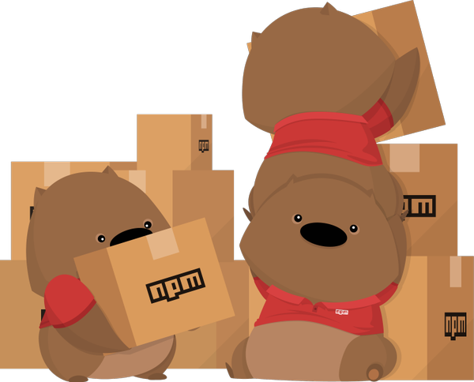
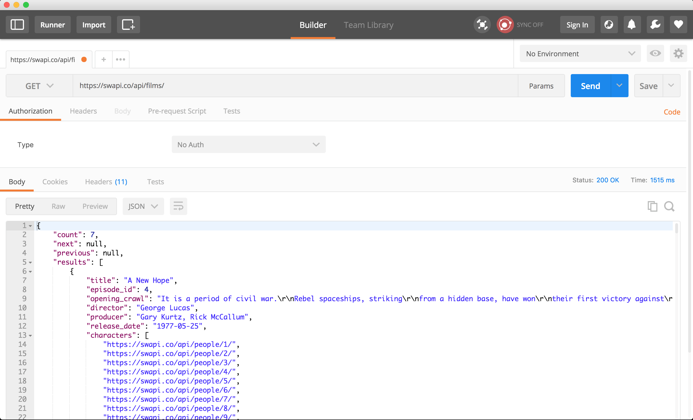
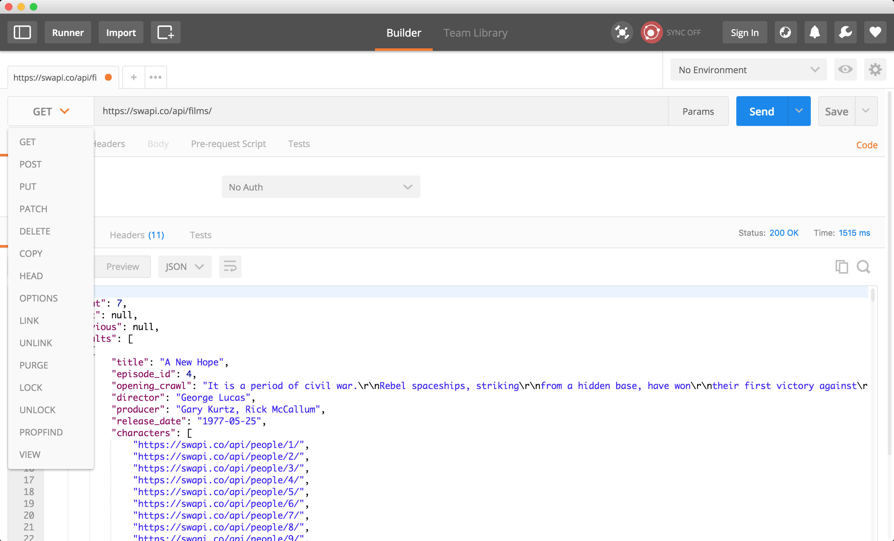
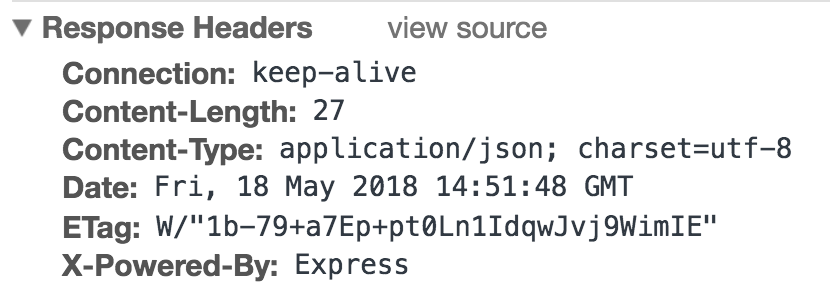

# Node.js

[<- Go Back](README.md)

* Node.js allows us to run JavaScript in different environments and run different tasks
* Using Node we can:
  * Run a simple script (like our exercises)
  * Bundle our front-end code and assets using different cool modules
  * Run a web server
  * Create back-end apps using different databases
* Over this course section we'll focus on using Node.js to create a web server and create a back-end app
* We'll create dynamic documents
* When we installed Node.js we also installed other program called NPM

## NPM
* NPM used to stand for Node Package Manager but nowadays it's just known as "NPM"
* Thanks to NPM we can install many different Node.js modules and import them into our projects
* This way we reuse code and we can contribute to other modules too
* NPM is one of the largest modules repository 
* Visit [NPM site](https://www.npmjs.com) to learn more about it
* Also learn more reading [NPM blog](https://blog.npmjs.org)
* Also, they have the best mascot ever.. NPM wombat!!



### Start a new NPM project
* To start a new project first we need to create a new folder and change directory to go inside of it
* You can do this in unix like systems

```
mkdir learning-node
cd learning-node
```

* Once we're in the right folder we run the NPM command `init`
* This command asks a lot of questions to configure our project
* We can ignore them and just press enter
* [NPM init doc](https://docs.npmjs.com/cli/init)

```bash
npm init
```

* Or we can generate it without having to answer the questions

```bash
npm init -y
```

* This script creates a new package.json file that allows us to configure our project
* Just looking at the file extension we can figure out that we'll use JSON for our npm configuration file

```js
{
  "name": "learning-node",
  "version": "1.0.0",
  "description": "",
  "main": "index.js",
  "scripts": {
    "test": "echo \"Error: no test specified\" && exit 1"
  },
  "author": "",
  "license": "ISC"
}
```

* NPM init uses our answers to create the configuration file based on our answers
* Once we have the file we can update any value on it

### NPM scripts
* In the **package.json** file we can find a **scripts** key
* By default we have a test script
* We can create our own scripts
* Add a **start** script

```js
"scripts": {
  "test": "echo \"Error: no test specified\" && exit 1",
  "start": "node index.js"
},
```

* Now we can run this command from our command line

```bash
npm start
```

* At this point we get an error

```bash
Error: Cannot find module 'index.js'
```

* We get this error as we try to execute index.js script and node can't find it
* As we are calling `node index.js` we need to create this new file at the same package.json or root level
* Update the start script definition if you need to move index.js to a different project/folder structure
* Create index.js and add the following code

**index.js**
```js
console.log('Welcome to JavaScript and Node.js server side');
```

* Run the npm start command again

```bash
npm start

Welcome to JavaScript and Node.js server side
```

* Now we know how to create, configure and run scripts using NPM and Node

### Install NPM module
* Using NPM we can install modules and use them on our projects
* Run **npm install** and the module name to install the given module
* You can check and search for modules on the [NPM site](https://www.npmjs.com)
* In this case we're going to install **Express** which is a popular module to create a web server
* A web server is the magic that gives you a web page when you ask the internet for one :)
  * If you are interested in knowing more, [here](https://developer.mozilla.org/en-US/docs/Learn/Common_questions/What_is_a_web_server) is a good place to start
* Check out [express npm page](https://www.npmjs.com/package/express)
* Also, take a look at [express site and doc](http://expressjs.com)

```bash
npm install express
```

**package.json**
```js
"dependencies": {
  "express": "^4.16.3"
}
```

* Running NPM install creates a **node_modules** folder
* Inside **node_modules** we find all the installed modules for a given project
* This folder can grow in size as we can have many installed modules or dependencies
* To avoid having issues we can [.gitignore](https://git-scm.com/docs/gitignore) this folder
* So if we're not sharing the node_modules folder with other team members... do we need to remember the list of installed modules?
* By default now NPM installs the modules and add them to our package.json dependencies
* Delete the node_modules folder
* Run the npm install command but without the module name

```bash
npm install
```

* NPM reads our list of dependencies, downloads and install all the modules for us
* In this case we have only Express as dependency
* In many cases we need dependencies that are only for development purposes like for example a library to run our tests, build our bundle or deploy our project
* NPM supports devDependencies that are modules that we don't deploy on our server
* To install a devDependencies we run npm install and add --save-dev as command parameter
* By default npm install now runs `npm install --save` to save the module as dependency
* Lets install a dev dependency called [UglifyJS](https://github.com/mishoo/UglifyJS2)

```
npm install uglify-js --save-dev
```

* Open package.json to see the installed dependecy

```json
"devDependencies": {
  "uglify-js": "^3.3.25"
}
```

* Now we have express installed as dependency and uglify.js as dev dependency
* Delete the node_modules and run npm install again to make sure that npm install both dependencies
* Lets configure uglify.js to run as script
* Add the following script to your package.json file

```json
"uglify": "uglifyjs index.js --output script.js"
```

* Open index.js and replace the console.log() for the following code

```js
var firstname = 'Ciro';
var lastname = 'Rodriguez';
var age = 20;

console.log(firstname);
console.log(lastname);
console.log(age);
```

* Now run the following npm command

```bash
npm run uglify
```

* When running this command you'll see the following output: `> uglifyjs index.js --output script.js`
* NPM has configured some scripts names as shortcuts like start and test
* When we need to run our own scripts we need to use `npm run scriptname`
* NPM can execute the code configured on this script as uglify.js is installed in the node_modules folder
* NPM can access installed node_modules modules
* Open the generated script.js file 

* script.js
```js
var firstname="Ciro";var lastname="Rodriguez";var age=20;constole.log(firstname);constole.log(lastname);constole.log(age);
```

* Uglify.js does a lot of things to bundle our code
* Uglify removes all the spaces as we need to create a smaller file so it takes less time to download
* This file is prepared to be deployed and not to read
* The index.js file still has our code and that it's more readable
* We don't need uglify.js as dependency as we prepare our files before we deploy them
* This is why we can install it as devDependency
* NPM can also uninstall packages running the uninstall command
* First we'll install a new module so we can then test this new command
* Install [Morgan.js](https://github.com/expressjs/morgan)

```bash
npm install morgan
```

* Check the package.json file

```json
"dependencies": {
  "express": "^4.16.3",
  "morgan": "^1.9.0"
},
```

* Now run npm uninstall with the module name that you want to remove

```bash
npm uninstall morgan
```

* After running npm uninstall your package.json should only have express as dependency

```json
"dependencies": {
  "express": "^4.16.3"
},
```

* All this modules has been installed as local dependencies
* NPM can also install modules as global so we can run them as programs from anywhere
* To install a module as global we also run npm install but we add the **-g** parameter
* For example when we installed [http-server](https://github.com/indexzero/http-server) we installed it as global so we can use it from any folder

```bash
npm install http-server -g
```

* As we're going to create a web server and we already have express installed we could start coding it
* Express is a really flexible module but we want to add some structure to our project
* Install [express-generator](https://github.com/expressjs/generator) as a global module

```bash
npm install express-generator -g
```

* To make sure that the module has been installed run the following command:

```bash
express --help
```

* If you get an error running the previous command try closing and opening your terminal again
* Sometimes you need to restart your terminal so the terminal notice that there's other modules installed (not so common but it might happen)
* Now you should get the following output

```bash
Usage: express [options] [dir]

Options:

  -h, --help           output usage information
      --version        output the version number
  -e, --ejs            add ejs engine support
      --pug            add pug engine support
      --hbs            add handlebars engine support
  -H, --hogan          add hogan.js engine support
  -v, --view <engine>  add view <engine> support (dust|ejs|hbs|hjs|jade|pug|twig|vash) (defaults to jade)
  -c, --css <engine>   add stylesheet <engine> support (less|stylus|compass|sass) (defaults to plain css)
      --git            add .gitignore
  -f, --force          force on non-empty directory
```

* As we're learning express lets add our own structure and uninstall this module
* We can add it later if we really need it

```bash
npm uninstall express-generator -g
```

* As you can see NPM is a great package module and will help us install and uninstall regular or dev dependencies

## Modules
* A module is just a way to encapsulate our code in a single code unit
* This means that we'll organize our code by functionality and create our own modules too
* Node.js by default has a module loader that we can use
* We can create a single file and use it as module in our project
* The **require** function accepts a string as parameter with the name of the module that we want to get
* Require will look into the node_modules folder to see if we have that module installed

```js
const module = require('modulename');
```

* We can also use relative paths to load our modules

```bash
/
|- index.js
|- my-module.js
```

* For example if we have the index.js file and my-module.js we can load the my-module from the index one in the following way

```js
const module = require('./my-module');
```

* As both files are siblings we can use `./` to let node node know that the my-module module is at the same level
* Also, you can see that we're not using `.js` as my module extension
* By default require will look for a JavaScript file

### Using modules
* As we have express installed as module we can require it from our project
* Delete all the `index.js` content and add the following one

```js
const express = require('express')
console.log(express)
```

* Now run npm start 

```bash
npm start
```

```bash
{ [Function: createApplication]
  application:
   { init: [Function: init],
     defaultConfiguration: [Function: defaultConfiguration],
     lazyrouter: [Function: lazyrouter],
     handle: [Function: handle],
     use: [Function: use],
     route: [Function: route],
     engine: [Function: engine],
     param: [Function: param],
     set: [Function: set],
     path: [Function: path],
     enabled: [Function: enabled],
     disabled: [Function: disabled],
     enable: [Function: enable],
     disable: [Function: disable],
     acl: [Function],
     bind: [Function],
     checkout: [Function],
     connect: [Function],
     copy: [Function],
     delete: [Function],
     get: [Function],
     head: [Function],
     link: [Function],
     lock: [Function],
     'm-search': [Function],
     merge: [Function],
     mkactivity: [Function],
     mkcalendar: [Function],
     mkcol: [Function],
     move: [Function],
     notify: [Function],
     options: [Function],
     patch: [Function],
     post: [Function],
     propfind: [Function],
     proppatch: [Function],
     purge: [Function],
     put: [Function],
     rebind: [Function],
     report: [Function],
     search: [Function],
     subscribe: [Function],
     trace: [Function],
     unbind: [Function],
     unlink: [Function],
     unlock: [Function],
     unsubscribe: [Function],
     all: [Function: all],
     del: [Function],
     render: [Function: render],
     listen: [Function: listen] },
  request:
   IncomingMessage {
     header: [Function: header],
     get: [Function: header],
     accepts: [Function],
     acceptsEncodings: [Function],
     acceptsEncoding: [Function],
     acceptsCharsets: [Function],
     acceptsCharset: [Function],
     acceptsLanguages: [Function],
     acceptsLanguage: [Function],
     range: [Function: range],
     param: [Function: param],
     is: [Function: is],
     protocol: [Getter],
     secure: [Getter],
     ip: [Getter],
     ips: [Getter],
     subdomains: [Getter],
     path: [Getter],
     hostname: [Getter],
     host: [Getter],
     fresh: [Getter],
     stale: [Getter],
     xhr: [Getter] },
  response:
   ServerResponse {
     status: [Function: status],
     links: [Function],
     send: [Function: send],
     json: [Function: json],
     jsonp: [Function: jsonp],
     sendStatus: [Function: sendStatus],
     sendFile: [Function: sendFile],
     sendfile: [Function],
     download: [Function: download],
     type: [Function: contentType],
     contentType: [Function: contentType],
     format: [Function],
     attachment: [Function: attachment],
     append: [Function: append],
     header: [Function: header],
     set: [Function: header],
     get: [Function],
     clearCookie: [Function: clearCookie],
     cookie: [Function],
     location: [Function: location],
     redirect: [Function: redirect],
     vary: [Function],
     render: [Function: render] },
  Route: [Function: Route],
  Router:
   { [Function]
     param: [Function: param],
     handle: [Function: handle],
     process_params: [Function: process_params],
     use: [Function: use],
     route: [Function: route],
     acl: [Function],
     bind: [Function],
     checkout: [Function],
     connect: [Function],
     copy: [Function],
     delete: [Function],
     get: [Function],
     head: [Function],
     link: [Function],
     lock: [Function],
     'm-search': [Function],
     merge: [Function],
     mkactivity: [Function],
     mkcalendar: [Function],
     mkcol: [Function],
     move: [Function],
     notify: [Function],
     options: [Function],
     patch: [Function],
     post: [Function],
     propfind: [Function],
     proppatch: [Function],
     purge: [Function],
     put: [Function],
     rebind: [Function],
     report: [Function],
     search: [Function],
     subscribe: [Function],
     trace: [Function],
     unbind: [Function],
     unlink: [Function],
     unlock: [Function],
     unsubscribe: [Function],
     all: [Function] },
  json: [Function: json],
  query: [Function: query],
  static:
   { [Function: serveStatic]
     mime:
      Mime {
        types: [Object],
        extensions: [Object],
        default_type: 'application/octet-stream',
        Mime: [Function: Mime],
        charsets: [Object] } },
  urlencoded: [Function: urlencoded] }
```

* We get a big object definition as output
* By using `require('express')` we tell node to get express code
* In this case we can assign the value that we get back from the require call `const express = require('express');`
* Node.js also has it own modules
* Take a look at [Node.js module doc](https://nodejs.org/api)

### Create your first module
* We can learn more about modules by creating our own one
* Create a `math.js` file and add the following code

**math.js**
```js
const revenew = 50;

const priceCalculation = function(price) {
  return price + revenew;
}

module.exports = priceCalculation;
```

* Comment the express require call
* Require math module and use it from index.js

**index.js**
```js
// const express = require('express')
// console.log(express)

const getPrice = require('./math');
const price = getPrice(200);

console.log(price);
```

* Run the project

```bash
npm start

250
```

* In this example we created a module called `math`
* The math module exports a `priceCalculation` function that we can use
* This function accepts a number parameter and will return a value with the final price
* Node.js uses `module.exports` that represents an object that we can export
* Now that we have our `math` module we can `require` it from `index.js`
* As the math module it's not installed in the node_module we use the relative path to import it `require('./math')`
* We defined a variable getPrice and assign what math module is exporting
* In this case it's just a function but it could be an object or any other value
* Then we can use the getPrice function with any numeric value to get the final price
* By using this math module we calculate the final price without knowing the logic behind it
* If we need to change the way that we calculate a price we just update the math module an it will work from anywhere it's being called
* In case we need or want to share this module between project we can just publish it on the NPM repository
* NPM has public and private repositories
* Also we can link NPM modules while we develop our projects if we have them as external dependencies

### How do Node.js modules work
* Node.js uses a [module pattern](https://medium.com/@tkssharma/javascript-module-pattern-b4b5012ada9f) to export code
* Once we export our code Node.js will enclose it inside a function so the module scope is private
* Module variables and rest of the code will be private
* We only can access and use what it has been exported using `module.exports`
* Also, we can export more code using just `exports` 

```js
exports = getPrice;
```

* Read and learn more about [Node.js modules](https://nodejs.org/api/modules.html)

#### Practice
[Exercise 1](./exercises/node/ex_1.md)

[Exercise 2](./exercises/node/ex_2.md)

[Exercise 3](./exercises/node/ex_3.md)

[Exercise 4](./exercises/node/ex_4.md)

[Exercise 5](./exercises/node/ex_5.md)

## Arrow Functions
* Node.js uses arrow functions for its callbacks and you can see many examples in their documentation
* Arrow functions are just JavaScript functions that we write in a different way
* We won't use the function reserved word
* Arrow function definition
```js
// Regular function
function() {}

// Arrow function
() => {}
```

* We can assign them to variables in the same way that we used to

```js
const myFunction = function() {
  console.log('my function call');
}

const myES6Function = () => {
  console.log('my function');
}
```

* Then we can call them in the same way we used to:

```js
const myFunction = function() {
  console.log('my function call');
}

const myES6Function = () => {
  console.log('my function');
}

myFunction();
myES6Function();
```

* In this example we see how similar functions and arrow functions are
* Arrow functions are part of the ES6 definition and they are simple to write
* We can [almost use them on any Browser](https://caniuse.com/#search=arrow%20functions) too

```js
const myFunction = function(parameter) {
  console.log('parameter: ', parameter);
}

const myES6Function = (parameter) => {
  console.log('parameter: ', parameter);
}
```

* Passing parameters works the same way too
* The only difference is that if we only pass one parameter we can remove the parentheses

```js
const myFunction = function(parameter) {
  console.log('parameter: ', parameter);
}

const myES6Function = parameter => {
  console.log('parameter: ', parameter);
}
```

* They are really usefull when we use them as callbacks:

```js
const students = ['tom', 'peter', 'maria', 'claire'];

students.forEach(function(student) {
  console.log(student);
});

students.forEach(student => {
  console.log(student);
});
```

* In both cases the functions are working as callbacks but arrow functions looks much simpler
* Arrow functions change the way that we can return values from it
* Using arrow functions will return the value after the => symbol

```js
function getMessage() {
  return 'hi, this is a message';
}

const getMessageArrowFunction = () => 'hi, this is a message';
const message = getMessageArrowFunction();
```

* As `{ }` in arrow functions are used to limit the function body we need to find a different way in case we need them to return an object
* We can use parentheses and curly brackets 

```js
function getUser() {
  const user = {
    name: 'Mateo',
    age: 26
  };
  
  return user;
}

const getUserArrowFunction = () => ({
  name: 'Mateo',
  age: 26
});

const user = getUserArrowFunction();
console.log(user.name);
```

* Arrow functions do not have their own this value
* This means that the `this` inside the function it's going to work in a different way
* Lexical Scoping just means that it uses this from the code that contains the Arrow Function
* You can see [great examples](https://hackernoon.com/javascript-es6-arrow-functions-and-lexical-this-f2a3e2a5e8c4)
* Read the [MDN Arrow functions](https://developer.mozilla.org/en-US/docs/Web/JavaScript/Reference/Functions/Arrow_functions) doc to learn more about Arrow Functions
* [ES6 in depth arrow functions](https://hacks.mozilla.org/2015/06/es6-in-depth-arrow-functions/)
* [The Coding Train - ES6 Arrow Function - YouTube](https://www.youtube.com/watch?v=mrYMzpbFz18)

#### Practice
[Exercise 6](./exercises/node/ex_6.md)

[Exercise 7](./exercises/node/ex_7.md)

## Web Server
* Node.js has a build in [HTTP](https://nodejs.org/dist/latest-v8.x/docs/api/http.html) module
* Using the HTTP module we can create a Node.js Web Server
* This web server will listen for `HTTP requests` and send `HTTP responses`
* Require the http module to start coding our server
* We don't have to run npm install as we're using a build in Node.js module
* Create a new server.js file and add the following code

* server.js
```js
const http = require('http');
const port = 3000;
```

* We defined an http variable and assigned what http node module exported
* Also we declared a port variable as we're going to need it to set up our server
* This means that our server will be listening at port 3000
* So now we need to create a server and we can do that using the `createServer` method
* This method accepts a callback function as parameter
* The callback function gets `2 parameters` that represents `request & response`
* This means that the callback function it's going to be executed on each request and we can handle the response

```js
const requestHandler = (request, response) => {  
  response.end('Hello Node.js Server!');
}

const server = http.createServer(requestHandler);
```

* We'll use the requestHandler function as createServer callback
* This means that requestHandler recibes a request and response object that represents the http request & response
* requestHandler will be executed on each HTTP request
* When we get a request we need to send a response back
* In this example we're sending just a text with `'Hello Node.js Server!'` content
* So far we haven't told the server on which port it should listen to
* We can configure it using `server.listen`
* This method accepts the port number as first parameter
* And a callback function as second parameter
* This function will get executed when the server start listening
* The callback function gets an error parameter that we can use to check if there's an error

```js
server.listen(port, (err) => {  
  if (err) {
    return console.log('something bad happened', err)
  }

  console.log(`server is listening on ${port}`)
})
```

* Now we have all the code together

```js
const http = require('http')  
const port = 3000

const requestHandler = (request, response) => {  
  console.log(request.url)
  response.end('Hello Node.js Server!')
}

const server = http.createServer(requestHandler)

server.listen(port, (err) => {  
  if (err) {
    return console.log('something bad happened', err)
  }

  console.log(`server is listening on ${port}`)
})
```

* Copy and paste this code into the server.js file
* Run the following command

```bash
node server.js
```

* If everything goes well you will see the following message as output

```bash
server is listening on 3000
```

* Also, you can configure `npm start` 

```json
"start": "node server.js"
```

* Now we have a Node.js web server running
* Open the browser and input localhost:3000 as url
* We get a `Hello Node.js Server!` back
* As we can see we're using the configured 3000 port
* The server will stop if we cut the Node.js script executing
* After doing it we won't get a response back from the server
* The HTTP module provides the basic features to have an HTTP server
* To create a real application we need more abstraction so we can handle more complexity
* This is the reason why we have many other modules that uses the basic HTTP adding more features and abstraction
* Some the of the most common web server modules are:
  * [Express](http://expressjs.com/)
  * [Hapi](http://hapijs.com/) 
  * [Koa](http://koajs.com/)
  * [Restify](http://restify.com/)
* In this course we'll use `Express.js`

#### Practice
[Exercise 8](./exercises/node/ex_8.md)

## Express
* Using express we'll be able to execute the following tasks:
  * Handle any HTTP request (GET, POST, etc)
  * Create and handle specific routes
  * Configure templating engines to create dynamic HTML
  * Configure and use express `middlewares` to add more features
  * Configure our server the way we want
  * And much, much more!
* Express is a minimal and flexible Node.js web application framework
* This is why we'll add many modules to configure our server like sessions, coockies and more
* Some known modules are maintained by the [express core team](http://expressjs.com/en/resources/middleware.html)
* There's no silver bullets on how to create/configure an Express server

### Create a web server using Express
* We already saw how we can create and start a Node web server using the HTTP module
* Now we need to learn how to do it using express
* The basic features are going to be the same:
  * Request the module
  * Configure the server
  * Handle request
  * Send response
* The request object allow us to get a lot of data from the user like username & password, product id or search query
* Using these values we can define what we should do, be it: interact with a database, create a session or just send some asset
* We can configure express to respond with static content like we have been doing using HTTP-Server module
* Also we can create dynamic content
* We might do it using a database or not
* To create dynamic content we'll use JavaScript and a template engine
* So, Express allows us to handle http routes for each request and configure the corresponding response
* Configure static assets
* Configure template engine
* And for any other task we can add many different modules that will help us work better
* To have express working we need to first install it

```bash
npm i express
```

* Now lets create a basic server by doing a Hello Node.js World example

**Example:**
```js
// require the express module
const express = require('express');

// then create a express server
const app = express();

// configure the default route and send a text as response
app.get('/', function(request, response) {
  response.send('Hello Node.js World!');
});

// configure the port that express is going to listen to
app.listen(3000, function() {
  console.log('Example app listening on port 3000!');
});
```

* In this example we see how to create a simple Express server
* We need to require the express module and create a express app/server
* Then we configure a GET default route `/`
* Using the listen method we tell express on which port it will listen to HTTP requests and show a message when the server starts
* Now that we have our server running we can visit `localhost:3000` using a browser to get the response back from the server

#### Practice
[Exercise 9](./exercises/node/ex_9.md)

### Using GET routes
* As you can see creating routes with express is really easy
* We use the `get` method to obtain `GET` requests
* This method accepts a string as first parameter that represents the route that we want to handle
* For example we used `/` to handle our root route
* The second parameter is a callback function that accepts 2 objects (`request & response`) as parameters
* The response object has a `send` method that we can use to send some data to the client as response
* Thats why we can see the message back when we send a request to our server

**Example:**
```js
app.get('/', function(request, response) {
  response.send('Hello World!');
});
```

* The express object has many methods to handle HTTP requests using different HTTP methods

**Example:**
```js
app.post('/', function(req, res) {
  res.send('Request using POST');
});

app.put('/', function(req, res) {
  res.send('Request using PUT');
});

app.delete('/', function(req, res) {
  res.send('Request using DELETE');
});
```

* Also we can use an `all` method to handle any type of HTTP method
* We can use this `all` method to configure `middleware` features for all our calls

**Example:**
```js
app.all('/', function(req, res) {
  res.send('Request using GET, POST, PUT or DELETE');
});
```

* Now that we know how express routes work we can create some to handle a products routes

**Example:**
```js
app.get('/products', function(req, res) {
  res.send('On this call we show a list of products');
});

app.post('/product/:id', function(req, res) {
  res.send('On this call we create a product');
});

app.put('/product/:id', function(req, res) {
  res.send('On this call we update a product');
});

app.delete('/product/:id', function(req, res) {
  res.send('On this call we delete a product');
});
```

* Using the browser we can only use GET requests
* To use POST we need to create a form and set the method to POST
* This is why we have a tool called [Postman](https://www.getpostman.com/) (you can find more like this one) that will help us request using different HTTP methods
* Install and open Postman
* Configure the URL that we want to use (request)
* We use the send button to create a request to the given URL using the selected HTTP method
* Then we can see the server response on the Postman lowers section of the screen



* Using Postman we can know the response status (in this example it's 200)
* We can also change the request and response HTTP headers
* And configure different HTTP methods (POST, PUT, DELETE, etc)s



#### Practice
[Exercise 10](./exercises/node/ex_10.md)

### Response handling
* Using the `response` object we can send the response to the client and choose different formats
* We can send JSON format if we're creating an API with the corresponding JSON headers
* Also, we can send an HTML (static or dynamic) content as string too
* You can read about all the response types that Express can handle on [express doc](https://expressjs.com/en/guide/routing.html#response-methods)

**JSON**
* The response `json` method allows us to send the user some data in JSON format
* We can pass a JavaScript object as parameter and the json method will transform it to JSON for us
* It will also add the `Content-Type application/json` header

**Example:**
```js
app.get('/', function(request, response) {
  response.json({ name: 'Marta', age: '40'});
});
```

* Then when we call this route we get: {"name":"Marta","age":"40"} back
* Also, we get the right headers too



**sendFile**
* Using the response `sendFile` method we can send a a file back
* We can send any type of file and it will depend on the client if it knows how to read or interpretate this response
* If we send html, images, audio, video, js or css and the client is a browser it will be able to handle this response

**Example:**
```js
const express = require('express');
const app = express();
const path = require('path');

app.get('/', function(request, response) {
  response.sendFile(path.join(__dirname, 'index.html'));
});

app.listen(3000, function() {
  console.log('Example app listening on port 3000!');
});
```

* In this example we're using the `path module` to join Node.js special `__dirname` variable and the file name (index.html) that we want to send
* Path module has a join method that allows us to join this two values
* Node.js [__dirname](https://nodejs.org/docs/latest/api/modules.html#modules_dirname) will return the current directory
* By joining the current direname and the file name we're creating an absolute path so sendFile knows exactly where it needs to get the file from

#### Practice
[Exercise 11](./exercises/node/ex_11.md)

[Exercise 12](./exercises/node/ex_12.md)

### Express Router
* As we saw on the products route example we can have many routes for one resource and our server file can grow
* To handle this routing config better we can use `express router`
* We'll be grouping our routes by action or resource type
* It's easier to read and maitain our server routes this way

**Example:**
* home.js

```js
// Create the express router to handle our home requests
var express = require('express');
var router = express.Router();

router.get('/', function(req, res) {
  res.send('Welcome to our Site!');
});

module.exports = router;
```

* products.js
```js
// Create the express router to handle our products requests
var express = require('express');
var router = express.Router();

router.get('/', function(req, res) {
  res.send('On this call we show a list of products');
});

router.post('/:id', function(req, res) {
  res.send('On this call we create a product');
});

router.put('/:id', function(req, res) {
  res.send('On this call we update a product');
});

router.delete('/:id', function(req, res) {
  res.send('On this call we delete a product');
});

module.exports = router;
```

* index.js
**Mount the routes**
```js
const express = require('express');
const app = express();

// Routers
const home = require('./home.js');
const products = require('./products.js');

app.use('/', home);
app.use('/products', products);
```

* In this example we see how we can have multiple routers using the express `Router` module
* Each router that we create can be mounted on the express app and configure the url that it need to handle
* Use express.Router() to create a new router
* `router.get / router.post` will handle the get and post HTTP methods
* Then using `app.use` we tell express to use this routes handlers
* We call this process `router mounting`

#### Practice
[Exercise 13](./exercises/node/ex_13.md)

### Status and error handling
* The response object has a `status` method that allows us to set the HTTP status response codes
* By default is 200
* It accepts a number as parameter
* We can also chain this method with others like send

**Example:**
```js
app.get('/', function(request, response) {
  res.status(200).json({ firsname: 'Pepe', lastname: 'Martin'});
});

app.get('/error', function(request, response) {
  res.status(500).send('Server error');
});
```

* In the first example we set 200 as status code and send a JavaScript object as JSON as response
* On the error call we want to send an error status back so we set 500 to let the user know that there's a server error
* Also, we can handle 404 routes the following way:

**Example:**
```js
app.use(function (req, res, next) {
  res.status(404).send("Sorry can't find that!")
})
```

* In this example we don't specify the route that we want to handle
* If the request doesn't match any of the other routes it will execute this one at last
* As it didn't found the route we can send a 404 as there's no document to send
* We could send a file back too with a [cool 404 message](https://www.creativebloq.com/web-design/best-404-pages-812505)
* Express also allows us to handle errors
* It's going to be similar to 404
* We need to add one more parameter that's the error one
* The callback function now will have the following parameter: `error, request, response and next`
* If we get an error message we can send it to as response
* This functions that we pass as parameters are called middleware
* The next parameter allows us to call the next express middleware (we'll talk more about it on the next section)

**Example:**
```js
app.use(function (err, req, res, next) {
  console.error(err.stack)
  res.status(500).send('Something broke!')
})
```

#### Practice
[Exercise 14](./exercises/node/ex_14.md)

### Middleware
* A **Middleware** is a function that has access to the request & response objects
* We can chain middleware calls using the `next` function in the application’s request-response cycle
* The `next` function is a function in the Express router which, when invoked, executes the middleware succeeding the current middleware
* So this means that the middleware gets three parameters: `request, response and a function callback called next`
* Express has many middlewares that we can install, configure and use

**Example:**
```js
const express = require('express');
const app = express();

const myMiddleware = function(req, res, next) {
  // We set a new property in the request object
  req.someValue = 'This is a value to test the Middleware';
  
  // We call the next middleware
  next();
}

app.listen(3000);
```

* To use a middleware we use the express `use` method
* This method accepts the function callback as parameter that will get executed on each request

**Example:**
```js
const express = require('express');
const app = express();

const myMiddleware = function(req, res, next) {
  req.someValue = 'This is a value to test the Middleware';
  
  next();
}

app.use(myMiddleware); // Add a middleware

app.listen(3000);
```

* Now we can define a new route

**Example:**
```js
const express = require('express');
const app = express();

const myMiddleware = function(req, res, next) {
  req.someValue = 'This is a value to test the Middleware';
  
  next();
}

app.use(myMiddleware);

app.get('/', (req, res) => {
  const responseMessage = req.someValue; // We get the request value that we setted from the middleware
  
  res.send(responseMessage);
});

app.listen(3000);
```

* So, a middleware is just a function that will get executed on each request
* The callback function will accept three parameters:
  * req: `request` object
  * res: `response` object
  * next: it's a function to call the following middleware
* To call the next middleware we need to call `next()` function 
* Using the express app and the `use` method we can configure express to use middlewares
* For example we can use other modules like [morgan](https://github.com/expressjs/morgan):

**Example:**
```js
const express = require('express');
const logger = require('morgan');
const app = express();

app.use(logger('dev'));
```

* In this case we imported `morgan` and configured it as a middleware
* We can use morgan as our server logger
* Learn about morgan and how to use it reading the module doc
* Using other express middleware is really simple
* [Express Middlewares](http://expressjs.com/en/resources/middleware.html)
* Learn more about [Express middleware reading the docs](https://expressjs.com/guide/writing-middleware.html)

#### Practice
[Exercise 15](./exercises/node/ex_15.md)

### Static Content
* So far we created routes to handle our requests
* Many times we just need to return a file like index.html, styles.css or scripts.js
* All this files doesn't change on the server as they're all static assets
* We can configure express to serve statics files from a folder
* By convention we call this folder public
* Express has a `static` method that accepts one string parameter
* This parameter represents the static folder name
* As this method returns a function we can use it as a middleware
* We use express `use` method to configure a middleware

**Example:**
```js
const express = require('express');
const app = express();

app.use(express.static('public'));
```

* In this example we set a public folder to serve our static assets
* So for example we can call the express server and request for files like index.html, styles.css or scripts.js
  * http://localhost:3000/img/logo.png
  * http://localhost:3000/js/script.js
  * http://localhost:3000/css/styles.css
  * http://localhost:3000/index.html
* We don't need to define our own routes for static assets (get, post, etc)
* If we take a deep look to this urls we can see that the public folder will be our site root for static assets

```bash
/
|-public
| |- img
| |  |- logo.png
| |
| |- js
| |  |- script.js
| |
| |- css
| |  |- styles.css
|
|- index.html
```

* We can also create a static assets alias using
* To create an alias we use the alias name as `app.use` first parameter
* Then we pass the middleware as second parameter

**Example:**
```js
const express = require('express')
const app = express()

app.use('/assets', express.static('public'));
```
* In this example we create `/assets` as our public static assets
* This means that using `/assets` as url we'll have access to the `public` folder content
* Due to this change we need to update the way that we call our assets:
  * http://localhost:3000/assets/img/logo.png
  * http://localhost:3000/assets/js/script.js
  * http://localhost:3000/assets/css/styles.css
  * http://localhost:3000/assets/index.html
* Using an alias we don't let the user know about our folder architecture
* Also, we can use any folder for our static assets
* We can change the folder name without having to update the alias
* Also we can configure more than one folder in case we need to
* Express will keep on looking for assets in all configured folders in case that it doesn't find it

**Example:**
```js
app.use(express.static('public'));
app.use(express.static('imgs'));
```

* In this case express will try to find first our assets on the `public` folder
* If it doesn't find it, then it will look for them on the `imgs` folder

#### Practice
[Exercise 16](./exercises/node/ex_16.md)

### Templates
* Using express we can configure a template engine
* Express can use many [different templates engines](http://expressjs.com/en/guide/using-template-engines.html)
* We'll use Pug as it's express default template engine
* Pug it’s a high performance and feature-rich templating engine
* Pug helps us write shorter HTML content
* This template used to be called `Jade` and it was renamed to `Pug`
* Pug works with indentation or white spaces (like Python)
* To see Pug in action we'll have to configure express to use Pug as template engine and also create our first template
* Install pug and set it as template engine

```
npm install pug
```

**Example:**
```js
app.set('view engine', 'pug');
```

* Use `app.set` method to set our `view engine` and use `pug`
* And now we create our first pug template
* As it's a pug template we'll use the `.pug` extension

**Example:**
* index.pug
```
doctype html
html(lang='en')
  head
    title= title
  body
    h1= message
    div.container
     p Starting using Pug!
```

* In some way this looks like HTML but it's much shorter as we're using Pug to write the template
* To use this template from express we need to save it on the views folder
* If you don't have a views folder you can create one

**Project structure:**
```
/
|- index.js
|- views
    |- index.pug
```

* The html, head, title, body & h1 template values will render the corresponding HTML tags
* Pug compiles this templates into HTML and it will throw a compilation error if identation it's not right
* Using pug we can assign values to the elements in the following way: `title= title` or `h1= message`
* In boths cases we're assigning a value to the title element and the h1 too
* Now we need to pass those values to the template so it can render it
* `title & message` are JavaScript variables
* Using the `=` operator in pug will assign the variables value as HTML element content
* Use `.classname` to define a class name like div.container
* And we can just write text if it's static content like `p Starting using Pug!` where the element p will have Starting using Pug! as content

**index.js**
```js
const express = require('express');
const app = express();

app.set('view engine', 'pug');

app.get('/', (req, res) => {
  res.render('index', { title: 'Hey', message: 'Hello there!' });
});

app.listen(3000);
```

* In this example we configured a root route
* Using the response `render` method we can send a response to the user
* The render method accepts two parameters
  * The first parameter is the template name
  * The second parameter is a JavaScript object where each property will become a template variable
* So, calling http://localhost:3000 will render the index.pug template passing Hey text as title value and Hello there! as message
* Express will render the template and create the content to send to the user
* The final template result will be:

```html
<!DOCTYPE html>
<html lang="en">
  <head>
    <title>Hey</title>
  </head>
  <body>
    <h1>Hello there!</h1>
    <div class="container">
      <p>Starting using Pug!</p>
    </div>
  </body>
</html>
```

* You can read more about the render method on [Express render doc](http://expressjs.com/api.html#app.render)
* Using Pug we have different ways to set HTML content
* We already saw that we can change the content using variables
* Also, we can use three different ways to set static content:
  * Leaving one space between the element and the content
  ```
  p text as content
  ```
  * Adding pipe and indentation 
  ```
  p
    | text as content
  ```
  * Finally using a dot and indentation
  ```
  p.
    text as content
  ```

* Use parenthesis to write HTML element attributes

```
a(href='contat.html', target='_blank') Contact
```

* Once this renders it will became a link tag with href and target attributes

```html
<a href="contact.html" target="_blank">Contact</a>
```

* Use ids and classes using the CSS notation, `#` for ids and `.` for classes

```
div#main main content
div.red text in red
```

```html
<div id="main">main content</div>
<div class="red">text in red</div>
```

* Also, we can combine ids and classes

```
div#container.left
```

* Pug has link and script tags support
* We use the tag name and parenthesis for the attributes like the rest of the elements

```
link(href='/css/styles.css', rel='stylesheet')

script(src='/js/scripts.js')
```

* We can also add css and js code as content in case we need to add styles or JavaScript to the document
* For CSS we need to replace link for style but for JavaScript it will still be script (like in the HTML that we already know)

```
style.
  body { 
    color: red;
  }

script(type='text/javascript').  
  const message = 'Using JS from PUG';
  alert(message);
```

```html
<style>
  body {
    color: red;
  }
</style>

<script type="text/javascript">
  const message = 'Using JS from PUG';
  alert(message);
</script>
```

* So far Pug it's great but we're still building a complete HTML document
* It would be nice to have a more modular way of building our UI so we can reuse sections
* Pug has mixin support that allow us to use code blocks

* product-mixin.pug
```
mixin product
  .product-wrapper
    h2 Product
    p Product description
```

* Now that we created the product mixin we can include it on our index.pug file and use it

* index.pug
```
include product-mixin

body
  +product
```

* In this example we use pug include to get the mixin content and call it from the index template
* Using `+` we let Pug know that this is a mixin that we want to use
* We can think about mixin like functions that we call
* At this moment we're using the product code but it's just static so it's not that helpful
* Adding variables we can make this mixin more useful

* product-mixin.pug
```
mixin product(product)
  .product-wrapper
    h2= product.title
    p= product.description
```

* index.pug
```
include product-mixin

body
  +product({title: 'PS4 Pro', description: 'Best console ever, so far..' })
```

* In this example we added a product parameter to the mixin so we can pass data to it
* When we call the mixin now we need to pass the product object as it's what the mixin is using
* Once Pug renders this template we get the expected output
```html
<section>
  <div class="product-wrapper">
    <h2>PS4 Pro</h2>
    <p>Best console ever, so far..</p>
  </div>
</section>
```

* We can re-use this mixin for other products
* index.pug
```
include product-mixin

body
  section  
    +product({title: 'PS4 Pro', description: 'Best console ever, so far..' })
  section
    +product({title: 'XBOX', description: 'Other great console' })
```

```html
<section>
  <div class="product-wrapper">
    <h2>PS4 Pro</h2>
    <p>Best console ever, so far..</p>
  </div>
</section>
<section>
  <div class="product-wrapper">
    <h2>XBOX</h2>
    <p>Other great console</p>
  </div>
</section>
```

* Learn more about mixins on [Pug mixin docs](https://pugjs.org/language/mixins.html)
* Pug supports template inheritance
* To use this useful feature we need to use `block and extends keywords`
* A `block` is simply a “block” of Pug that a child template may replace over the template
* This process is recursive
* Pug blocks can provide default content in case we need it
* This provides a default content and is purely optional
* The following example defines a scripts, content & foot block

* layout.pug
```
doctype html
html(lang='en')
  head
    title= title
    style(type="text/css").
      body { 
        color: red;
      }
    block scripts
  body
    block content
    block foot
```

* With this layout we can call the scripts, content and foot blocks
* Now we can extend this layout for other templates

* index.pug
```
extends ./layout.pug
include product-mixin

block scripts
  script.
    alert('alert from a block');

block content
  h1= message
  div.container
    p Starting using Pug!
  p
    | text as content
  p.
    text as content
  p text as content
  a.foo_link(href='about.html', target='_blank') About Us
  div#main main content
  div.red text in red
  section  
    +product({title: 'PS4 Pro', description: 'Best console ever, so far..' })
  section
    +product({title: 'XBOX', description: 'Other great console' })

block foot
  div This footer content comes from a block
```

* Using block scripts we're able to add code to the scripts layout section
* The same happens with content and foot
* Once Pug renders everything together we get the final HTML result

```html
<!DOCTYPE html>
<html lang="en">
  <head>
    <title>Hey</title>
      <style type="text/css">body { 
        color: red;
      }
      </style>
      <script>
        alert('alert from a block');
      </script>
  </head>
  <body>
    <h1>Hello there!</h1>
    <div class="container">
      <p>Starting using Pug!</p>
    </div>
    <p>text as content</p>
    <p>text as content</p>
    <p>text as content</p>
    <a class="foo_link" href="about.html" target="_blank">About Us</a>
    <div id="main">main content</div>
    <div class="red">text in red</div>
    <section>
      <div class="product-wrapper">
        <h2>PS4 Pro</h2>
        <p>Best console ever, so far..</p>
      </div>
    </section>
    <section>
      <div class="product-wrapper">
        <h2>XBOX</h2>
        <p>Other great console</p>
      </div>
    </section>
    <div>This footer content comes from a block</div>
  </body>
</html>
```

* You can learn more about layouts and blocks on the [Pug inheritance docs](https://pugjs.org/language/inheritance.html)
* So far we learned a lot about Pug and how it works and it looks like it's a really helpful tool to build our ui
* But we're still missing some main features like using js code, iterating elements or using conditionals inside our templates
* Use `-` to define JavaScript variables inside the templates

```
- const niceTitle = 'This is a nice title';
```

* Then we can use this title variable on our templates

```
h1= niceTitle
p This template has a nice #{niceTitle}
```

* In this example we defined a niceTitle string variable with the text: This is a nice title
* The we used this variable on our template in two different ways
  * First we assign `niceTitle` value as `h1 element content` using `=` operator
  * The we used the same `niceTitle` value as string Interpolation using `#{niceTitle}`
* We could even use HTML encoded content and Pug will escape that content for us

```
- myDivContent = '<span>This content is from a template variable</span>';

div This div has a span #{myDivContent}
```

``html
<div>
  This div has a span &lt;span&gt;This content is from a template variable&lt;/span&gt;
</div>
```

* We can see that Pug will replace the `< >` simbols for the HTML entities so we can show the HTML tags as content instead of real html content
* You can learn more about string interpolation, escape sequence, whitespace and more on [Pug interpolation docs](https://pugjs.org/language/interpolation.html)

* We can use conditional inside our templates

```
- var language = "spanish"

if language == "spanish"
    p Estas programando muy bien, felicitaciones!!
else  
    p Your code rocks, Congrats!!
```

* In this case we'll get the following HTML as we defined language as spanish
* Also, we could change the language value to other language and we'll see the message in english

```html
<p>Estas programando muy bien, felicitaciones!!</p>
```

* Pug gives us a `unless` that works like a negated if (!)

```
unless language != "spanish"
  p Your code rocks, Congrats!!
```

* Learn more about conditionals on [Pug conditionals doc](https://pugjs.org/language/conditionals.html)
* We have different options to iterate over our values using Pug
* Use each to iterate over an array
```
- hookCharacters = ['Peter', 'Nana', 'Captain Hook']

ul
  each character in hookCharacters
    li= character
```

```html
<ul>
  <li>Peter</li>
  <li>Nana</li>
  <li>Captain Hook</li>
</ul>
```

* In this example we use a local array but we could get this value from express and the render method
* Using `each` we get each value of the array
* In this case we iterate the `hookCharacters` array
* So on each iteration we get a `character` value
* Then we tell Pug to use the character name as li element content `li= character`
* We can also get the iteration index

```
- hookCharacters = ['Peter', 'Nana', 'Captain Hook']

ul
  each character, index in hookCharacters
    li= index + ': ' + character
```

```html
<ul>
  <li>0: Peter</li>
  <li>1: Nana</li>
  <li>2: Captain Hook</li>
</ul>
```
* We can also use `while` as PUG iterator

```
- var n = 0;
ul
  while n < 4
    li= n++
```

```html
<ul>
  <li>0</li>
  <li>1</li>
  <li>2</li>
  <li>3</li>
</ul>
```

* Learn more about iteration on [Pug iteration doc](https://pugjs.org/language/iteration.html)
* Check out Pug assets and sources to learm much more about this powerful template engine


## Sending/getting data from the client to the server
* To send data from the client to the server we can use forms or ajax calls
* Using forms we'll be able to send values using GET and POST
* By doing AJAX calls we can use HTTP GET, POST, UPDATE and DELETE
* We need to configure Express routes to get the request values using one of this methods
* If the server expects the values from GET, the client will send them using GET method
* In case the server expects the value from POST, the client will send them using POST method
* So we need to send values to the server the way it expected them
* One of the most simple way to pass a value to the route handler is using the express params
* For example we can create a route handler for `/products/` and add a product id
* In this case the URL it's going to look like: `http://localhost:3000/products/1`
* In this case we're calling the products handler and passing an id to it
* Express has a special way to configure URL parameters and it's using `:` on the route handler
* For example we can create a route like `/products/:id`
* In this URL `:id` it's the parameter that we're going to pass
* Lets define the route this way

```js
app.get('/products/:id', (req, res) => {
  res.send('Product with the id: ');
})
```

* In this example we see that we can create a route handler that it's expecting a URL parameter
* In this case the url it's going to be `http://localhost:3000/products/10`
* Now we need to know how to retrieve this id parameter using Express
* The request object has a params property that it's an object with all the parameters that this request has
* As we configured `:id` and we called using `/products/10` there's going to be an `id` property on the request.params object
* To get the id from the url we use `req.params.id`

```js
app.get('/products/:id', (req, res) => {
  const id = req.params.id;

  res.send(`Product with the id: ${id}`);
});
```

* In this example we see how using req.params.id we can get the id from the URL
* Other way to send values to the server it's using query string
* We know that using an url like `http://localhost:3000/products/?id=1` we are passing `id=1` as query string
* The request object has a query property that allows us to get the URL query string params
* Using `req.query` we get an object back that represents the URL query string
* In this case we want to get the id value so we can do `req.query.id` to get `1` as value back
```js
app.get('/products', (req, res) => {
  const id = req.query.id;
  
  res.send(`Product with the id: ${id}`);
});
```

* In this example we see that the route it's waiting for a query parameter with the id name
* If we call `http://localhost:3000/products?id=1` we pass id as query parameter with value 1
* In this case this req.query.id will become 1 and we assign it to the id variable
* So we can say that this are two different ways to pass values using GET and express routes
* Notice the different between using `/products/:id` and `req.params.id`
* The other option is to use  `/products` and query string like `req.query.id`
* Now that we know this we can create a form and send values to the server

```html
<form action="/products" method="get">
  <input type="text" name="username" placeholder="username">
  <input type="text" name="firstname" placeholder="firstname">
  <input type="text" name="lastname" placeholder="lastname">
  <input type="submit" value="Submit">
</form>
```

* This form has three inputs username, firstname & lastname
* When we submit this form all this values will be submitted to `/products`
* As the form is configured to use GET it will send all this values using query string
* The URL it's going to look like: `http://localhost:3000/products?username=nisnardi&firstname=nicolas&lastname=isnardi`
* We can see that we'll have a `username, firstname & lastname` values
* On the Express route handler this will become: 
```js
req.query.username;
req.query.firstname;
req.query.lastname;
```
* Now we can configure our route to handle this values
```js
app.get('/products', (req, res) => {
  const username = req.query.username;
  const firstname = req.query.firstname;
  const lastname = req.query.lastname;
  
  res.send(`We got the following values from the query string: ${username}, ${firstname} & ${lastname}`);
});
```

* We can see that we can use query string to retrieve values from the form
* As we sent them using GET from the form we need to use req.query to retrieve the values
* Once the route handler gets executed it will get the query values and we define three variables to store each query string value
* Then we just send the response using this query string values
```
We got the following values from the query string: nisnardi, nicolas & isnardi
```

* To send data to the server using POST we can change the form action

```html
<form action="/products" method="post">
  <input type="text" name="username" placeholder="username">
  <input type="text" name="firstname" placeholder="firstname">
  <input type="text" name="lastname" placeholder="lastname">
  <input type="submit" value="Submit">
</form>
```

* As you can see the only value that changed is `method="post"` (it used to be get)
* Now the values won't be submitted as query string and instead we'll send them on the request body
* To use Express to get POST values we need to add [body-parser](https://github.com/expressjs/body-parser) that's a Express middleware
* Body parser can get all the POST requests or we can configure it just fo the routes that we want
* Then it will get the POST values and append then as request body property
* So in this case we're sending `username, firstname & lastname`
* And they will become `req.body.username, req.body.firstname & req.body.lastname` after executing body-parser as middleware
* To use this module we need to install it
```
npm install body-parser
```
* Once we installed the module we need to configure it
```js
const bodyParser = require('body-parser');
const urlencodedParser = bodyParser.urlencoded({ extended: false });
```

* First we required body-parser module
* Then we configure body-parser for urlencoded (the form enctype that we use by default)
* We assign the body-parser return value to the `urlencodedParser`
* Now we can use this middleware in our routes
* We'll add `urlencodedParser` to any route that we want body-parser to append the POST values into the request body

```js
app.post('/products', urlencodedParser, (req, res) => {
  const username = req.body.username;
  const firstname = req.body.firstname;
  const lastname = req.body.lastname;
  
  console.log(req.body);

  res.send(`We got the following values from the query string: ${username}, ${firstname} & ${lastname}`);
});
```

* In this example we configured a post route handler for `/products/`
* When we submit the form it will send the request to this route handler
* The request will send all the form values
* Using `urlencodedParser` we configure this route to use body-parser
* This means that when this route gets called we'll have all the form values in the `req.body` object
* To get the values sent from the form we use: `req.body.username, req.body.firstname & req.body.lastname`
* This names comes from the form inputs name
* When we show the `req.body` value on the console we get:
```js
{ 
  username: 'nisnardi',
  firstname: 'nicolas',
  lastname: 'isnardi' 
}
```

* The req.body it's a JavaScript object and body-parsed added username, firstname & lastname as properties
* Then using this properties we can get the values
* The last thing that we need to know is how to send files
* Express won't handle our files upload so we need to use a module called [Multer](https://github.com/expressjs/multer)
* Multer works in a similar way that body-parser
* We can only use multer if we're uploading images
* Something really important is that as we're going to be uploading a file we need to set the form enctype in a different way
* When using multer set the `form enctype` to `multipart/form-data`
* Multer will append the values to the request body
* We can configure multer to use one or many files
* For now we can configure to use it with one file to make it easier
* First we need to install multer to our project
```
npm i multer
```
* Now that we have multer installed we need to require ir and configure it
```js
const multer  = require('multer');
const upload = multer({ dest: 'upload' });
```

* After requiring multer as module we need to configure the folder that we're going to store the uploaded images
* In this case we configured `upload` as the destination folder
* As we're going to send a file we need to update our form

```html
<form action="/products" method="post" enctype="multipart/form-data">
  <input type="text" name="username" placeholder="username">
  <input type="text" name="firstname" placeholder="firstname">
  <input type="text" name="lastname" placeholder="lastname">
  <input type="file" name="file">
  <input type="submit" value="Submit">
</form>
```
* To upload the file we need to change the `enctype="multipart/form-data"` so multer can take care of it
* Also we need to add a `<input type="file" name="file">`
* Note that the name of the input is `file` as this is the value that we need to set up in multer too
```js
app.post('/products', upload.single('file'), (req, res) => {
  const filename = req.file.originalname;
  
  console.log(req.body);
  console.log(req.file);
  
  res.send(`Congrats we uploaded the following file ${filename}`);
});
```
* in this example we can see that multer will store the inputs values into the request body (the same as body-parser)
* The body object will look something like:
```js
{ 
  username: 'nisnardi',
  firstname: 'nicolas',
  lastname: 'isnardi' 
}
```
* In this example we see that it looks the same way that using body-parser
* As we configure `upload.single('file')` we told multer to get the `file` value and upload it to the `upload` folder
* Using `req.file` we can access the uploaded file values
* When we configure multer with `upload.single` it will use `req.file` to append all the file values
* Remember that we used `file` as input name
* If we use other input name like `avatar` we still use req.file to get the values but `upload.single('avatar')` to configure the rout handler
* Our `req.file` object will look like this:
```js
{ 
  fieldname: 'file',
  originalname: 'lukecage.jpg',
  encoding: '7bit',
  mimetype: 'image/jpeg',
  destination: 'upload',
  filename: '7b4f43860a856577f5c47aba1ae592c5',
  path: 'upload/7b4f43860a856577f5c47aba1ae592c5',
  size: 13078 
}
```
* In this example we can see that using `originalname` property we get the uploaded file real name
* Multer will add a random name to the uploaded file by default `filename: '7b4f43860a856577f5c47aba1ae592c5'`
* This means that the file on the server won't be `lukecage.jpg` but `7b4f43860a856577f5c47aba1ae592c5`
* We can configure multer to use a different file name in case we want to
* You can read about it on the [multer doc](https://github.com/expressjs/multer)
* Express has many cool forms to handle sessions, form validations, security and much more!
* Go for it and look for more Express modules and learn how to use it by reading the modules doc
* [Node.js file upload using Multer](https://medium.com/@bmshamsnahid/nodejs-file-upload-using-multer-3a904516f6d2)

## We're CRAZY about JavaScript, Node.js and Express.js


## Assets / Sources
* [NodeSchool - Free Node.js, JavaScript and more courses](https://nodeschool.io/)
* [pugjs.org](https://pugjs.org)
* [Codeburst - getting-started-with-pug-template-engine - Medium ()](https://codeburst.io/getting-started-with-pug-template-engine-e49cfa291e33)
* [dcode - Pug (Jade) Tutorial #1 - Getting Started | HTML + NodeJS - Youtube](https://www.youtube.com/watch?v=AY99ODBchIA&list=PLVvjrrRCBy2JbOPP2JXfCtADABI1QHzWg)
* [jade](https://webapplog.com/jade)
* [Learn pug.js with pugs](https://codepen.io/mimoduo/post/learn-pug-js-with-pugs)
* [Pug.js - Cheat sheet](https://codepen.io/mimoduo/post/pug-js-cheat-sheet)
* [Express server side rendering](https://gist.github.com/joepie91/c0069ab0e0da40cc7b54b8c2203befe1)
* [Practical Node - online book](https://gittobook.org/books/185/practicalnode) (look at the PUG sections over the index)
* [Youtube - Node.js / Express / MongoDB - Build a Shopping Cart](https://www.youtube.com/watch?v=-3vvxn78MH4&t=1s)
* [Youtube - Node Authentication Tutorial | Creating a User Based App from Scratch](https://www.youtube.com/watch?v=gYjHDMPrkWU&list=PLpPnRKq7eNW3Qm2OfoJ3Hyvf-36TulLDp)

